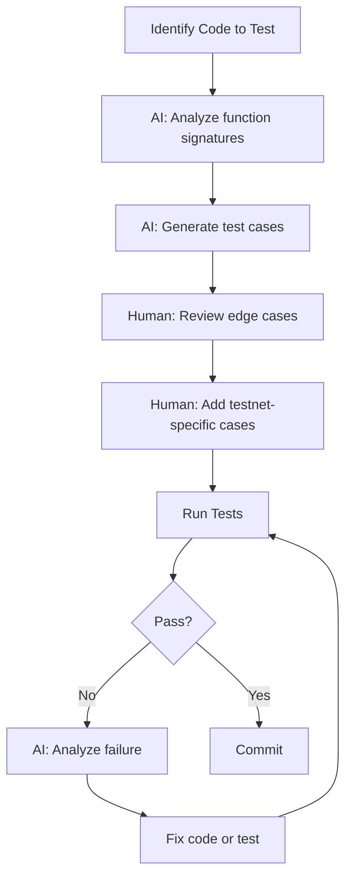

# Testing Guide

How to use AI assistance for generating and running NexusMiner test cases.

## Test Categories

### Protocol Tests

**AI Prompt:** "Generate test cases for the Falcon authentication handshake"

Key areas to test:
- Opcode serialization (legacy and stateless)
- Big-endian encoding/decoding of header and length fields
- Template parsing (228-byte payload validation)
- Authentication flow (all 4 MINER_AUTH steps)
- Push notification handling

### Connection Tests

**AI Prompt:** "Generate test cases for reconnection with backoff"

Key areas to test:
- Graceful disconnect and reconnect
- Session preservation across reconnection
- Keepalive timer behavior
- Genesis config reuse (no reconfiguration on reconnect)

### Mining Tests

**AI Prompt:** "Generate test cases for stale detection during mining"

Key areas to test:
- Template update notification to workers
- Stale block detection by height comparison
- Correct channel routing (prime vs hash)
- Block submission and response handling

## AI-Assisted Test Generation Workflow



## Sample AI Prompts for Test Generation

| Component | Prompt |
|-----------|--------|
| Packet assembly | "Generate tests for packet serialization with all opcode types" |
| Template parsing | "Test 228-byte template parsing with valid and malformed payloads" |
| Authentication | "Test Falcon-512 and Falcon-1024 key sizes in AUTH_INIT" |
| Stale detection | "Test stale notification when channel height changes" |
| Reconnection | "Test session resume after disconnect with preserved genesis" |
| Encryption | "Test ChaCha20 payload encryption with known test vectors" |

## Testnet Validation Checklist

Before submitting a PR, validate on testnet:

- [ ] Connect to testnet node successfully
- [ ] Falcon authentication completes
- [ ] Channel selection works (prime and hash)
- [ ] Templates received via push notification
- [ ] Mining loop runs without errors
- [ ] Stale detection triggers on new blocks
- [ ] Reconnection recovers after network interruption
- [ ] Block submission accepted (if solution found)

## Using AI for Test Analysis

When tests fail, use AI to diagnose:

```
"This test failed with [error]. Explain what went wrong and suggest a fix."
"Compare the expected and actual output for this template parsing test."
"What edge cases am I missing in my authentication test suite?"
```
