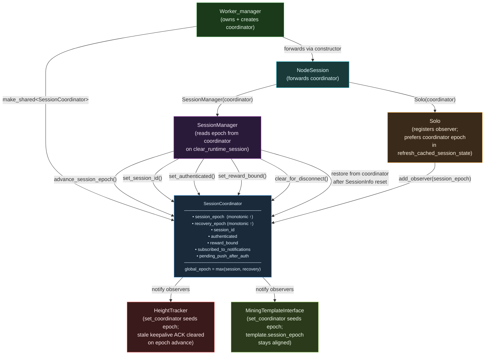

# SessionCoordinator — Unified Monotonic Authority for Session and Recovery State

## Overview

`SessionCoordinator` is the **single source of truth** for all session identity
state that was previously duplicated across five independent components.  It
holds monotonically increasing epoch counters, session identity, authentication
status, and reward binding state — all behind a single `std::mutex`.

Before this class existed, the miner maintained **8+ independent copies** of
critical fields in `SessionManager`, `Solo`, `HeightTracker`,
`MiningTemplateInterface`, and `Worker_manager::RecoveryContext`.  Those copies
drifted apart whenever `clear_runtime_session_locked()` did
`m_session = SessionInfo{}`, silently resetting `session_epoch` to 0 while
other components still held the old value.

The most visible symptom was the epoch-mismatch log line:

```
[TemplateInterface] Session epoch set to 1
[Worker_manager] → GET_BLOCK sent (recovery epoch 0)   ← MISMATCH
```

---

## Architecture Diagram



---

## Key Invariants

| # | Invariant | Enforcement |
|---|-----------|-------------|
| 1 | `session_epoch` is **monotonically increasing** — never resets to 0 | `advance_session_epoch()` only increments; `clear_for_disconnect()` does NOT touch epochs |
| 2 | `recovery_epoch` is **monotonically increasing** — never resets to 0 | `advance_recovery_epoch()` only increments; `transition_to(HEALTHY)` no longer resets it |
| 3 | `clear_for_disconnect()` clears identity fields but **preserves both epochs** | Epochs are stripped from `SessionInfo{}` reset via `m_session.session_epoch = m_coordinator->session_epoch()` |
| 4 | `commit_authenticated()` advances epoch + sets `session_id` + sets `authenticated` **atomically** | Single `std::mutex` lock covers all three writes — no window where `session_id` is set but epoch has not advanced |
| 5 | All reads/writes are thread-safe | One `std::mutex m_mutex` for all state |
| 6 | `global_epoch() = max(session_epoch, recovery_epoch)` | Lets any component detect staleness without knowing which domain advanced |
| 7 | Observer notification is synchronous | Fired under the same mutex lock; `HeightTracker` and `MiningTemplateInterface` see changes atomically |

---

## Ownership Model

| Field | Authoritative home (before) | Authoritative home (after) |
|-------|-----------------------------|---------------------------|
| `session_epoch` | `SessionManager::SessionInfo::session_epoch` | **`SessionCoordinator`** |
| `recovery_epoch` | `RecoveryContext::epoch` in `worker_manager.hpp` | **`SessionCoordinator`** |
| `session_id` | `SessionManager::SessionInfo::session_id` | **`SessionCoordinator`** (SessionManager syncs from it) |
| `authenticated` | `SessionManager::SessionInfo::authenticated` | **`SessionCoordinator`** (SessionManager syncs from it) |
| `reward_bound` | `SessionManager::SessionInfo::reward_bound` | **`SessionCoordinator`** (SessionManager syncs from it) |
| `subscribed_to_notifications` | `Solo::m_subscribed_to_notifications` (no authoritative home) | **`SessionCoordinator`** |
| `pending_push_after_auth` | `Solo::m_pending_push_after_auth` (no authoritative home) | **`SessionCoordinator`** |

---

## Component Integration

### Worker_manager

`Worker_manager` owns the coordinator's lifetime.  It is created in the
constructor before any `NodeSession` is wired up:

```cpp
m_coordinator = std::make_shared<protocol::SessionCoordinator>(m_logger);
```

The coordinator is forwarded to `NodeSession` via the constructor, which then
threads it to `SessionManager` and both `Solo` instances.

Recovery-epoch management previously used `RecoveryContext::epoch`.  That field
has been removed.  All recovery-epoch mutations now go through the coordinator:

```cpp
// transition_to(non-HEALTHY):
m_coordinator->advance_recovery_epoch(reason);

// transition_to(HEALTHY):
// [nothing — recovery_epoch is monotonic and NEVER reset]
```

### SessionManager

`SessionManager` accepts an optional coordinator in its constructor.  If none
is provided (tests, secondary contexts), it creates a local one.

The critical fix is inside `clear_runtime_session_locked()`:

```cpp
// Before: silently zeroed session_epoch
m_session = SessionInfo{};

// After: restore epoch from coordinator so it is never reset
m_session = SessionInfo{};
m_session.session_epoch = m_coordinator->session_epoch();
```

On successful authentication, `transition_to_authenticated_locked()` advances
the coordinator's epoch atomically together with setting `session_id` and
`authenticated`:

```cpp
m_session.session_epoch = m_coordinator->advance_session_epoch("authenticated");
m_coordinator->set_session_id(session_id, "authenticated");
m_coordinator->set_authenticated(true, "authenticated");
```

On `clear_for_disconnect()` and `clear_for_reauth()`, the coordinator's
`clear_for_disconnect()` is called to reset identity fields while epochs survive.

### Solo

`Solo` registers a coordinator observer in its constructor that automatically
propagates `session_epoch` changes to `HeightTracker` and
`MiningTemplateInterface` — removing the need for the manual
`propagate_session_to_template_interface()` call chain:

```cpp
m_coordinator->add_observer(
    [this](const char* domain, uint64_t, uint64_t new_val) {
        if (domain == SessionCoordinator::DOMAIN_SESSION_EPOCH) {
            m_height_tracker.set_session_epoch(new_val);
            if (m_template_interface)
                m_template_interface->set_session_epoch(new_val);
        }
    });
```

`refresh_cached_session_state()` now prefers the coordinator's epoch over the
session snapshot's epoch, closing the last remaining drift window:

```cpp
const uint64_t authoritative_epoch = m_coordinator
    ? m_coordinator->session_epoch()
    : session.session_epoch;
```

### HeightTracker / MiningTemplateInterface

Both expose a `set_coordinator()` method that seeds the local epoch immediately
from the coordinator's current value.  Subsequent changes arrive via the
`Solo`-registered observer, so these components never receive a stale epoch.

---

## Observer Pattern

Observers are registered with `add_observer()` and receive three arguments:

| Argument | Type | Description |
|----------|------|-------------|
| `domain` | `const char*` | One of the `DOMAIN_*` string pointer constants (e.g., `DOMAIN_SESSION_EPOCH`) |
| `old_val` | `uint64_t` | Value before the change |
| `new_val` | `uint64_t` | Value after the change |

Use **pointer comparison** with `DOMAIN_*` constants in observer callbacks —
they are `static constexpr` string literals, so pointer equality is O(1):

```cpp
if (domain == SessionCoordinator::DOMAIN_SESSION_EPOCH) { ... }
```

Available domain constants:

| Constant | Meaning |
|----------|---------|
| `DOMAIN_SESSION_EPOCH` | `session_epoch` advanced |
| `DOMAIN_RECOVERY_EPOCH` | `recovery_epoch` advanced |
| `DOMAIN_SESSION_ID` | `session_id` changed |
| `DOMAIN_AUTHENTICATED` | `authenticated` changed |
| `DOMAIN_REWARD_BOUND` | `reward_bound` changed |
| `DOMAIN_SUBSCRIBED` | `subscribed_to_notifications` changed |
| `DOMAIN_PENDING_PUSH` | `pending_push_after_auth` changed |

---

## Composite Query Methods

These methods replace the delegation-with-fallback pattern in `Solo`:

| Method | Equivalent expression |
|--------|-----------------------|
| `can_request_get_block()` | `authenticated` |
| `can_submit()` | `authenticated && reward_bound` |
| `is_session_active()` | `authenticated && session_id != 0` |

---

## Snapshot and Diagnostics

`snapshot()` returns a `Snapshot` struct with a consistent point-in-time view
of all fields.  Use it for logging and diagnostics:

```cpp
auto snap = coordinator->snapshot();
// snap.session_epoch, snap.recovery_epoch, snap.global_epoch,
// snap.session_id, snap.authenticated, snap.reward_bound, ...
```

`diagnostics()` returns a human-readable string suitable for log output.

---

## Before / After

### session_epoch regression (critical fix)

```
// BEFORE: clear_runtime_session_locked silently zeroed epoch
m_session = SessionInfo{};          // session_epoch → 0  ← BUG

// AFTER: epoch restored from coordinator (always >= previous value)
m_session = SessionInfo{};
m_session.session_epoch = m_coordinator->session_epoch();
```

### recovery_epoch regression (critical fix)

```
// BEFORE: epoch reset to 0 on HEALTHY transition
m_recovery.epoch = 0;              // ← epoch regression on recovery complete

// AFTER: removed entirely — recovery_epoch is monotonic in coordinator
// transition_to(HEALTHY) contains NO epoch mutation
```

### Epoch mismatch log (was the visible symptom)

```
// BEFORE (reproducible):
[TemplateInterface] Session epoch set to 1
[Worker_manager] → GET_BLOCK sent (recovery epoch 0)   ← MISMATCH

// AFTER (impossible):
Both components read from the same coordinator.
session_epoch and recovery_epoch can only advance, never regress.
```

---

## Tests

`session_coordinator_test.cpp` (61 tests) covers:

| Test | Verifies |
|------|---------|
| Epoch monotonicity | `advance_session_epoch()` / `advance_recovery_epoch()` only increase |
| `clear_for_disconnect` preserves epochs | Both epoch counters survive identity reset |
| `commit_authenticated` atomicity | Epoch + session_id + auth set in one lock |
| Observer notification ordering | Fired for every state change; `clear_for_disconnect` notifies observers |
| Thread safety | 4 concurrent writers + 4 readers; no exceptions; monotonicity holds |
| `global_epoch()` | Always equals `max(session_epoch, recovery_epoch)` |
| Composite queries | `can_request_get_block`, `can_submit`, `is_session_active` correct under all state combinations |
| Snapshot | All 8 fields match the authoritative state |
| `diagnostics()` | Non-empty; contains `session_epoch` and `recovery_epoch` |
| Return values | `advance_*()` returns the new value |

---

## Related Documents

- [session-container-architecture.md](session-container-architecture.md) — Authoritative `MinerSessionContainer` ownership model (superseded for epoch fields by this document)
- [reconnect-and-resync-model.md](reconnect-and-resync-model.md) — How `refresh_cached_session_state()` resyncs after reconnect
- [../../diagrams/mining-loops/connection-recovery.md](../../diagrams/mining-loops/connection-recovery.md) — Recovery state machine diagram
- [../../diagrams/pr-b_degraded_mode_recovery.md](../../diagrams/pr-b_degraded_mode_recovery.md) — Degraded-mode escape ladder
