# Falcon Dual Signature System - Miner Guide

**Critical Security Feature**

Nexus mining uses a **dual Falcon signature system** that separates session authentication from blockchain proof. Understanding both signatures is essential for secure mining operations.

---

## Table of Contents

1. [Overview](#overview)
2. [Signature Types](#signature-types)
3. [Complete Mining Flow](#complete-mining-flow)
4. [Key Management](#key-management)
5. [Configuration](#configuration)
6. [Security Scenarios](#security-scenarios)
7. [Troubleshooting](#troubleshooting)
8. [Best Practices](#best-practices)
9. [Cross-References](#cross-references)

---

## Overview

### Why Two Signatures?

**Problem:** Traditional mining uses a single private key for everything:
- ❌ If compromised, entire account is at risk
- ❌ Key must be on mining machine (hot storage)
- ❌ Cannot rotate without blockchain transaction
- ❌ Every block adds signature to blockchain (storage bloat)

**Nexus Solution:** Separate operational and ownership keys:
- ✅ **Disposable key** for block authentication (MANDATORY, always enabled)
  - Verified but NOT stored on blockchain (0 bytes overhead)
  - Rotatable without blockchain transaction
  - Hot storage acceptable (mining machine)
- ✅ **Physical key** for blockchain proof (OPTIONAL, off by default)
  - Stored on blockchain only when enabled
  - Embedded with Disposable signature in SUBMIT_BLOCK
  - Cold storage required (hardware wallet/HSM)
- ✅ Compromise isolation (losing disposable doesn't lose account)
- ✅ Operational efficiency (61% blockchain savings with defaults)

### Critical Sequence

**ALWAYS in this order:**

```
STEP 1: Mine for solution (10-60 seconds typical)
                ↓
STEP 2: Disposable Signature → Sign block in SUBMIT_BLOCK (MANDATORY, always enabled)
                ↓
STEP 3: Physical Signature → Embedded with Disposable, stored on blockchain (OPTIONAL)
```

**Important:**
- **Disposable signature is MANDATORY** (always enabled by default, cannot be disabled)
- **Physical signature is OPTIONAL** (disabled by default, configurable)
- Both signatures are included in SUBMIT_BLOCK packet when Physical is enabled
- Disposable signature is verified but NOT stored on blockchain (0 bytes overhead)
- Physical signature is stored on blockchain if enabled (809/1577 bytes per block)

---

## Signature Types

### Comparison Table

| Aspect | Disposable Signature | Physical Signature |
|--------|---------------------|-------------------|
| **Purpose** | Block submission authentication | Blockchain proof (optional) |
| **Used In** | SUBMIT_BLOCK (0x0005) - MANDATORY | SUBMIT_BLOCK (0x0005) - OPTIONAL |
| **Enabled** | ALWAYS (cannot disable) | Optional (OFF by default) |
| **Frequency** | Every block found (~1-2/day typical) | Every block found if enabled |
| **Storage** | Mining machine (hot) | Hardware wallet/secure server (cold) |
| **Size** | 809 bytes (F-512 CT) or 1577 bytes (F-1024 CT) | Same as disposable |
| **Persisted** | Verified, then discarded (0 bytes overhead) | Blockchain block data (embedded with Disposable) |
| **Rotation** | Easy (no blockchain transaction) | Hard (requires blockchain transaction) |
| **Compromise** | Limited impact (block auth only) | Critical (full account) |
| **Key File** | `disposable.key` | `physical.key` or hardware wallet |

---

### Disposable Signature

**Role:** Authenticate block submission (MANDATORY, always enabled)

**Properties:**
- **ALWAYS ENABLED** by default (cannot be disabled - core protocol requirement)
- Generated fresh for each deployment (or rotated periodically)
- Can be stored on mining machine disk
- Used in SUBMIT_BLOCK packet for every block found
- Signature is **verified but NOT stored** on blockchain (discarded after verification)
- Provides cryptographic proof without blockchain overhead (0 bytes)
- Signature size: 809 bytes (Falcon-512 CT) or 1577 bytes (Falcon-1024 CT)
- If compromised: Generate new key, re-authenticate

**When Used:**
```
Block found → Load disposable key → Sign block in SUBMIT_BLOCK → Node verifies → Discarded
```

**Security Level:** Medium (hot storage acceptable, no blockchain persistence)

---

### Physical Signature

**Role:** Prove block ownership on blockchain (OPTIONAL, disabled by default)

**Properties:**
- **OPTIONAL feature** (OFF by default for 0 blockchain overhead)
- Linked permanently to blockchain account (genesis hash)
- Should be in hardware wallet or secure offline storage
- **Embedded with Disposable signature** in SUBMIT_BLOCK packet
- Physical signature comes AFTER Disposable signature in the packet structure
- Stored permanently in blockchain block data when enabled
- Signature size: 809 bytes (Falcon-512 CT) or 1577 bytes (Falcon-1024 CT)
- Required for reward distribution when enabled
- If compromised: CRITICAL - full account at risk

**When Used:**
```
Block found → Disposable signature created → Physical signature embedded → Both in SUBMIT_BLOCK
```

**Security Level:** Maximum (cold storage required, permanent blockchain record)

---

## Complete Mining Flow

### Sequence Diagram (Miner Perspective)

```mermaid
sequenceDiagram
    participant Miner
    participant DisposableKey
    participant PhysicalKey
    participant Node
    participant Blockchain
    
    Note over Miner,Blockchain: CRITICAL: Dual Signature System
    
    Note over Miner,Node: Mining Process Starts
    
    Miner->>Node: GET_BLOCK (0xD008)
    Node-->>Miner: Block template
    
    Miner->>Miner: Hash for solution
    Note right of Miner: Try nonces until<br>hash < target
    
    Note over Miner: SOLUTION FOUND!
    
    rect rgb(255, 230, 230)
        Note over Miner,Blockchain: PHASE 1: Disposable Signature (MANDATORY - Always Enabled)
        
        Miner->>Miner: Construct complete block
        Note right of Miner: Header + transactions + solution
        
        Miner->>Miner: Calculate block hash
        Note right of Miner: uint1024_t blockHash = GetHash()
        
        Miner->>DisposableKey: Load disposable.key
        Note right of DisposableKey: MANDATORY key<br>Hot storage on mining machine
        
        DisposableKey-->>Miner: Disposable private key
        
        Miner->>DisposableKey: Sign(block_data)
        Note right of DisposableKey: Falcon-512/1024 signature<br>Size: 809 or 1577 bytes CT<br>Time: 1-2ms
        
        DisposableKey-->>Miner: Disposable signature
        
        Note over Miner: Disposable signature created<br>(will be verified but NOT stored on blockchain)
    end
    
    rect rgb(230, 255, 230)
        Note over Miner,Blockchain: PHASE 2: Physical Signature (OPTIONAL - Off by Default)
        
        alt Physical Falcon Enabled
            Miner->>PhysicalKey: Load physical key
            Note right of PhysicalKey: OPTIONAL key<br>Cold storage required<br>(Hardware wallet/HSM)
            
            alt Hardware Wallet
                Miner->>PhysicalKey: Request signature (USB/network)
                PhysicalKey->>PhysicalKey: Sign on secure element
                Note right of PhysicalKey: Private key never leaves device
                PhysicalKey-->>Miner: Physical signature
            else Remote Signing Service
                Miner->>PhysicalKey: Call signing API (TLS)
                PhysicalKey->>PhysicalKey: Sign on secure server
                Note right of PhysicalKey: Private key in HSM
                PhysicalKey-->>Miner: Physical signature
            else Local File (NOT RECOMMENDED)
                Miner->>PhysicalKey: Read physical.key from disk
                Note right of PhysicalKey: ⚠️ RISK: Key on hot machine
                Miner->>Miner: Sign locally
                PhysicalKey-->>Miner: Physical signature
            end
            
            Note over Miner: Physical signature embedded AFTER Disposable<br>(will be stored on blockchain)
        else Physical Falcon Disabled (Default)
            Note over Miner: Physical signature skipped<br>(0 blockchain overhead)
        end
    end
    
    rect rgb(230, 230, 255)
        Note over Miner,Blockchain: PHASE 3: Block Submission
        
        Miner->>Node: SUBMIT_BLOCK (0x0005)
        Note right of Miner: Contains:<br>• Block data<br>• Disposable signature (MANDATORY)<br>• Physical signature (if enabled)<br>• Genesis hash
        
        Node->>Node: Validate PoW
        Note left of Node: Verify hash < target
        
        Node->>Node: Verify Disposable signature
        Note left of Node: Falcon::Verify()<br>Time: 2-5ms<br>MANDATORY verification
        
        alt Disposable Signature Invalid
            Node-->>Miner: REJECT (0x00)
            Note left of Node: Disposable signature failed
            Note over Miner: ❌ BLOCK REJECTED<br>Disposable signature invalid
        end
        
        alt Physical Falcon Enabled
            Node->>Node: Verify Physical signature
            Note left of Node: Falcon::Verify()<br>Time: 10-20ms<br>OPTIONAL verification
            
            alt Physical Signature Invalid
                Node-->>Miner: REJECT (0x00)
                Note left of Node: Physical signature failed
                Note over Miner: ❌ BLOCK REJECTED<br>Physical signature invalid
            end
            
            Node->>Blockchain: Check genesis account
            Note over Blockchain: Verify account exists
            
            alt Account Not Found
                Node-->>Miner: REJECT (0x00)
                Note over Miner: ❌ BLOCK REJECTED<br>Genesis account doesn't exist
            end
            
            Node->>Blockchain: Get registered pubkey
            Note over Blockchain: Retrieve account's<br>Falcon pubkey
            
            Node->>Node: Compare physical pubkey
            Note left of Node: Submitted pubkey must match<br>blockchain account pubkey
            
            alt Pubkey Mismatch
                Node-->>Miner: REJECT (0x00)
                Note over Miner: ❌ BLOCK REJECTED<br>Physical pubkey doesn't match account
            end
        end
        
        Note over Node: ALL VALIDATIONS PASSED
        
        Node->>Blockchain: Add block to chain
        Note over Blockchain: Disposable signature verified, discarded (0 bytes)<br>Physical signature stored if enabled (809/1577 bytes)
        
        Node-->>Miner: ACCEPT (0x01)
        Note left of Node: Block accepted!<br>Reward scheduled
        
        Note over Miner,Blockchain: ✓ BLOCK ACCEPTED<br>✓ Disposable signature (verified, discarded)<br>✓ Physical signature (stored if enabled)
    end
```



---

## Key Management

### Key Generation

#### Disposable Key (Hot)

**Generate fresh key for each deployment:**

```bash
# Generate disposable Falcon-1024 key
./nexus-miner --generate-disposable-key

# Output:
# Disposable key generated successfully
# Private key: disposable.key (saved)
# Public key:  disposable.pub (saved)
#
# IMPORTANT: This key is for SESSION AUTH only
# DO NOT use for blockchain transactions
```

**Key file:** `~/.nexus/disposable.key` (or configured path)

**Permissions:**
```bash
chmod 600 ~/.nexus/disposable.key
chown $(whoami):$(whoami) ~/.nexus/disposable.key
```

**Rotation schedule:** Monthly or after suspected compromise

---

#### Physical Key (Cold)

**Generate ONCE and secure permanently:**

```bash
# Generate physical Falcon-1024 key
./nexus-miner --generate-physical-key --hardware-wallet

# OR for testing (NOT PRODUCTION):
./nexus-miner --generate-physical-key --file=physical.key

# Output:
# Physical key generated successfully
# Private key: Stored in hardware wallet
# Public key:  physical.pub (saved)
# Genesis hash: a1206f9c4feb8239d60381f62af789feb671371cfe70838f6b9de7098...
#
# CRITICAL: This key is linked to your blockchain account
# Keep private key in SECURE COLD STORAGE
# Losing this key = losing access to account
```

**Storage options (in order of security):**

1. **Hardware wallet (BEST):** Ledger, Trezor, YubiKey
2. **Remote signing service:** Secure server with HSM
3. **Encrypted offline storage:** USB drive in safe
4. **Paper wallet:** Printed and stored securely
5. **Local file (AVOID):** Only for testing/development

---

### Key Storage Best Practices

#### Disposable Key (Hot Storage Acceptable)

```
✓ Acceptable locations:
  • Mining machine filesystem (~/.nexus/disposable.key)
  • Encrypted disk
  • In-memory only (regenerate on restart)
  
⚠️ Considerations:
  • Rotate monthly
  • Monitor for unauthorized access
  • Backup not critical (can regenerate)
```

---

#### Physical Key (Cold Storage Required)

```
✓ REQUIRED security:
  • Hardware wallet (Ledger/Trezor/YubiKey)
  • Offline encrypted storage
  • Safe or bank vault
  • Multi-signature custody (future)
  
❌ NEVER:
  • On mining machine filesystem
  • In cloud storage
  • Unencrypted on any disk
  • Accessible from internet
```

---

### Key Rotation

#### Rotating Disposable Key

**When:** Monthly, after compromise, or policy change

**Steps:**
```bash
# 1. Generate new disposable key
./nexus-miner --generate-disposable-key --output=disposable-new.key

# 2. Stop miner
./nexus-miner --stop

# 3. Replace old key
mv ~/.nexus/disposable.key ~/.nexus/disposable-old.key
mv disposable-new.key ~/.nexus/disposable.key

# 4. Restart miner (will re-authenticate with new key)
./nexus-miner --start

# 5. Verify new session
./nexus-miner --show-session

# 6. Securely delete old key
shred -vfz ~/.nexus/disposable-old.key
```

**Impact:** Zero (seamless re-authentication)

**Downtime:** < 1 second

---

#### Rotating Physical Key

**When:** Compromise, security upgrade, or account transfer

**Steps:**
```bash
# 1. Generate new physical key
./nexus-miner --generate-physical-key --hardware-wallet

# 2. Update blockchain account (REQUIRES TRANSACTION)
./nexus-cli updatekey genesis=<genesis_hash> newkey=<new_pubkey>

# 3. Wait for confirmation (1-2 blocks)
./nexus-cli getaccount genesis=<genesis_hash>

# 4. Update miner configuration
# Edit miner.conf:
#   physical_falcon_pubkey=<new_pubkey>

# 5. Restart miner
./nexus-miner --restart

# 6. Verify next block submission
./nexus-miner --tail-logs | grep "SUBMIT_BLOCK"
```

**Impact:** High (requires blockchain transaction, costs fee)

**Downtime:** 2-5 minutes (blockchain confirmation)

**Cost:** Network transaction fee

---

## Configuration

### Basic Configuration (Disposable Only)

**File:** `~/.nexus/miner.conf`

```toml
# Minimal configuration - disposable signatures only
[mining]
mode = "PRIME"
wallet_ip = "127.0.0.1"
port = 8323

[falcon]
version = 1024                    # Falcon-1024 (default)
disposable_key = "~/.nexus/disposable.key"
enable_physical = false           # Physical signatures OFF (default)
```

**Security level:** Medium (session auth only)

**Blockchain overhead:** 0 bytes

---

### Enhanced Configuration (Dual Signatures)

**File:** `~/.nexus/miner.conf`

```toml
# Full dual signature configuration
[mining]
mode = "PRIME"
wallet_ip = "127.0.0.1"
port = 8323

[falcon]
version = 1024                    # Falcon-1024
disposable_key = "~/.nexus/disposable.key"
physical_key = "~/.nexus/physical.key"
enable_physical = true            # Physical signatures ON

[security]
disposable_rotation_days = 30     # Auto-rotate disposable key
physical_key_protection = "hardware_wallet"
```

**Security level:** Maximum (full dual signatures)

**Blockchain overhead:** 1330 bytes per block (Falcon-1024)

---

### Hardware Wallet Configuration

**File:** `~/.nexus/miner.conf`

```toml
[falcon]
version = 1024
disposable_key = "~/.nexus/disposable.key"
enable_physical = true

[hardware_wallet]
type = "ledger"                   # or "trezor", "yubikey"
device_path = "/dev/hidraw0"
timeout_ms = 5000
require_confirmation = true       # Physical button press required
```

---

### Remote Signing Service Configuration

**File:** `~/.nexus/miner.conf`

```toml
[falcon]
version = 1024
disposable_key = "~/.nexus/disposable.key"
enable_physical = true

[remote_signer]
url = "https://signing.example.com/api/v1/sign"
api_key_file = "~/.nexus/signing-api.key"
tls_cert = "~/.nexus/signer-ca.pem"
timeout_ms = 10000
retry_count = 3
```

---

## Security Scenarios

### Scenario 1: Disposable Key Compromised

**Detection:**
- Unauthorized mining sessions
- Unexpected session authentications
- Alert from intrusion detection system

**Impact:**
- ⚠️ Attacker can authenticate mining sessions
- ✅ Cannot access blockchain account
- ✅ Cannot steal rewards
- ✅ Physical key still secure

**Response:**
```bash
# 1. Immediately rotate disposable key
./nexus-miner --generate-disposable-key --force

# 2. Audit mining logs
./nexus-miner --audit-sessions

# 3. Report to node operator (optional)
./nexus-cli report-compromise session=<session_id>

# 4. Review security practices
```

**Recovery time:** < 5 minutes

**Financial loss:** $0 (no access to rewards)

---

### Scenario 2: Physical Key Compromised

**Detection:**
- Unauthorized block submissions
- Unexpected reward distributions
- Hardware wallet breach alert

**Impact:**
- ❌ CRITICAL: Full account access compromised
- ❌ Attacker can claim rewards
- ❌ Attacker can transfer funds
- ❌ Account ownership at risk

**Response:**
```bash
# 1. IMMEDIATELY stop mining
./nexus-miner --emergency-stop

# 2. Transfer funds to new account (if possible)
./nexus-cli transfer from=<compromised> to=<new_account> amount=ALL

# 3. Generate new physical key on secure system
./nexus-miner --generate-physical-key --hardware-wallet

# 4. Update blockchain account
./nexus-cli updatekey genesis=<genesis> newkey=<new_pubkey>

# 5. Forensic analysis
./nexus-miner --forensic-dump > compromise-report.txt

# 6. Report to Nexus security team
```

**Recovery time:** 1-2 hours

**Financial loss:** Potentially significant

**Critical:** This is why physical keys MUST be in cold storage!

---

### Scenario 3: Mining Machine Fully Compromised

**Detection:**
- Complete system breach
- Root/admin access gained by attacker
- Ransomware or persistent malware

**Impact with Dual Signatures:**
- ⚠️ Disposable key compromised (on machine)
- ✅ Physical key safe (if in hardware wallet)
- ⚠️ Mining operations disrupted
- ✅ Blockchain account secure

**Response:**
```bash
# 1. Isolate compromised machine
# (disconnect network)

# 2. From secure system: Rotate disposable key
./nexus-miner --generate-disposable-key --remote

# 3. Verify physical key NOT on compromised machine
# Check hardware wallet logs

# 4. Rebuild mining machine from scratch
# (clean OS install)

# 5. Restore configuration with new disposable key
# (physical key still safe in hardware wallet)

# 6. Resume mining
```

**Recovery time:** 2-4 hours (machine rebuild)

**Financial loss:** $0 (if physical key was in hardware wallet)

---

### Scenario 4: Session Hijacking Attack

**Attack:**
- Attacker intercepts MINER_AUTH packet
- Attempts to replay disposable signature

**Defense:**
- Node validates signature with cached pubkey
- Timestamp/nonce prevents replay
- TLS/HTTPS encrypts session traffic

**Result:**
- ✅ Attack fails (signature validation)
- ✅ Session remains secure
- ⚠️ Alert logged for investigation

---

### Scenario 5: Quantum Computer Attack (Future)

**Attack:**
- Quantum computer breaks Falcon-512
- Attempts to forge signatures

**Defense:**
- Falcon-1024 provides 256-bit quantum security
- 2^64× more resistant than Falcon-512
- Time to break: centuries (even with quantum computer)

**Result:**
- ✅ Falcon-1024 accounts remain secure
- ⚠️ Falcon-512 accounts potentially vulnerable
- 📖 Migration guide available

---

## Troubleshooting

### Disposable Signature Failures

#### Error: "Disposable signature verification failed"

**Causes:**
- Corrupted disposable key file
- Wrong key version (512 vs 1024)
- Key mismatch (pubkey != privkey)
- Malformed signature

**Solutions:**
```bash
# 1. Verify key integrity
./nexus-miner --verify-key disposable.key

# 2. Check key version
./nexus-miner --key-info disposable.key

# 3. Regenerate key if corrupted
./nexus-miner --generate-disposable-key --force

# 4. Verify signature generation
./nexus-miner --test-sign disposable.key
```

---

#### Error: "Session authentication timeout"

**Causes:**
- Network latency (> 5 seconds)
- Node overloaded
- Firewall blocking MINER_AUTH

**Solutions:**
```bash
# 1. Check network connectivity
ping <node_ip>

# 2. Verify port accessibility
telnet <node_ip> <port>

# 3. Increase timeout
# In miner.conf:
#   [network]
#   auth_timeout_ms = 10000

# 4. Retry authentication
./nexus-miner --retry-auth
```

---

### Physical Signature Failures

#### Error: "Physical signature verification failed"

**Causes:**
- Wrong physical key used
- Pubkey doesn't match blockchain account
- Hardware wallet disconnected
- Remote signer unreachable

**Solutions:**
```bash
# 1. Verify correct key
./nexus-miner --verify-physical-key

# 2. Check blockchain account
./nexus-cli getaccount genesis=<genesis>

# 3. Test hardware wallet connection
./nexus-miner --test-hardware-wallet

# 4. Test remote signer
curl https://signing.example.com/health

# 5. Fall back to local signing (temporary)
# In miner.conf:
#   [falcon]
#   physical_key = "~/.nexus/physical-backup.key"
```

---

#### Error: "Genesis account not found"

**Causes:**
- Account not created on blockchain
- Wrong genesis hash
- Node not synchronized

**Solutions:**
```bash
# 1. Check account exists
./nexus-cli getaccount genesis=<genesis>

# 2. Verify genesis hash
./nexus-miner --show-genesis

# 3. Create account if missing
./nexus-cli createaccount type=mining genesis=<genesis>

# 4. Wait for node synchronization
./nexus-cli getinfo | grep "blocks"
```

---

#### Error: "Pubkey mismatch"

**Causes:**
- Using wrong physical key
- Key not registered on blockchain
- Account key updated but miner config not updated

**Solutions:**
```bash
# 1. Get registered pubkey from blockchain
./nexus-cli getaccount genesis=<genesis> | grep "pubkey"

# 2. Compare with miner's physical key
./nexus-miner --show-physical-pubkey

# 3. If mismatch, update miner.conf
# Use correct key matching blockchain

# 4. If blockchain key is wrong, update it (requires transaction)
./nexus-cli updatekey genesis=<genesis> newkey=<correct_pubkey>
```

---

### Hardware Wallet Issues

#### Error: "Hardware wallet not detected"

**Solutions:**
```bash
# 1. Check USB connection
lsusb | grep -i "ledger\|trezor\|yubikey"

# 2. Verify permissions
ls -l /dev/hidraw*

# 3. Install udev rules
sudo cp 51-ledger.rules /etc/udev/rules.d/
sudo udevadm control --reload-rules

# 4. Test device
./nexus-miner --test-device
```

---

#### Error: "Hardware wallet signature timeout"

**Solutions:**
```bash
# 1. Increase timeout
# In miner.conf:
#   [hardware_wallet]
#   timeout_ms = 30000

# 2. Check device firmware
# Update if outdated

# 3. Reduce signature frequency
# Use disposable-only for most blocks
# Enable physical only for important blocks
```

---

### Performance Issues

#### Symptom: Slow block submissions

**Causes:**
- Physical signature generation (10-20ms overhead)
- Hardware wallet latency (100-500ms)
- Remote signer network latency (100-1000ms)

**Solutions:**
```bash
# 1. Disable physical signatures (if not required)
# In miner.conf:
#   [falcon]
#   enable_physical = false

# 2. Use local key for testing
# (NOT for production)

# 3. Optimize network path to remote signer
# Use dedicated VPN or direct connection

# 4. Monitor signature timing
./nexus-miner --signature-stats
```

---

## Best Practices

### Security Best Practices

1. **Separate Storage**
   - Disposable key: On mining machine
   - Physical key: Hardware wallet or HSM
   - Never store both on same machine

2. **Regular Rotation**
   - Disposable key: Monthly
   - Physical key: Only if compromised
   - Document rotation schedule

3. **Access Control**
   - Disposable key: File permissions 600
   - Physical key: Multi-factor auth required
   - Audit access logs

4. **Backup Strategy**
   - Disposable key: Optional (can regenerate)
   - Physical key: CRITICAL (multiple secure locations)
   - Test recovery procedures

5. **Monitoring**
   - Log all signature operations
   - Alert on unusual patterns
   - Track signature failure rates

---

### Operational Best Practices

1. **Development/Testing**
   - Use separate test keys
   - Enable both signatures for testing
   - Never use production keys in test

2. **Production Deployment**
   - Start with disposable-only
   - Add physical signatures when comfortable
   - Use hardware wallet for physical key

3. **High-Security Operations**
   - Use hardware wallet for physical key
   - Enable physical signatures
   - Implement monitoring and alerting

4. **Multi-Machine Farms**
   - Unique disposable key per machine
   - Shared physical key (in HSM)
   - Centralized key management

5. **Disaster Recovery**
   - Document key locations
   - Test recovery procedures quarterly
   - Maintain offline backups

---

### Performance Optimization

1. **Minimize Physical Signatures**
   - Use disposable-only for routine mining
   - Enable physical only for high-value blocks
   - Balance security vs performance

2. **Hardware Wallet Optimization**
   - Keep device connected and unlocked
   - Use auto-confirmation for known operations
   - Monitor device health

3. **Remote Signer Optimization**
   - Use low-latency network connection
   - Implement request caching
   - Monitor service availability

4. **Signature Caching**
   - Cache disposable signatures (session duration)
   - Pre-generate signatures when possible
   - Implement signature pools

---

## Cross-References

### Related Documentation

**Authentication:**
- [Falcon Integration Guide](../authentication/falcon-integration.md) - Getting started with Falcon
- [Falcon Key Generation](../authentication/falcon-keygen-guide.md) - Key generation procedures
- [Unified Falcon Protocol](../authentication/unified-falcon-protocol.md) - Protocol specification
- [Falcon Handshake Cache](../authentication/falcon-handshake-cache.md) - Session management

**Security:**
- [Security Overview](security-overview.md) - Overall security architecture
- [Falcon Security](falcon-security.md) - Cryptographic details
- [TLS/HTTPS Integration](tls-https.md) - Secure communications
- [Mutual TLS](mutual-tls.md) - Client certificate authentication

**Configuration:**
- [nexus.conf Reference](../../reference/nexus.conf.md) - Configuration options
- [TOML Format Guide](../../reference/toml-format.md) - Configuration syntax

**Troubleshooting:**
- [Troubleshooting Guide](../troubleshooting.md) - Common issues
- [Enhanced Diagnostics](../troubleshooting/enhanced-diagnostics.md) - Advanced debugging

---

### External Resources

**Nexus Documentation:**
- [LLL-TAO Node Documentation](https://github.com/Nexusoft/LLL-TAO) - Node-side protocol documentation
- [Tritium White Paper](https://nexus.io/ResourceHub/whitepaper) - Nexus architecture overview
- [Mining Guide](https://nexus.io/mining) - Official mining guide

**Falcon Cryptography:**
- [NIST PQC Project](https://csrc.nist.gov/projects/post-quantum-cryptography) - Post-quantum standards
- [Falcon Specification](https://falcon-sign.info/) - Official Falcon documentation
- [PQC Security Analysis](https://pqshield.com/falcon/) - Security assessments

**Hardware Wallets:**
- [Ledger Support](https://support.ledger.com/) - Ledger wallet documentation
- [Trezor Documentation](https://wiki.trezor.io/) - Trezor wallet guide
- [YubiKey Guide](https://www.yubico.com/documentation/) - YubiKey documentation

---

## Glossary

**Disposable Signature:** Ephemeral Falcon signature used for session authentication; not stored on blockchain; rotatable without blockchain transaction.

**Physical Signature:** Permanent Falcon signature stored on blockchain; proves block ownership; linked to genesis account; requires blockchain transaction to rotate.

**Genesis Hash:** Unique identifier for a Nexus blockchain account; derived from account creation transaction.

**Session Authentication:** Process of proving miner identity to node using disposable signature; creates temporary mining session.

**Blockchain Proof:** Permanent cryptographic proof of block authorship stored on blockchain using physical signature.

**Hardware Wallet:** Dedicated cryptographic device that stores private keys in secure element; keys never leave device.

**Remote Signing Service:** Network-accessible signing service with HSM backend; provides secure signature generation without exposing private keys.

**Cold Storage:** Offline key storage method; key never connected to internet; maximum security.

**Hot Storage:** Online key storage on active system; convenient but higher risk.

**Key Rotation:** Process of replacing cryptographic key with new key; frequency depends on key type and security policy.

---

**Document Version:** 1.0  
**Last Updated:** January 2026  
**Maintained By:** NexusMiner Documentation Team  
**Feedback:** [GitHub Issues](https://github.com/Nexusoft/NexusMiner/issues)

---
