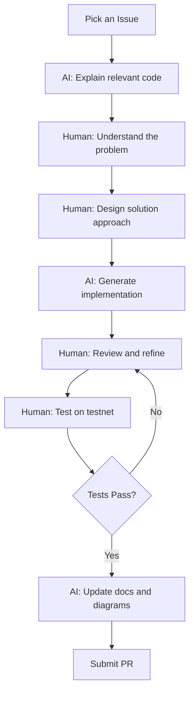

# Becoming a NexusMiner Expert with AI

A structured learning pathway for new contributors using AI assistance.

## Phase 1: Protocol Understanding (AI-Led)

**Goal:** Understand the LLP protocol and authentication flow.

1. **AI:** "Show me the stateless protocol handshake"
2. **AI:** "What happens when PRIME_BLOCK_AVAILABLE arrives?"
3. **Human:** Trace in debugger, validate AI explanation
4. **AI:** "Generate diagram of packet flow"

### Key Files to Study
- `src/LLP/miner_opcodes.hpp` — All opcode definitions
- `src/protocol/src/protocol/solo.cpp` — Falcon authentication state machine
- `src/protocol/src/protocol/mining_template_interface.cpp` — Template parsing

### Checkpoint Questions
- [ ] Can you explain the Falcon-512 authentication handshake?
- [ ] What is the difference between legacy and stateless opcodes?
- [ ] How does the 228-byte template get parsed?

## Phase 2: Mining Loop Mastery (Human-Led)

**Goal:** Understand and optimize the core mining loops.

1. **Human:** Design optimization strategy
2. **AI:** "Find all places we parse templates"
3. **Human:** Identify bottleneck (parsing vs hashing)
4. **AI:** "Show profiling results, suggest improvements"

### Key Files to Study
- `src/cpu/src/cpu/worker_prime.cpp` — Prime mining sieve loop
- `src/cpu/src/cpu/worker_hash.cpp` — Hash mining loop
- `src/protocol/src/protocol/session_manager.cpp` — Session lifecycle

### Checkpoint Questions
- [ ] Can you describe the segmented sieve algorithm?
- [ ] How does stale detection work during mining?
- [ ] Where is the biggest CPU bottleneck in prime mining?

## Phase 3: Advanced Contributions (Symbiotic)

**Goal:** Make meaningful contributions to the miner.

1. **Human:** "We need better error recovery"
2. **AI:** "Here's how connection recovery works currently"
3. **Human:** Design new state machine
4. **AI:** Generate implementation skeleton
5. **Human:** Refine, test edge cases
6. **AI:** Update all documentation

### Example Contribution Workflow

### Suggested AI Prompts for Each Phase

| Phase | Prompt | Purpose |
|-------|--------|---------|
| 1 | "Explain opcode 0xD0D8 and show all handlers" | Learn protocol |
| 1 | "Generate sequence diagram for authentication" | Visualize flow |
| 2 | "Where are the parsing hotspots in worker_prime?" | Find bottlenecks |
| 2 | "How can we reduce allocations in the mining loop?" | Optimize |
| 3 | "Show me all error handling paths in session_manager" | Understand recovery |
| 3 | "Generate a state machine for reconnection with backoff" | Design feature |
