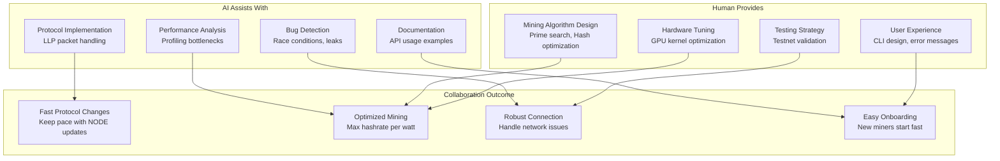
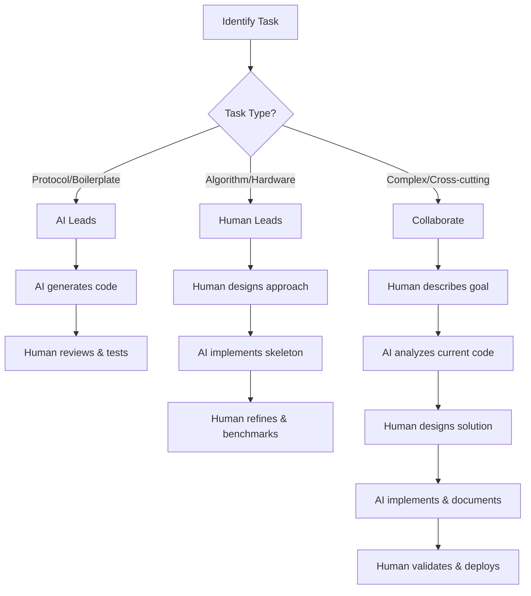

# Miner Development Guide: AI-Human Collaboration

A framework for effective AI-Human collaboration when developing NexusMiner.

## When to Use AI

| Task | AI Strength | Human Strength |
|------|-------------|----------------|
| Implement new opcode handler | ✅ Pattern matching from existing code | Review edge cases |
| Optimize hash kernel | Suggest profiling approach | ✅ GPU architecture knowledge |
| Debug connection drop | ✅ Trace all state transitions | Reproduce real-world conditions |
| Write protocol docs | ✅ Cross-reference all opcodes | Validate accuracy |
| Design search algorithm | Generate implementation skeleton | ✅ Algorithm design |
| Add error recovery | ✅ Find all error paths | ✅ Design recovery strategy |

## Workflow

