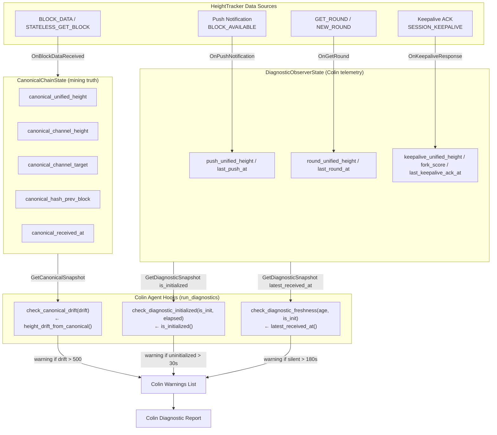
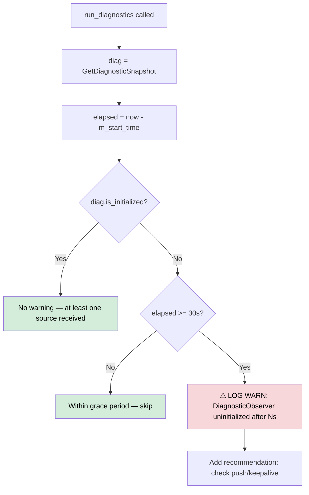
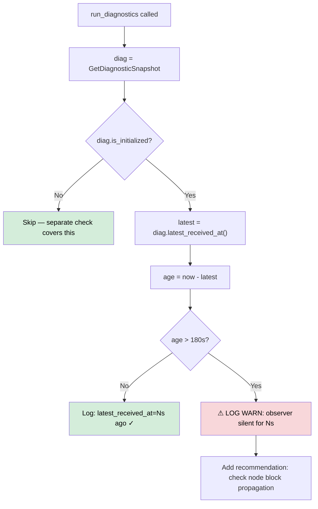
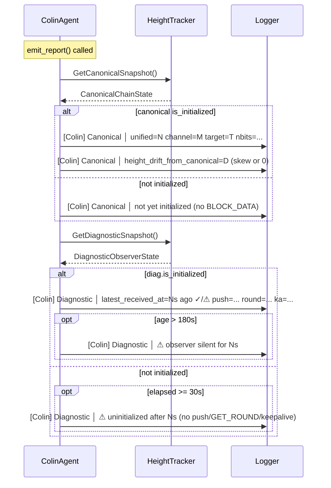

# Colin Agent Hook Flow — Mermaid Diagrams

This document contains Mermaid diagrams showing how the three new Colin agent hooks
(`check_canonical_drift`, `check_diagnostic_initialized`, `check_diagnostic_freshness`)
plug into the diagnostic pipeline.

---

## Diagram 1: Colin Hook Input Routing



---

## Diagram 2: `check_canonical_drift()` Decision Flow

```mermaid
flowchart TD
    A[run_diagnostics called] --> B{canonical.is_initialized?}
    B -- No --> C[Skip — no canonical data yet]
    B -- Yes --> D[drift = height_drift_from_canonical]
    D --> E{drift == 0?}
    E -- Yes --> F["Log: drift=0 ✓ (unified == channel_target)"]
    E -- No --> G{|drift| > 500?}
    G -- No --> H["Log: drift=N (inter-channel skew, normal)"]
    G -- Yes --> I["⚠ LOG WARN: drift=N outside expected range"]
    I --> J["Add recommendation: check BLOCK_DATA feed"]
```

---

## Diagram 3: `check_diagnostic_initialized()` Decision Flow



---

## Diagram 4: `check_diagnostic_freshness()` Decision Flow



---

## Diagram 5: Colin Report Section — Canonical + Diagnostic



---

## Diagram 6: Full Colin Report Section Order

```mermaid
graph LR
    A["[Colin] DIAGNOSTIC REPORT"] --> B[Lane Health]
    B --> C[Block Stats]
    C --> D["Height Tracker (GetSnapshot)"]
    D --> E[Keepalive ACK Age]
    E --> F["► Canonical Chain State (NEW)<br/>height_drift_from_canonical"]
    F --> G["► Diagnostic Observer State (NEW)<br/>is_initialized + latest_received_at"]
    G --> H[TipSync Cross-Check]
    H --> I[SESSION_STATUS_ACK]
    I --> J[Warnings + Recommendations]
    J --> K[Node Diagnostics PING_DIAG]
    K --> L[Active Template]
    L --> M[Miner Telemetry PONG]

    style F fill:#cce5ff,color:#000
    style G fill:#cce5ff,color:#000
```


