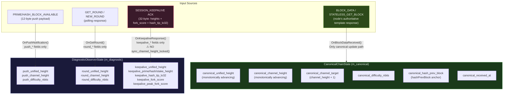
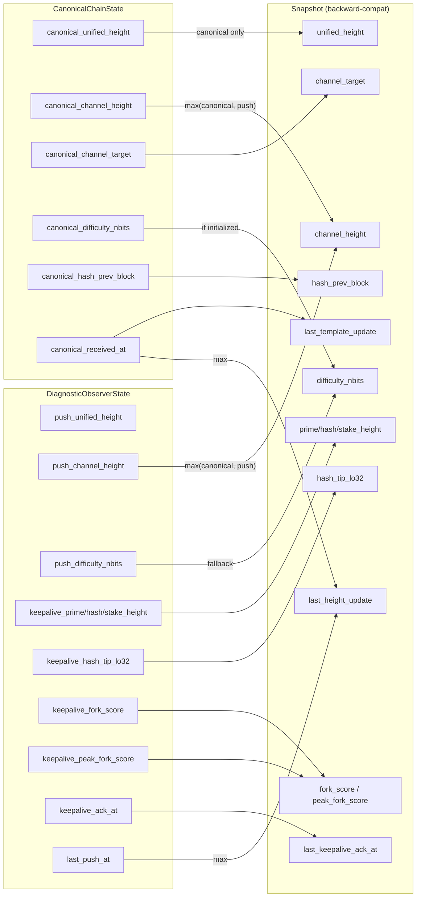
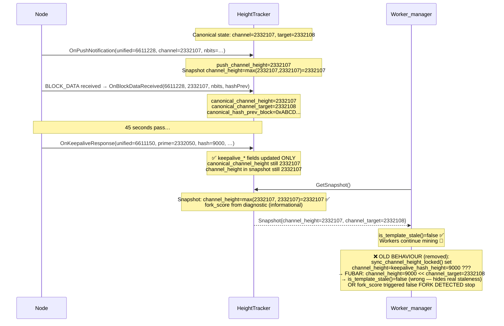
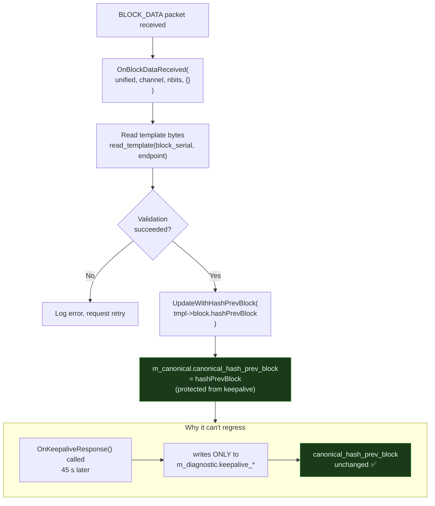
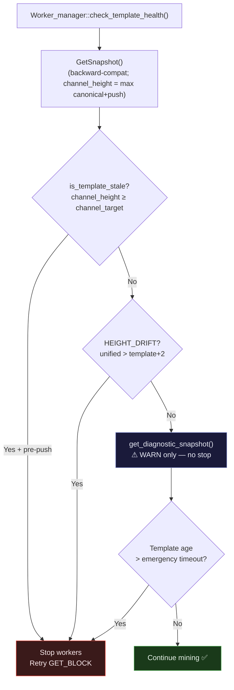
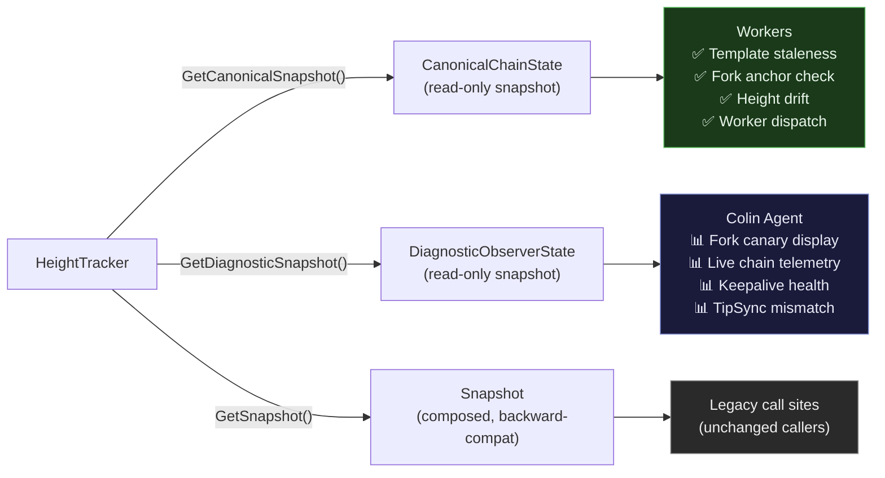

# HeightTracker State Machine — Canonical vs Diagnostic

Data-flow diagrams for the `CanonicalChainState` / `DiagnosticObserverState`
architectural separation introduced to eliminate keepalive-driven FUBAR states.

---

## 1. Input Routing Overview

Every input to `HeightTracker` is now routed to exactly one lane:

---

## 2. `GetSnapshot()` Composition

`GetSnapshot()` composes the backward-compatible `Snapshot` struct from both state
objects. `unified_height` now remains canonical `BLOCK_DATA` truth, while
`channel_height` still uses `max(canonical, push)` to preserve push-driven
channel staleness detection without allowing keepalive regressions.

---

## 3. Keepalive Isolation — The Fix in Detail

This sequence shows why the old `sync_channel_height_locked()` call was dangerous
and how isolation eliminates the bug:

---

## 4. `hashPrevBlock` Canonical Protection

---

## 5. Mining Decision Path (Workers use Canonical only)

---

## 6. Colin Diagnostics vs Worker Mining — Read Path

---

## Related Documents

- [height-tracker-canonical-state.md](../current/mining/height-tracker-canonical-state.md) — full architecture reference
- [unified-push-architecture.md](unified-push-architecture.md) — push notification flow
- [mining-loops/template-lifecycle.md](mining-loops/template-lifecycle.md) — template lifecycle
- `src/protocol/inc/protocol/height_tracker.hpp` — struct definitions
- `src/protocol/height_tracker_test.cpp` — Tests 27–31 (canonical isolation)
