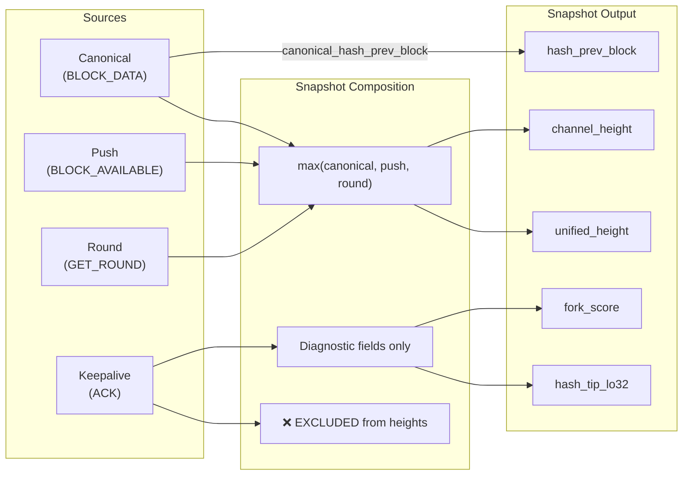
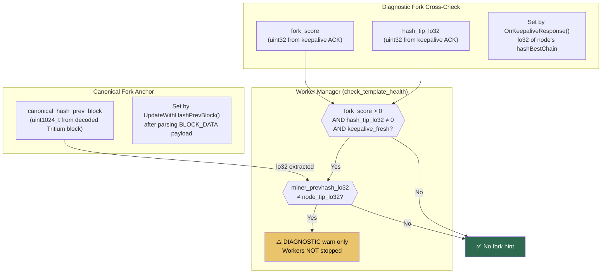
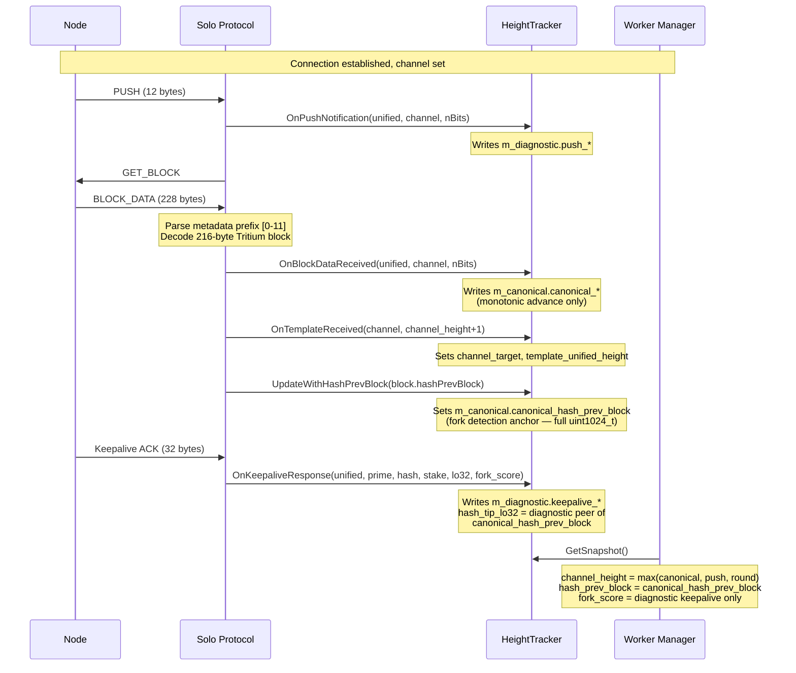

# HeightTracker Canonical / Diagnostic Architecture

> **Architectural reference** for the two-lane HeightTracker state isolation
> introduced to prevent keepalive ACKs from corrupting mining decisions.

---

## 1. Two-Lane State Isolation

`HeightTracker` splits its internal state into two strictly separated lanes.
Only **BLOCK_DATA** (the decoded 216-byte Tritium block) may write canonical
state. All other sources write diagnostic-only state.

```mermaid
graph TB
    subgraph "Node (LLL-TAO)"
        BD[BLOCK_DATA<br/>216-byte Tritium block]
        PUSH[PUSH notification<br/>12-byte payload]
        GR[GET_ROUND response<br/>12-byte payload]
        KA[Keepalive ACK<br/>32-byte payload]
    end

    subgraph "HeightTracker"
        subgraph "CanonicalChainState (m_canonical)"
            CUH[canonical_unified_height<br/>block.nHeight]
            CCH[canonical_channel_height<br/>nChannelHeight]
            CCT[canonical_channel_target<br/>channel_height + 1]
            CDB[canonical_difficulty_nbits<br/>nBits]
            CHPB[canonical_hash_prev_block<br/>hashPrevBlock — uint1024_t]
            CRA[canonical_received_at<br/>timestamp]
            CINIT["is_initialized()<br/>unified_height > 0"]
        end

        subgraph "DiagnosticObserverState (m_diagnostic)"
            subgraph "Push"
                PUH[push_unified_height]
                PCH[push_channel_height]
                PDB[push_difficulty_nbits]
            end
            subgraph "GET_ROUND"
                RUH[round_unified_height]
                RCH[round_channel_height]
                RDB[round_difficulty_nbits]
            end
            subgraph "Keepalive"
                KUH[keepalive_unified_height]
                KPH[keepalive_prime_height]
                KHH[keepalive_hash_height]
                KSH[keepalive_stake_height]
                HTL[hash_tip_lo32<br/>diagnostic peer of<br/>canonical_hash_prev_block]
                FS[fork_score]
                PFS[peak_fork_score]
            end
        end

        SNAP["GetSnapshot()<br/>Backward-compatible composition"]
    end

    BD -->|"OnBlockDataReceived()"| CUH
    BD -->|"OnBlockDataReceived()"| CCH
    BD -->|"OnBlockDataReceived()"| CCT
    BD -->|"OnBlockDataReceived()"| CDB
    BD -->|"UpdateWithHashPrevBlock()"| CHPB

    PUSH -->|"OnPushNotification()"| PUH
    PUSH -->|"OnPushNotification()"| PCH
    GR -->|"OnGetRound()"| RUH
    GR -->|"OnGetRound()"| RCH
    KA -->|"OnKeepaliveResponse()"| KUH
    KA -->|"OnKeepaliveResponse()"| HTL
    KA -->|"OnKeepaliveResponse()"| FS

    CUH --> SNAP
    PUH --> SNAP
    RUH --> SNAP

    style CUH fill:#2d6a4f,color:#fff
    style CCH fill:#2d6a4f,color:#fff
    style CCT fill:#2d6a4f,color:#fff
    style CDB fill:#2d6a4f,color:#fff
    style CHPB fill:#2d6a4f,color:#fff
    style CRA fill:#2d6a4f,color:#fff
    style CINIT fill:#2d6a4f,color:#fff
    style HTL fill:#d4a373,color:#000
    style FS fill:#d4a373,color:#000
    style PFS fill:#d4a373,color:#000
```



---

## 2. Snapshot Composition

`GetSnapshot()` composes a backward-compatible `Snapshot` by taking the max
of canonical and diagnostic heights.  **Keepalive heights are excluded.**

```
channel_height = max(canonical_channel_height, push_channel_height, round_channel_height)
unified_height = max(canonical_unified_height, push_unified_height, round_unified_height)
prime_height   = max(canonical_prime_height,   push_prime_height,   round_prime_height)
hash_height    = max(canonical_hash_height,    push_hash_height,    round_hash_height)
stake_height   = keepalive_stake_height        (diagnostic only — no canonical peer)

difficulty_nbits    = latest non-zero from any non-keepalive source
hash_prev_block     = canonical_hash_prev_block
hash_tip_lo32       = diagnostic keepalive lo32 (fork cross-check only)
fork_score          = diagnostic keepalive fork_score
peak_fork_score     = high-water mark of fork_score
```



---

## 3. Writer Permissions Matrix

| Method | Canonical | Diagnostic | Notes |
|--------|:---------:|:----------:|-------|
| `OnBlockDataReceived()` | ✅ | — | **Sole canonical writer** (heights, difficulty, channel_target, received_at) |
| `UpdateWithHashPrevBlock()` | ✅ | — | Writes `canonical_hash_prev_block` (fork anchor) |
| `OnPushNotification()` | — | ✅ | push_* fields |
| `OnGetRound()` | — | ✅ | round_* fields |
| `OnKeepaliveResponse()` | — | ✅ | keepalive_*, hash_tip_lo32, fork_score |
| `OnTemplateReceived()` | — | — | Shared state: channel_target, template_unified_height |
| `AdvanceChannelTarget()` | — | — | Shared state: channel_target (advance only) |

---

## 4. Fork Detection: Canonical vs Diagnostic



**Key invariant**: Keepalive fork_score is **diagnostic only** — it never stops
workers or discards templates. Only canonical `hashPrevBlock` changes (detected
via the template's decoded Tritium block) trigger real fork recovery.

---

## 5. Monotonicity Guarantees

`OnBlockDataReceived()` enforces monotonic advancement:

```
if (unified_height > canonical_unified_height)
    canonical_unified_height = unified_height

if (channel_height > canonical_channel_height)
    canonical_channel_height = channel_height
    canonical_channel_target = channel_height + 1

if (nbits != 0)
    canonical_difficulty_nbits = nbits    // latest wins for difficulty
```

This means:
- Stale BLOCK_DATA responses **cannot** regress canonical heights
- `canonical_channel_target` always equals `canonical_channel_height + 1`
- `is_initialized()` becomes `true` once and never reverts to `false`

---

## 6. Data Flow Timeline



---

## 7. CanonicalChainState — Complete Field Reference

Anchored to the decoded **216-byte Tritium block** from `BLOCK_DATA` /
`STATELESS_GET_BLOCK`:

```cpp
struct CanonicalChainState {
    uint32_t   canonical_unified_height{0};    // block.nHeight from BLOCK_DATA
    uint32_t   canonical_channel_height{0};    // nChannelHeight from metadata prefix
    uint32_t   canonical_difficulty_nbits{0};  // nBits from metadata prefix
    uint32_t   canonical_prime_height{0};      // Prime channel (when channel==1)
    uint32_t   canonical_hash_height{0};       // Hash channel (when channel==2)
    uint32_t   canonical_channel_target{0};    // channel_height + 1
    uint1024_t canonical_hash_prev_block{};    // hashPrevBlock from decoded block
    std::chrono::steady_clock::time_point
               canonical_received_at{};        // When canonical state was set

    bool is_initialized() const { return canonical_unified_height > 0; }
};
```

---

## 8. DiagnosticObserverState — Complete Field Reference

Read-only telemetry data. **Never drives mining decisions.**

```cpp
struct DiagnosticObserverState {
    // Push notification data
    uint32_t push_unified_height{0};
    uint32_t push_channel_height{0};
    uint32_t push_prime_height{0};
    uint32_t push_hash_height{0};
    uint32_t push_difficulty_nbits{0};

    // GET_ROUND data
    uint32_t round_unified_height{0};
    uint32_t round_channel_height{0};
    uint32_t round_prime_height{0};
    uint32_t round_hash_height{0};
    uint32_t round_difficulty_nbits{0};

    // Keepalive data
    uint32_t keepalive_unified_height{0};
    uint32_t keepalive_prime_height{0};
    uint32_t keepalive_hash_height{0};
    uint32_t keepalive_stake_height{0};

    // Diagnostic equivalent of canonical_hash_prev_block
    // (lo32 of node's hashBestChain from keepalive ACK)
    uint32_t hash_tip_lo32{0};

    uint32_t fork_score{0};
    uint32_t peak_fork_score{0};
    std::chrono::steady_clock::time_point last_keepalive_ack_at{};
};
```

---

## 9. Related Documents

- [height-tracker-block-data-feed.md](../../current/mining/height-tracker-block-data-feed.md) — Two-step BLOCK_DATA feed sequence
- [unified-tip-vs-channel-height.md](../../current/mining/unified-tip-vs-channel-height.md) — Staleness detection definitions
- [unified-push-architecture.md](../unified-push-architecture.md) — Push notification flow
- [template-lifecycle.md](template-lifecycle.md) — Template lifecycle from GET_BLOCK to submission
- [connection-recovery.md](connection-recovery.md) — Reconnection and session recovery
- `src/protocol/inc/protocol/height_tracker.hpp` — `HeightTracker` class definition
- `src/protocol/src/protocol/height_tracker.cpp` — `HeightTracker` implementation
- `src/worker_manager.cpp` — Fork detection (diagnostic-only check_template_health)
