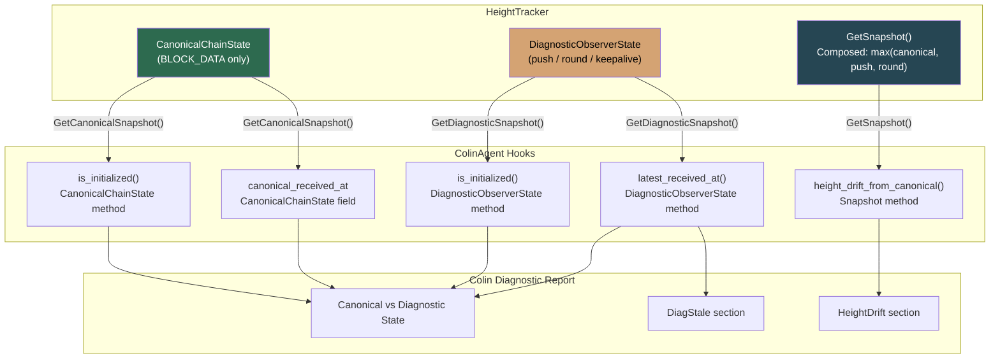
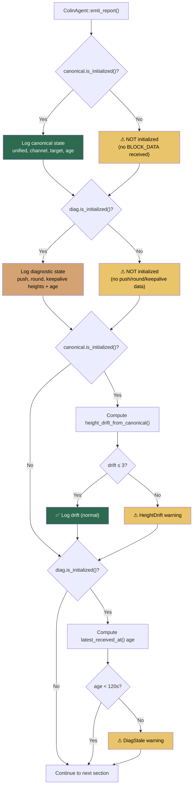
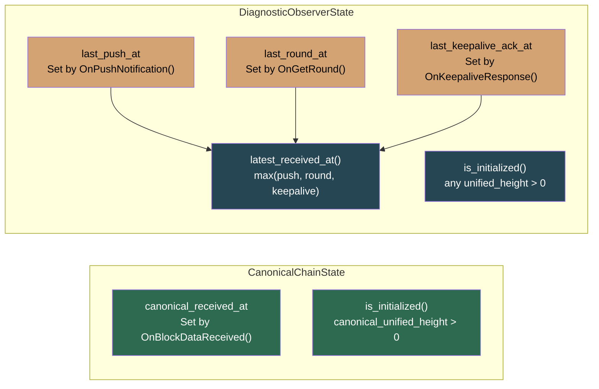

# Colin Agent — Canonical vs Diagnostic Integration

> **Reference diagram** for how `ColinAgent` uses the two-lane HeightTracker
> state (canonical + diagnostic) for intelligent diagnostics via
> `height_drift_from_canonical()`, `DiagnosticObserverState::is_initialized()`,
> and `DiagnosticObserverState::latest_received_at()`.

---

## 1. Colin Agent Data Sources



---

## 2. Three Colin Diagnostic Hooks

### `height_drift_from_canonical()` — Snapshot Method

Measures how far the composed snapshot heights (max of canonical, push, round)
have drifted from the canonical BLOCK_DATA path.

```
drift = unified_height − canonical_unified_height
```

| Drift | Meaning | Colin Action |
|-------|---------|--------------|
| 0 | Canonical caught up with push/round | ✅ Log info |
| +1 to +3 | Push/round slightly ahead — normal during BLOCK_DATA latency | ✅ Log info |
| > +3 | Push/round significantly ahead — BLOCK_DATA may be delayed | ⚠️ Warning + recommendation |
| < 0 | Anomaly — canonical ahead of composed snapshot | ⚠️ Warning (should not happen) |

### `DiagnosticObserverState::is_initialized()` — Struct Method

Returns `true` when any diagnostic data has been received (push, round, or keepalive).

```cpp
bool is_initialized() const {
    return push_unified_height > 0 || round_unified_height > 0 || keepalive_unified_height > 0;
}
```

Colin checks this to determine if diagnostic sources are feeding data:
- **Not initialized** → warn: "no push/round/keepalive data yet"
- **Initialized** → log diagnostic heights and latest timestamp

### `DiagnosticObserverState::latest_received_at()` — Struct Method

Returns the most recent timestamp across all diagnostic sources.
Diagnostic equivalent of `CanonicalChainState::canonical_received_at`.

```cpp
std::chrono::steady_clock::time_point latest_received_at() const {
    return std::max({last_push_at, last_round_at, last_keepalive_ack_at});
}
```

Colin checks this to detect all-source staleness:
- **< 120s** → fresh, no warning
- **≥ 120s** → all diagnostic sources have gone silent → warning

---

## 3. Colin Report Flow



---

## 4. Warning Catalog: New Static Methods

| Method | Threshold | Trigger |
|--------|-----------|---------|
| `check_canonical_drift(drift)` | drift > 3 | Canonical BLOCK_DATA path lagging behind push/round |
| `check_diagnostic_staleness(age_s)` | age ≥ 120s | All diagnostic sources (push/round/keepalive) have gone silent |

Both return empty string when healthy, non-empty warning string when triggered.

---

## 5. Timestamp Coverage



---

## 6. Related Documents

- [canonical-height-architecture.md](canonical-height-architecture.md) — Two-lane state isolation architecture
- [canonical-height-isolation-pr.md](../../archive/pr-summaries/canonical-height-isolation-pr.md) — Historical PR summary
- `src/colin_agent.hpp` — ColinAgent class definition
- `src/colin_agent.cpp` — ColinAgent implementation with diagnostic hooks
- `src/protocol/inc/protocol/height_tracker.hpp` — HeightTracker, CanonicalChainState, DiagnosticObserverState
