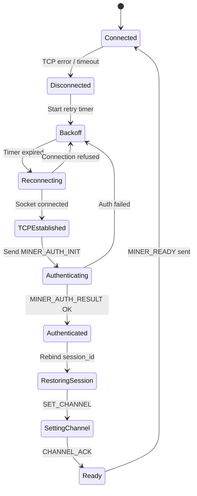
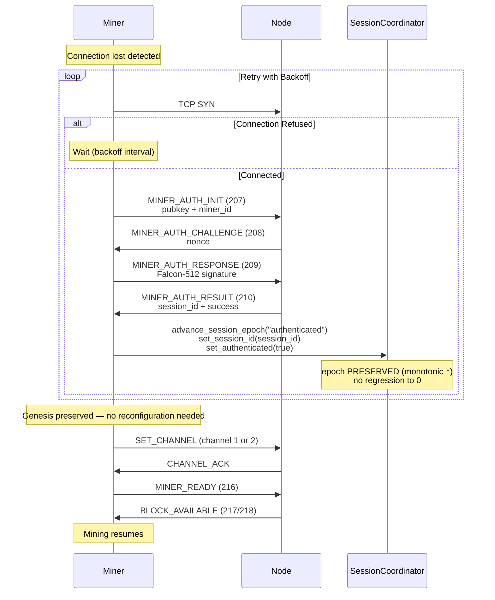

# Connection Recovery

Reconnection and resume logic when the network connection is lost.

## Reconnection Sequence

## Session Management Details

- **Keepalive interval:** Configurable (default ~30 seconds)
- **Session binding:** `session_id` ties miner to template interface
- **Genesis preservation:** Reconnection reuses genesis config (no reconfig needed)
- **State machine:** `DISCONNECTED → AUTHENTICATED` managed by `session_manager`
- **Encryption:** ChaCha20 derived from `SHA256(KDF_DOMAIN || genesis_hash)`
- **Epoch continuity:** `SessionCoordinator` holds `session_epoch` and `recovery_epoch` — both are monotonically increasing and are **never reset to 0** on disconnect/reconnect.  See [session-coordinator.md](../../current/miner/architecture/session-coordinator.md).
