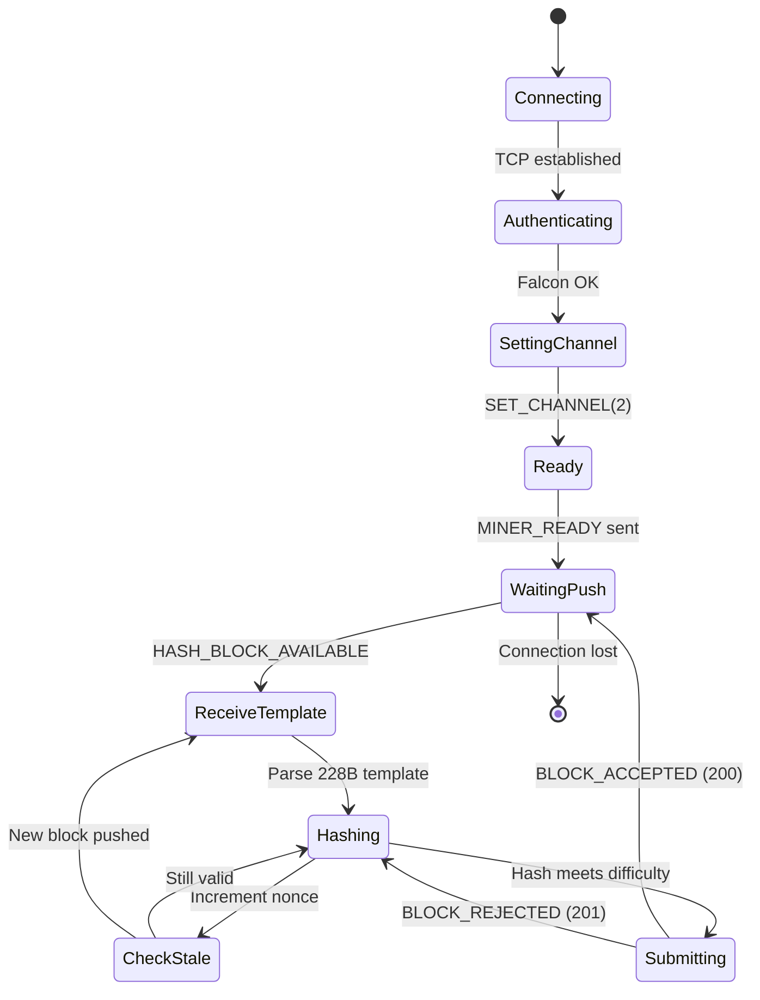
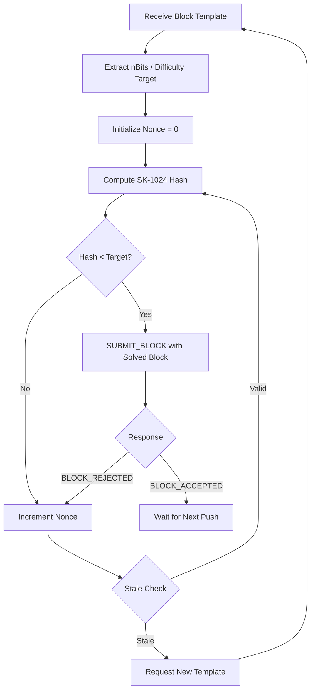

# Hash Mining Flow

State machine for the hash channel mining loop (SK-1024 proof-of-work).

## Hash Mining Inner Loop

## Key Details

- **Channel:** Hash (channel 2)
- **Push notification:** `HASH_BLOCK_AVAILABLE` (218)
- **Hashing algorithm:** SK-1024
- **GPU acceleration:** Supported via CUDA/OpenCL workers
- **Template format:** Same 228-byte structure as prime channel
