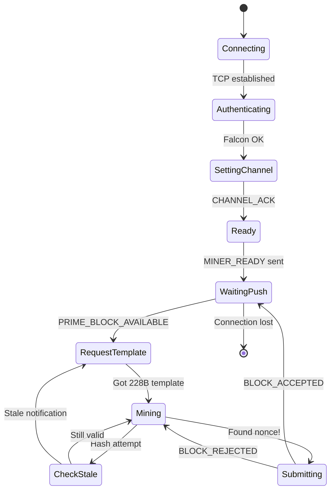
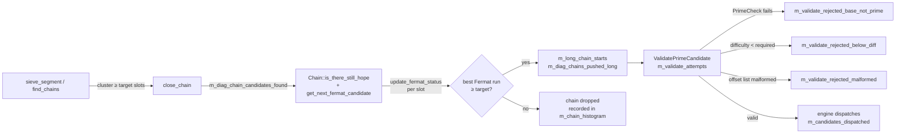
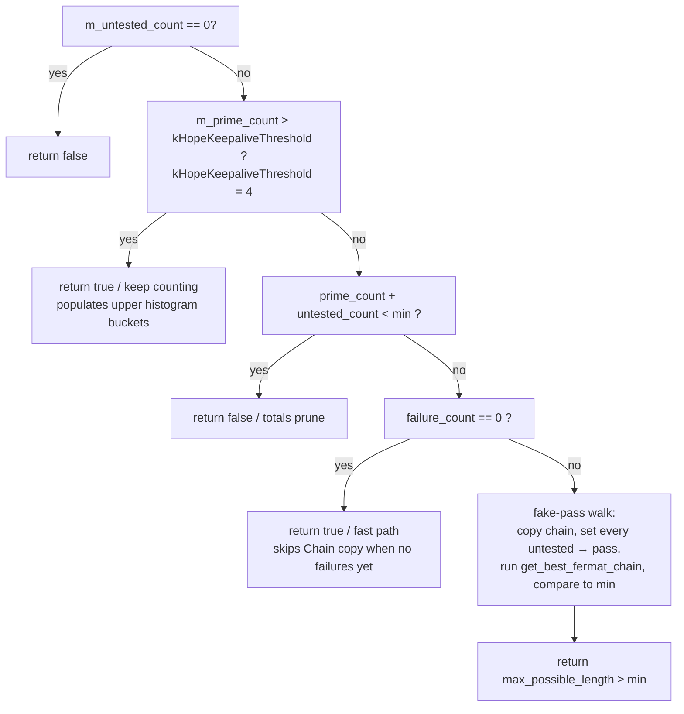

# Prime Mining Flow

State machine for the prime channel mining loop, from connection through block submission.



## Prime Mining Inner Loop

Detailed view of the sieve-based prime search within the `Mining` state.


## Key Details

- **Channel:** Prime (channel 1)
- **Template size:** 228 bytes (12-byte metadata + 216-byte Tritium block)
- **Opcodes:** `GET_BLOCK` (129 / 0xD081), `SUBMIT_BLOCK` (1 / 0xD001)
- **Push notifications:** `PRIME_BLOCK_AVAILABLE` (217) — sent on **any** channel block (universal PoW tip push)
- **Stale detection:** Two reasons trigger a template refresh:
  - `channel_advanced`: `channel_height >= channel_target` (own channel found block)
  - `tip_moved`: `unified_height > template_unified_height` (other channel found block — `hashPrevBlock` stale)
  - See [unified-tip-vs-channel-height.md](../../current/mining/unified-tip-vs-channel-height.md)

## Sieve → Fermat → Dispatch funnel (Stone 6.9)

The "Find Prime Chains" → "Fermat Primality Test" → "Submit" flow above is implemented inside `cpu::Sieve` and `cpu::PrimeMiningEngine`. There are four places the funnel can lose a candidate, each with its own metric:



### Target chain length wiring

`Sieve::m_target_chain_length` (default `mining::MIN_CHAIN_LENGTH = 8`) drives **three** filters that must all use the same value to avoid silent drops:

| Stage                        | Old behaviour (≤ Stone 6.8)          | Stone 6.9                                    | Stone 6.9.1                                                                                   |
| ---                          | ---                                  | ---                                          | ---                                                                                           |
| `Sieve::close_chain`         | `length() ≥ 8` (hard-coded)          | `length() ≥ m_target_chain_length`           | `length() ≥ slot_filter_min() == m_target_chain_length + kSlotFilterSlack (=1)`               |
| `Sieve::find_chains` (popcount skip) | `hits < 8` (hard-coded via `m_min_chain_length`) | `hits < m_target_chain_length` | `hits < slot_filter_min()` |
| `Chain::is_there_still_hope` | naïve `prime+untested ≥ 8` predicate | GPU-style: keepalive · totals · fake-pass walk | unchanged (still uses `m_min_chain_length == target_length` exactly) |
| `test_chains` / `clean_chains` push to `m_long_chain_starts` | `≥ m_min_chain_report_length` (= 4 on CPU, 5 on GPU) | `≥ m_target_chain_length` | unchanged |

> **Why slack=1 matters.** The slot filter (`close_chain`) and the Fermat-time predicate (`is_there_still_hope`) answer different questions: the sieve filter asks "how many *possible* primes does this cluster have?" while the Fermat predicate asks "how many *actual* primes do we need to dispatch?" If both share a single value `target_length`, then a length-target Fermat run requires every single slot to pass Fermat — at 1024-bit Fermat-pass probability ~0.14%, this is statistically impossible. `kSlotFilterSlack` is the explicit failure budget: with slack=1, Fermat is allowed to fail in 1 slot out of `target+1`, which empirically reproduces pre-Stone-6.9 throughput.

Engine mode sets the per-session value via `Sieve::prepare(start, target_length)` on every base-hash rebind:

```
target_length = max(2, ceil(session->nbits / 1e7))     // mirrors Worker_prime::getNetworkDifficulty()
sieve->prepare(base_hash + starting_nonce, target_length)
```

`Worker_prime` (legacy non-engine path) keeps the default of 8 unless it opts in via `set_target_length`.

### `Chain::is_there_still_hope` (CPU now mirrors GPU `cuda_chain.cu`)



The keepalive (B) is the single change that re-populates the chain histogram's bucket-6 / bucket-7 cells once the target reaches the same length. The fast path (D) is an allocation-free shortcut when the chain has not yet seen any failures (the chain is then still contiguous, so the totals upper bound is exact).

### Diagnostic histograms

- `Sieve::m_chain_histogram[k]` — count of chains whose **best Fermat run** reached length `k` (exactly).
- `Sieve::m_chain_histogram_attempted[k]` — count of chains that survived `close_chain` with **≥ k** sieve-survivor slots (cumulative tail). Bucket `k` is incremented for every chain whose slot count is `k` or greater, so a chain of length 8 bumps buckets 0..8.

The per-bucket survival probability operators care about is therefore

```
        Σ_{j≥k} m_chain_histogram[j]
P(k) = ───────────────────────────────
          m_chain_histogram_attempted[k]
```

i.e. "fraction of chains wide enough to possibly produce a length-`k` Fermat run that actually did". A `0/N` cell now means "N candidates entered with ≥k slots, all aborted before reaching length k", which is interpretable. A `0/0` cell still means "the sieve never produced a candidate that wide".

### Where to look in code

- `src/cpu/src/cpu/prime/chain_sieve.hpp` — `Sieve::set_target_length` / `prepare(start, target)`, `Sieve::kSlotFilterSlack` / `slot_filter_min()`, `Chain::kHopeKeepaliveThreshold`, the two histograms.
- `src/cpu/src/cpu/prime/chain_sieve.cpp` — `Chain::is_there_still_hope` (lines ~84–160), `Sieve::close_chain` / `open_chain` (target propagation), `Sieve::find_chains` (popcount-window skip using `slot_filter_min()`), `Sieve::test_chains` / `clean_chains` (target gate).
- `src/cpu/src/cpu/prime/prime_mining_engine.cpp` — `run_pool_thread` derives `target_length` from `session->nbits`; the dispatch loop disambiguates `ValidatePrimeCandidate` rejection reasons; `run_stats_logger` emits the second `[PrimeMiningEngine] funnel: ...` info line every 30 s.
- `src/cpu/chain_sieve_test.cpp` — unit tests pinning `set_target_length` clamping and the four `is_there_still_hope` decision branches.
