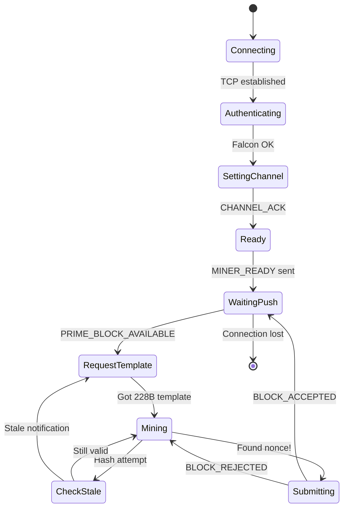
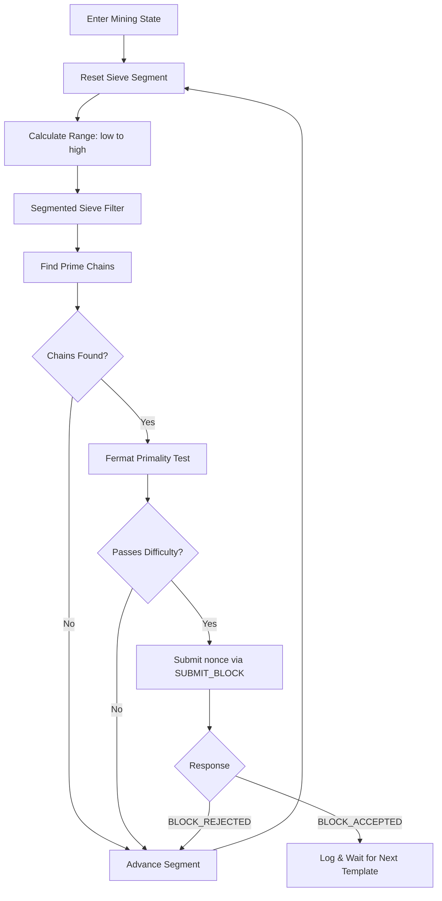

# Prime Mining Flow

State machine for the prime channel mining loop, from connection through block submission.

## Prime Mining Inner Loop

Detailed view of the sieve-based prime search within the `Mining` state.

> **Canonical submit:** The miner submits only `hashMerkleRoot` + `nNonce` (216 bytes).
> Prime `vOffsets` (Cunningham chain offsets) are computed locally for worker validation
> but are **not** included in the canonical wire payload. The node validates the prime
> cluster server-side. See [prime-submission-alignment.md](../../architecture/prime-submission-alignment.md).

## Key Details

- **Channel:** Prime (channel 1)
- **Template size:** 228 bytes (12-byte metadata + 216-byte Tritium block)
- **Submit payload:** 216 bytes (nonce-only canonical — same as Hash channel)
- **Opcodes:** `GET_BLOCK` (129 / 0xD081), `SUBMIT_BLOCK` (1 / 0xD001)
- **Push notifications:** `PRIME_BLOCK_AVAILABLE` (217) — sent on **any** channel block (universal PoW tip push)
- **Stale detection:** Two reasons trigger a template refresh:
  - `channel_advanced`: `channel_height >= channel_target` (own channel found block)
  - `tip_moved`: `unified_height > template_unified_height` (other channel found block — `hashPrevBlock` stale)
  - See [unified-tip-vs-channel-height.md](../../current/mining/unified-tip-vs-channel-height.md)
