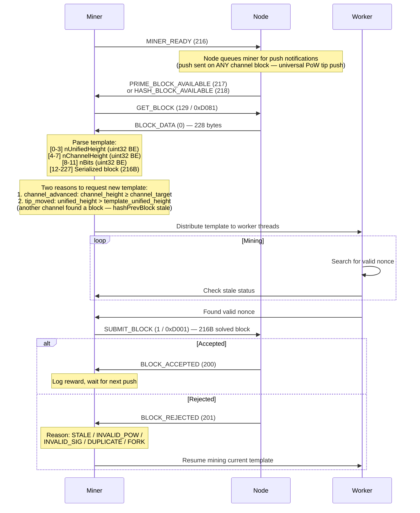
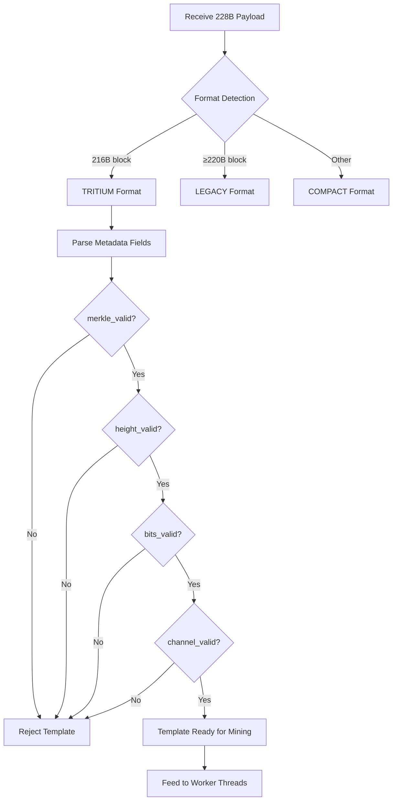

# Template Lifecycle

From `GET_BLOCK` request to block submission and acceptance.

## Template Validation

## Key Fields

| Offset | Size | Field | Encoding |
|--------|------|-------|----------|
| 0–3 | 4 bytes | nUnifiedHeight | uint32 big-endian |
| 4–7 | 4 bytes | nChannelHeight | uint32 big-endian |
| 8–11 | 4 bytes | nBits (difficulty) | uint32 big-endian |
| 12–227 | 216 bytes | Serialized block | Tritium format |
