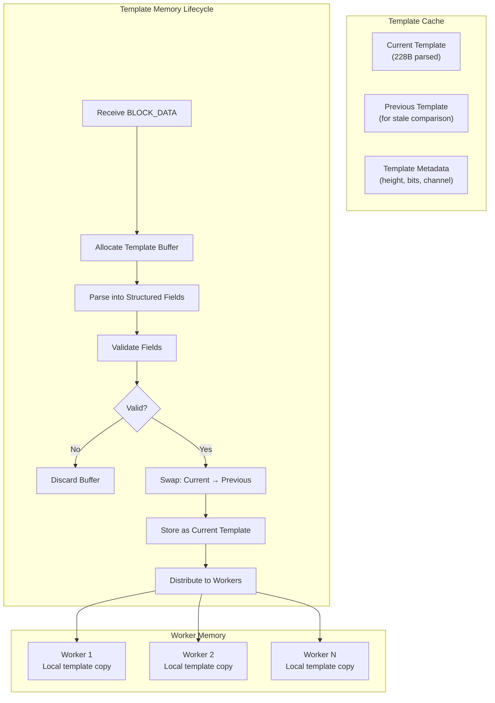
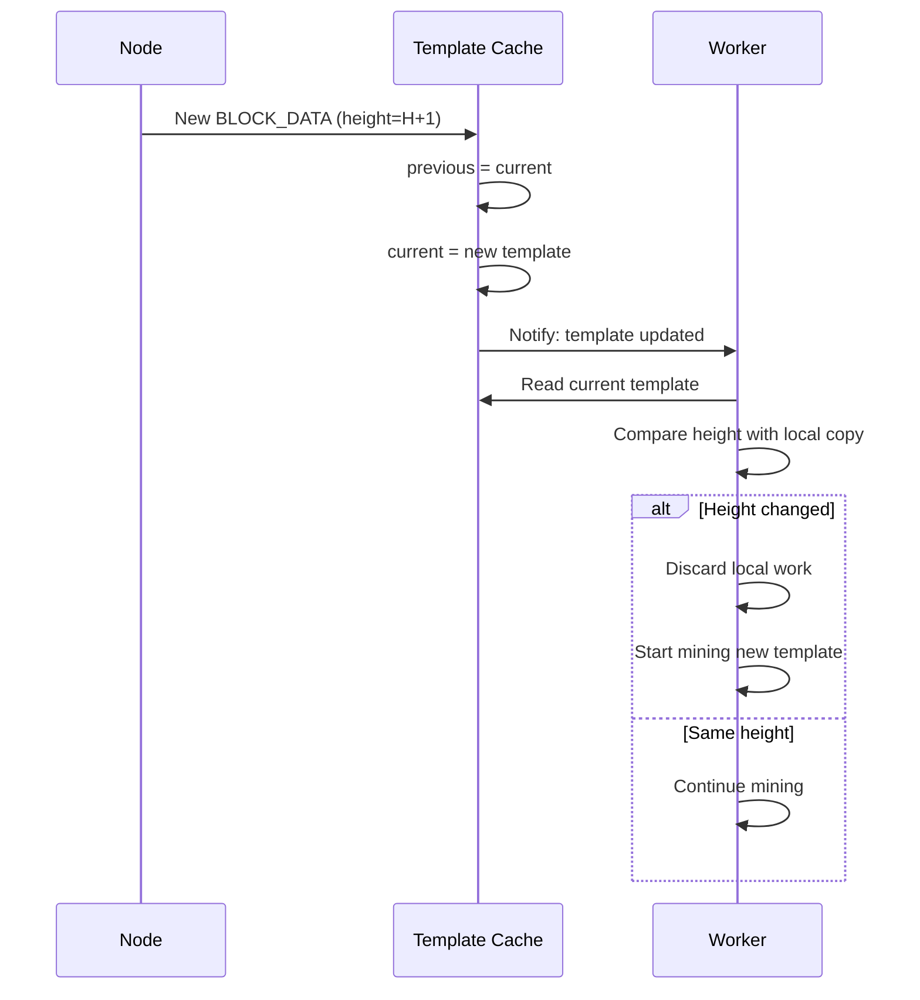

# Memory Management

Block template caching and memory lifecycle in NexusMiner.

## Stale Detection Memory Flow

## Key Memory Considerations

- **Template size:** 228 bytes per template (lightweight)
- **Worker copies:** Each worker thread holds a local copy to avoid lock contention
- **Swap strategy:** Previous template retained for stale comparison only
- **Session data:** `session_id` and Falcon keys held for connection lifetime
- **ChaCha20 state:** Encryption context derived once per session, reused
