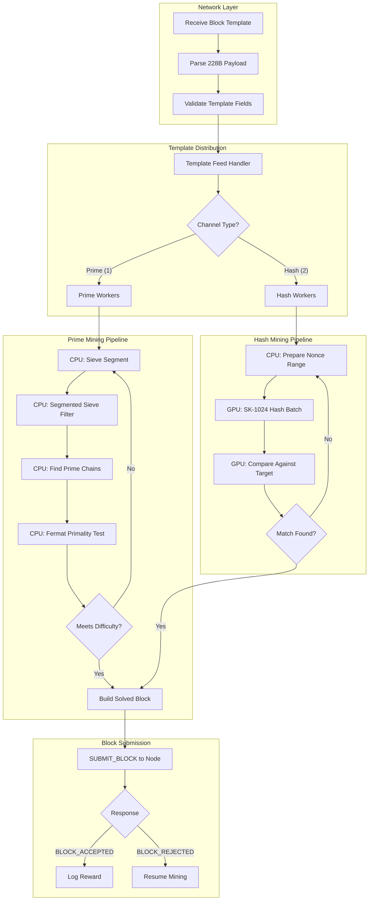
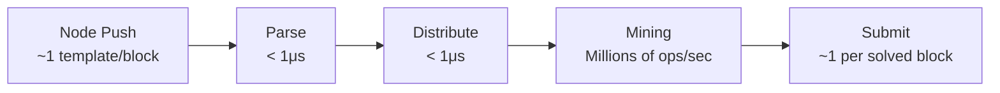

# Mining Pipeline

CPU → GPU → Validation flow for NexusMiner processing.

## Data Flow Rates

## Pipeline Bottlenecks

| Stage | Prime Channel | Hash Channel |
|-------|--------------|--------------|
| Template Parse | Negligible | Negligible |
| Sieve/Hash Setup | ~1ms | ~0.1ms |
| Core Computation | Sieve + Fermat (CPU bound) | SK-1024 (GPU bound) |
| Submission | Network latency | Network latency |
| **Bottleneck** | **CPU primality testing** | **GPU hash throughput** |
