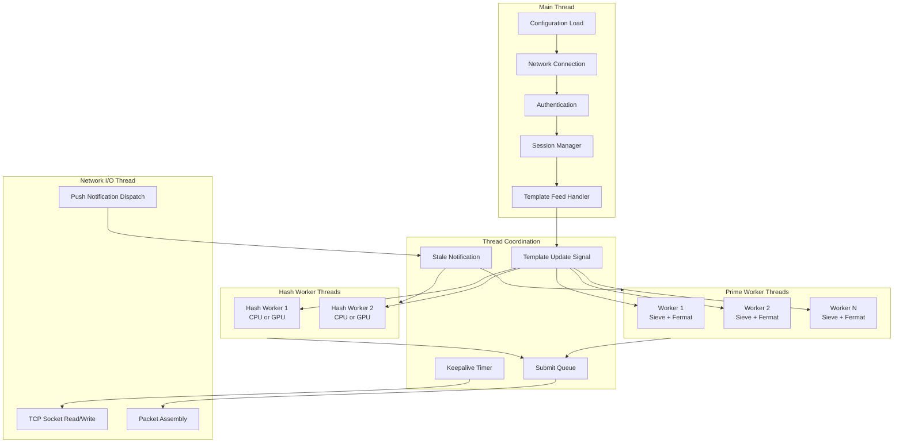
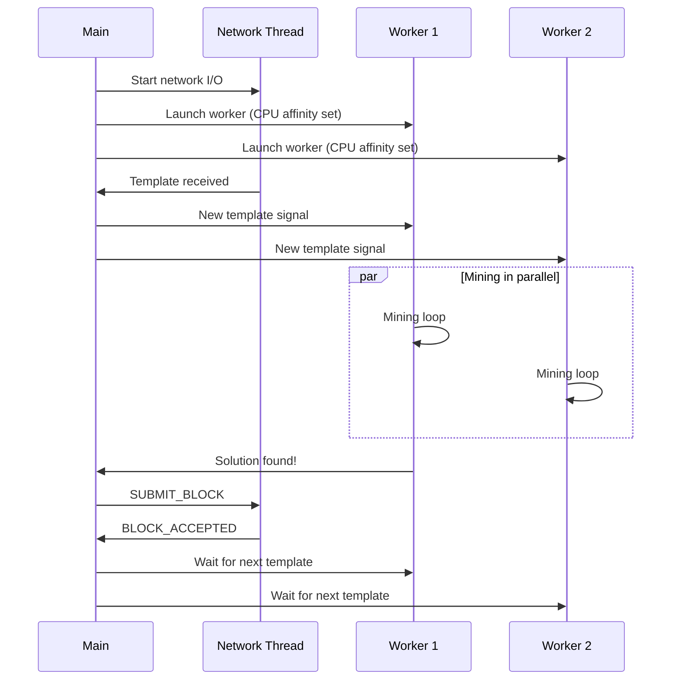

# Thread Architecture

Worker thread coordination in NexusMiner.

## Thread Lifecycle

## CPU Affinity & Threading Details

- **CPU affinity:** Workers can be pinned to specific cores
- **Hyper-threading:** E-core and HT thread filtering supported
- **Thread priority:** Mining workers run at elevated priority
- **Single-thread mode:** Prime mining can fall back to single-thread for debugging
- **GPU workers:** Hash workers can offload to CUDA/OpenCL devices
