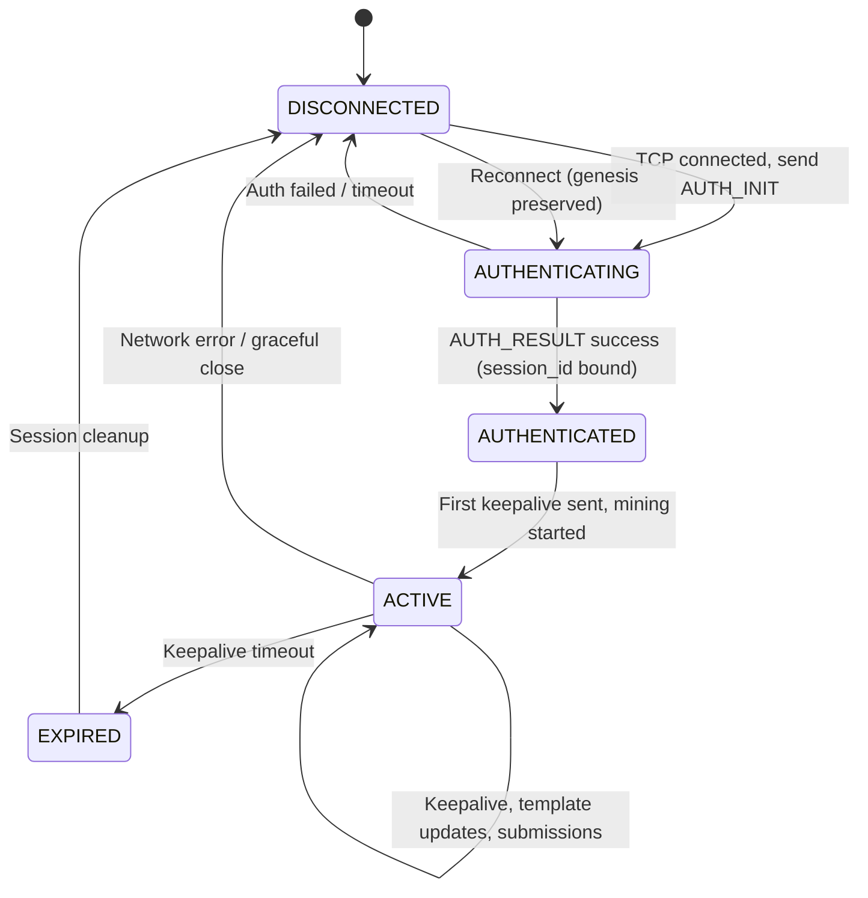

# Full Connection Flow

Complete sequence diagram covering the entire miner lifecycle: connect → authenticate → mine → disconnect.

## End-to-End Connection Lifecycle

```mermaid
sequenceDiagram
    participant Miner
    participant Node
    participant Workers as Worker Threads

    rect rgb(200, 220, 255)
    Note over Miner,Node: Phase 1: TCP Connection
    Miner->>Node: TCP SYN
    Node->>Miner: TCP SYN-ACK
    Miner->>Node: TCP ACK
    Note over Miner: Socket established
    end

    rect rgb(230, 240, 255)
    Note over Miner,Node: Phase 2: Falcon Authentication
    Miner->>Node: MINER_AUTH_INIT (207 / 0xD0CF)<br/>[genesis_hash(32B)][pubkey_len(2B)][pubkey(897B)][miner_id_len(2B)][miner_id]
    Node->>Miner: MINER_AUTH_CHALLENGE (208 / 0xD0D0)<br/>[nonce_len(2B, BE)][nonce(32B)]
    Note over Miner: Sign nonce with Falcon-512 private key
    Miner->>Node: MINER_AUTH_RESPONSE (209 / 0xD0D1)<br/>[sig_len(2B, LE)][signature(~690B)]
    Node->>Miner: MINER_AUTH_RESULT (210 / 0xD0D2)<br/>[status(1B)][session_id(4B, LE)]
    Note over Miner: SessionManager.start_session()<br/>State: DISCONNECTED → AUTHENTICATED
    end

    rect rgb(255, 245, 220)
    Note over Miner,Node: Phase 3: Channel Setup & Reward Binding
    opt Reward address configured
        Miner->>Node: MINER_SET_REWARD (213)<br/>[ChaCha20-encrypted reward address]
        Node->>Miner: MINER_REWARD_RESULT (214)<br/>[status(1B): 0x01=success]
    end
    Miner->>Node: SET_CHANNEL<br/>[channel_id: 1=Prime, 2=Hash]
    Node->>Miner: CHANNEL_ACK
    end

    rect rgb(220, 255, 220)
    Note over Miner,Node: Phase 4: Mining Ready & Template Push
    Miner->>Node: MINER_READY (216 / 0xD0D8)
    Note over Node: Subscribe miner to push notifications
    Node->>Miner: PRIME_BLOCK_AVAILABLE (217) or<br/>HASH_BLOCK_AVAILABLE (218)
    Miner->>Node: GET_BLOCK (129 / 0xD081)
    Node->>Miner: BLOCK_DATA (0)<br/>[228B: height(4B) + channel_height(4B) + bits(4B) + block(216B)]
    Miner->>Workers: Distribute template to worker threads
    Note over Miner: State: AUTHENTICATED → ACTIVE<br/>(after first keepalive)
    end

    rect rgb(240, 255, 240)
    Note over Miner,Workers: Phase 5: Mining Loop
    loop Mining
        par Parallel operations
            Workers->>Workers: Search for valid nonce
        and Keepalive
            Miner->>Node: SESSION_KEEPALIVE (~30s interval)
        and Stale check
            Node->>Miner: BLOCK_AVAILABLE (new block pushed)
            Miner->>Node: GET_BLOCK
            Node->>Miner: BLOCK_DATA (new template)
            Miner->>Workers: Update template (stale old work)
        end
    end
    end

    rect rgb(255, 240, 220)
    Note over Miner,Node: Phase 6: Block Submission
    Workers->>Miner: Solution found!
    Miner->>Node: SUBMIT_BLOCK (1 / 0xD001)<br/>[216B solved block]
    alt Accepted
        Node->>Miner: BLOCK_ACCEPTED (200)
        Note over Miner: Log reward, continue mining
    else Rejected
        Node->>Miner: BLOCK_REJECTED (201)<br/>Reason: STALE / INVALID_POW / DUPLICATE
        Note over Miner: Resume mining current template
    end
    end

    rect rgb(255, 220, 220)
    Note over Miner,Node: Phase 7: Disconnect & Cleanup
    alt Graceful shutdown
        Miner->>Node: Connection close
        Note over Miner: SessionManager.end_session()<br/>Stop keepalive timer<br/>Clear session_id & session_key<br/>PRESERVE genesis (for reconnect)
    else Network error
        Note over Miner,Node: TCP connection lost
        Note over Miner: Detect via connection callback<br/>connection→close(), m_connection = nullptr
    else Protocol mismatch
        Note over Miner: Lane mismatch detected<br/>connection→close()
    end
    Note over Miner: State: → DISCONNECTED<br/>Genesis preserved for reconnection
    end
```

## Session State Machine

## Lifecycle Timing

| Phase | Duration | Notes |
|-------|----------|-------|
| TCP Connect | ~1-100ms | Network dependent |
| Falcon Auth | ~10-50ms | Signature generation + verification |
| Channel Setup | ~5-20ms | Includes optional reward binding |
| First Template | ~1-10ms | Push notification + GET_BLOCK |
| Mining Loop | Minutes to hours | Until block found or disconnect |
| Keepalive | Every ~30s | Configurable (1-168 hours max session) |
| Submission | ~1-10ms | Network round-trip |
| Reconnection | ~100ms-10s | Backoff on repeated failures |
