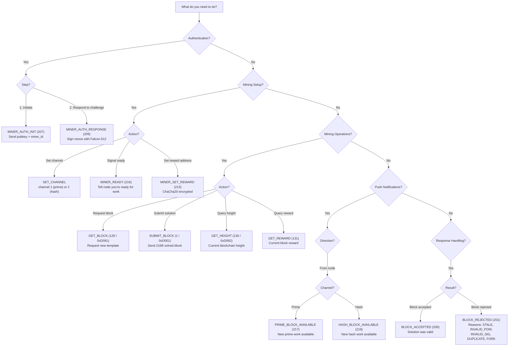

# Opcode Decision Tree

Which opcode to use in each situation.

## Opcode Reference Table

| Opcode | Value | Direction | Description |
|--------|-------|-----------|-------------|
| BLOCK_DATA | 0 | Node→Miner | Block template payload |
| SUBMIT_BLOCK | 1 | Miner→Node | Submit solved block |
| SET_CHANNEL | — | Miner→Node | Select prime (1) or hash (2) |
| GET_BLOCK | 129 | Miner→Node | Request block template |
| GET_HEIGHT | 130 | Miner→Node | Query blockchain height |
| GET_REWARD | 131 | Miner→Node | Query block reward |
| GET_ROUND | 133 | Miner→Node | Query current round |
| BLOCK_ACCEPTED | 200 | Node→Miner | Submission accepted |
| BLOCK_REJECTED | 201 | Node→Miner | Submission rejected |
| MINER_AUTH_INIT | 207 | Miner→Node | Start authentication |
| MINER_AUTH_CHALLENGE | 208 | Node→Miner | Auth challenge nonce |
| MINER_AUTH_RESPONSE | 209 | Miner→Node | Signed challenge |
| MINER_AUTH_RESULT | 210 | Node→Miner | Auth result + session_id |
| MINER_SET_REWARD | 213 | Miner→Node | Set reward address |
| MINER_REWARD_RESULT | 214 | Node→Miner | Reward binding result |
| MINER_READY | 216 | Miner→Node | Ready for push notifications |
| PRIME_BLOCK_AVAILABLE | 217 | Node→Miner | New prime block available |
| HASH_BLOCK_AVAILABLE | 218 | Node→Miner | New hash block available |
