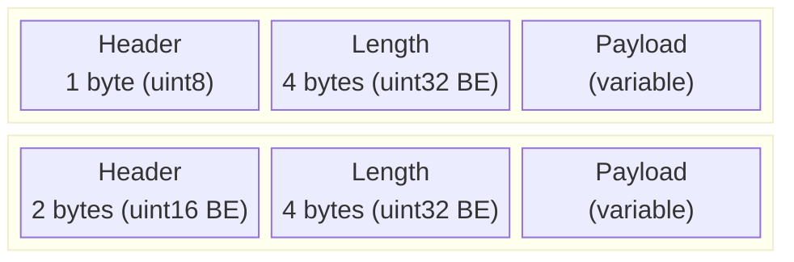
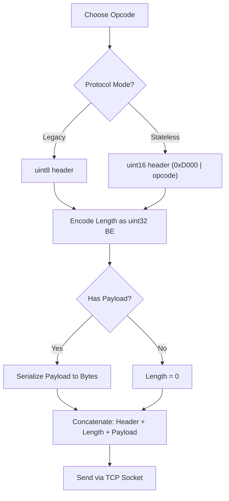
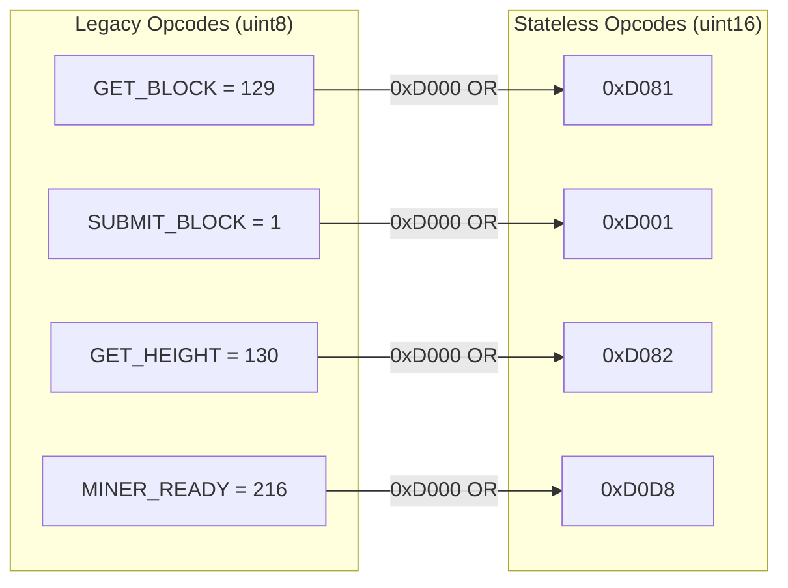

# Packet Assembly

How miners construct LLP (Lower Level Protocol) packets for Nexus communication.

## Packet Structure



## Assembly Flow



## Opcode Mapping (Legacy → Stateless)



## Example: Constructing a GET_BLOCK Packet

```
Legacy:       [0x81]                [0x00 0x00 0x00 0x00]
               ^header (129)         ^length (0, no payload)

Stateless:    [0xD0 0x81]           [0x00 0x00 0x00 0x00]
               ^header (0xD081)      ^length (0, no payload)
```

## Example: Constructing a SUBMIT_BLOCK Packet

```
Legacy:       [0x01]                [0x00 0x00 0x00 0xD8]  [216 bytes of solved block]
               ^header (1)           ^length (216)           ^payload

Stateless:    [0xD0 0x01]           [0x00 0x00 0x00 0xD8]  [216 bytes of solved block]
               ^header (0xD001)      ^length (216)           ^payload
```
