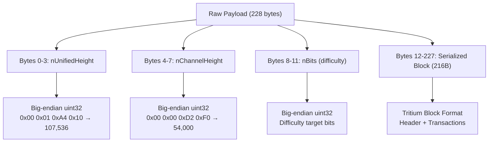
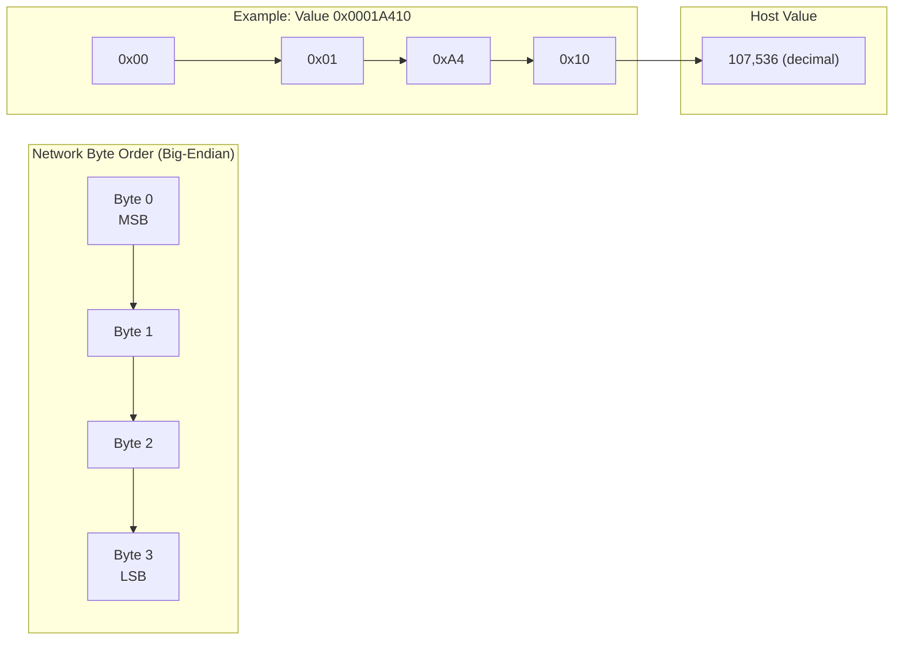
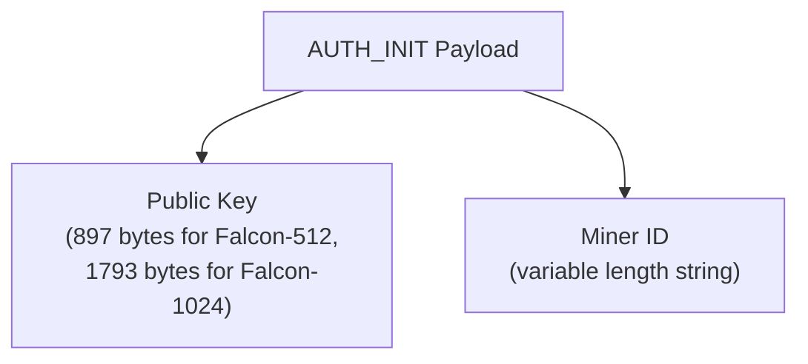
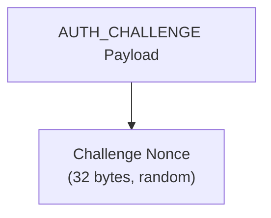
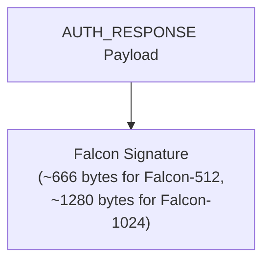
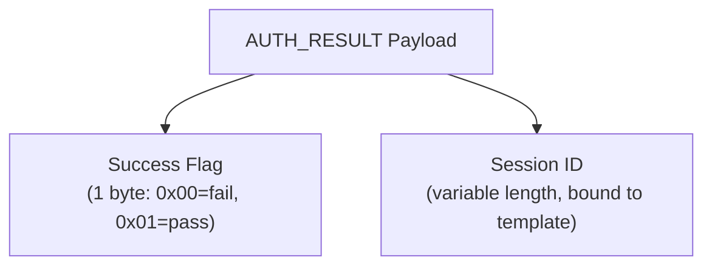
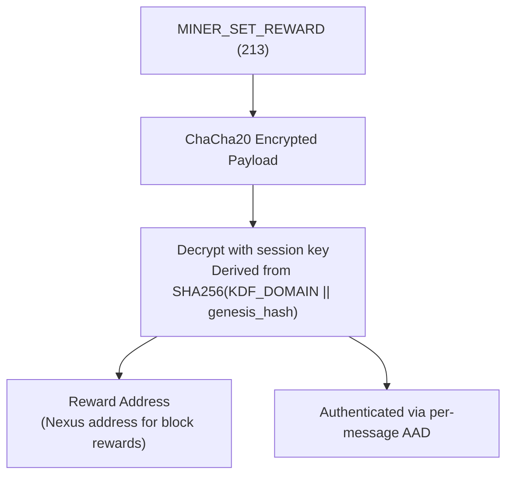

# Payload Parsing

Big-endian parsing visualization for NexusMiner protocol payloads.

## Block Template Parsing (228 bytes)



## Big-Endian Byte Order



## Authentication Payload Parsing

### MINER_AUTH_INIT (207) — Miner → Node



### MINER_AUTH_CHALLENGE (208) — Node → Miner



### MINER_AUTH_RESPONSE (209) — Miner → Node



### MINER_AUTH_RESULT (210) — Node → Miner



## Stateless Opcode Header Parsing

```
Received header bytes: [0xD0] [0x81]

Step 1: Combine to uint16 big-endian → 0xD081
Step 2: Check prefix: 0xD081 & 0xF000 == 0xD000 → Stateless protocol
Step 3: Extract opcode: 0xD081 & 0x0FFF == 0x0081 == 129 → GET_BLOCK
```

## Reward Binding Payload (ChaCha20 Encrypted)


