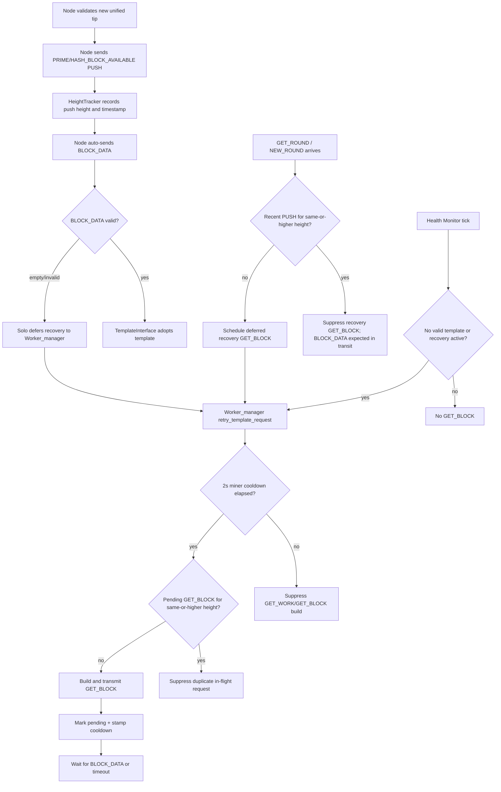

# PUSH, GET_BLOCK, and Health Monitor Cooldown Flow

This diagram shows how template refresh signals interact after the miner-side
2-second GET_BLOCK/GET_WORK cooldown.

## Rules

- PUSH is authoritative liveness; after PUSH the node is expected to auto-send
  `BLOCK_DATA`.
- `NEW_ROUND` does not send GET_BLOCK when a recent same-or-higher PUSH means
  `BLOCK_DATA` is already in transit.
- Empty/malformed template packets do not recursively send GET_BLOCK from packet
  ingress; they defer to Worker_manager recovery.
- Worker_manager and Solo both respect the 2-second miner cooldown before a new
  GET_BLOCK/GET_WORK request can be transmitted.
- `HEALTH_NO_TEMPLATE` bypasses height dedup only; it does not bypass cooldown or
  pending/in-flight suppression.

