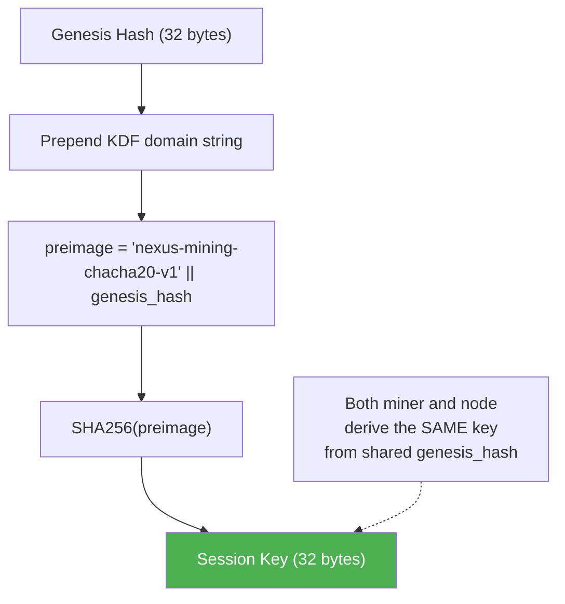
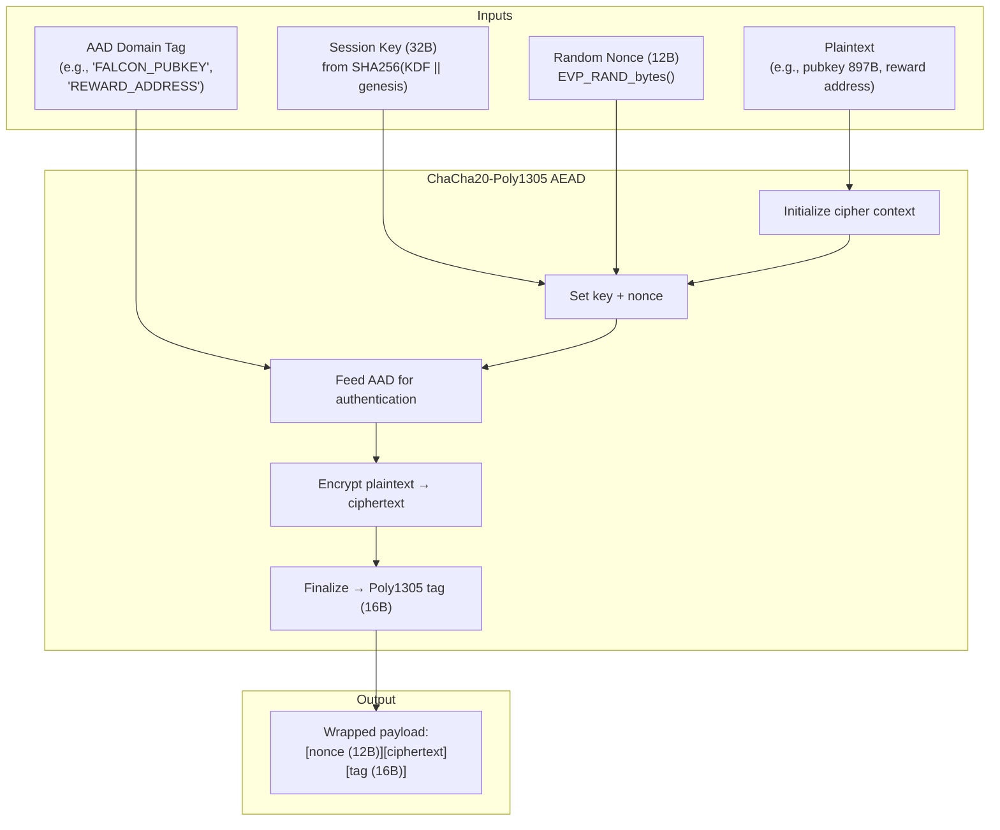
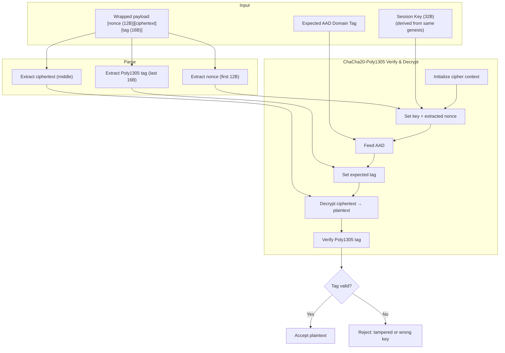
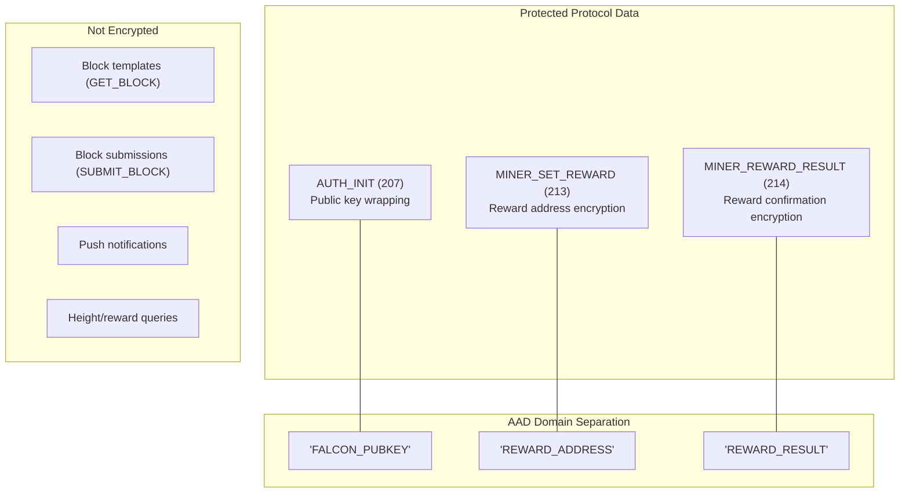

# ChaCha20 Encryption Flow

ChaCha20-Poly1305 authenticated encryption used in NexusMiner for protecting sensitive protocol data.

## Key Derivation

## Encryption Flow (Encrypt)

## Decryption Flow (Decrypt)

## Where ChaCha20 Is Used

## Wrapped Payload Size Calculations

| Data | Plaintext | + Nonce (12B) | + Tag (16B) | Wrapped Total |
|------|-----------|---------------|-------------|---------------|
| Falcon-512 pubkey | 897 bytes | 909 bytes | 925 bytes | **925 bytes** |
| Falcon-1024 pubkey | 1793 bytes | 1805 bytes | 1821 bytes | **1821 bytes** |
| Reward address | variable | +12 bytes | +16 bytes | **+28 bytes** |

## Security Properties

- **RFC 8439 compliant:** ChaCha20-Poly1305 AEAD construction
- **Fresh nonce per operation:** 12-byte random nonce via `EVP_RAND_bytes()` prevents ciphertext reuse
- **Deterministic key derivation:** Both parties derive the same key from shared genesis hash
- **Domain separation via AAD:** Different AAD tags prevent cross-context decryption
- **Integrity protection:** Poly1305 tag detects any tampering with ciphertext or AAD
