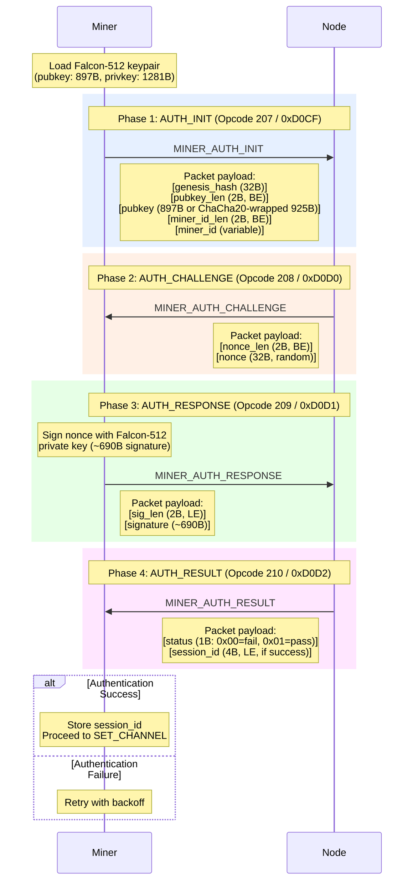
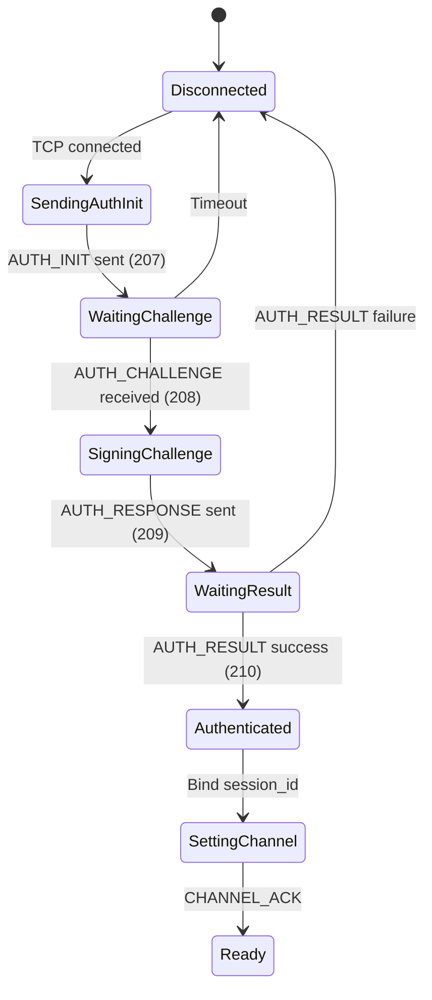
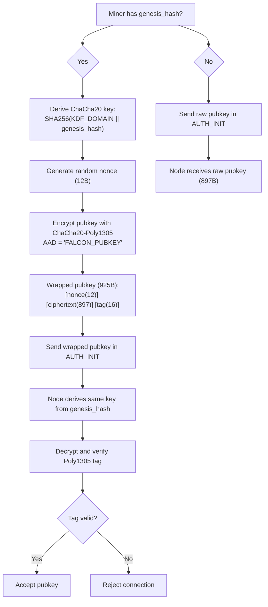
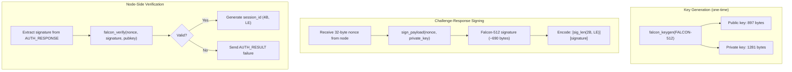

# Falcon Handshake Detail

Complete Falcon-512/1024 authentication handshake between miner and node.

## Full Handshake Sequence

## Handshake State Machine

## Genesis-First Public Key Protection

When a genesis hash is available, the public key is wrapped with ChaCha20 before transmission.

## Falcon Signature Details

## Key Sizes Reference

| Component | Falcon-512 | Falcon-1024 |
|-----------|-----------|------------|
| Public key | 897 bytes | 1793 bytes |
| Private key | 1281 bytes | 2305 bytes |
| Signature | ~690 bytes | ~1280 bytes |
| Wrapped pubkey | 925 bytes | 1821 bytes |
| Security level | NIST Level I | NIST Level V |
