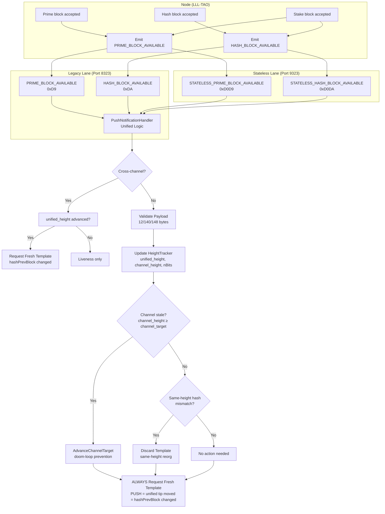

# NexusMiner Push Notification Architecture

## Universal Push Flow (PR #164+, unified-height-driven model)

The node emits `PRIME_BLOCK_AVAILABLE` / `HASH_BLOCK_AVAILABLE` whenever **any**
channel advances the unified tip — not only when the miner's own channel mines.
Every PUSH means the unified tip moved, which changes `hashPrevBlock`, so the
miner **always** requests a fresh template.



### Key Principle: Unified-Height-Driven Model

Every PUSH from the node signifies a unified tip advance.  Every unified height
movement changes `hashPrevBlock`, so the mining template **must** be refreshed.
Channel heights are tracked informationally (doom-loop prevention, diagnostics)
but do **not** drive the template refresh decision.

Same-height dedup is unified-height-only via `GetBlockDedupGuard`.  The 100ms
rapid-burst guard prevents two identical pushes from racing.

## Payload Format

**12-byte compact (legacy):**
```
[0–3]   unified_height  — best-tip height across ALL channels
[4–7]   channel_height  — miner's own channel height
[8–11]  nBits           — compact difficulty target
```

**148-byte v2 (full-picture, preferred):**
```
[0–3]   unified_height
[4–7]   channel_height (own channel)
[8–11]  nBits (difficulty)
[12–15] other_channel_height (other PoW channel)
[16–19] stake_height
[20–147] hashBestChain (uint1024_t, 128 bytes LE)
```

See [unified-tip-vs-channel-height.md](../current/mining/unified-tip-vs-channel-height.md)
for full definitions of `unified_height`, `channel_height`, `channel_target`.
