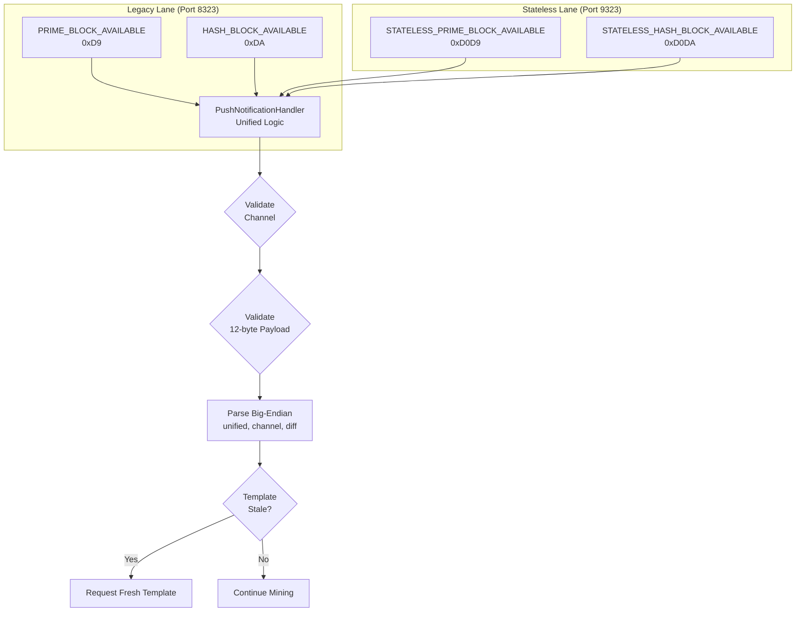

# NexusMiner Push Notification Architecture

## Unified Handler Design (PR #123)

```mermaid
graph TB
    subgraph "Legacy Lane (Port 8323)"
        L1[PRIME_BLOCK_AVAILABLE<br/>0xD9] --> UH
        L2[HASH_BLOCK_AVAILABLE<br/>0xDA] --> UH
    end
    
    subgraph "Stateless Lane (Port 9323)"
        S1[STATELESS_PRIME_BLOCK_AVAILABLE<br/>0xD0D9] --> UH
        S2[STATELESS_HASH_BLOCK_AVAILABLE<br/>0xD0DA] --> UH
    end
    
    UH[PushNotificationHandler<br/>Unified Logic] --> V1{Validate<br/>Channel}
    V1 --> V2{Validate<br/>12-byte Payload}
    V2 --> P[Parse Big-Endian<br/>unified, channel, diff]
    P --> C{Template<br/>Stale?}
    C -->|Yes| R[Request Fresh Template]
    C -->|No| M[Continue Mining]
```
