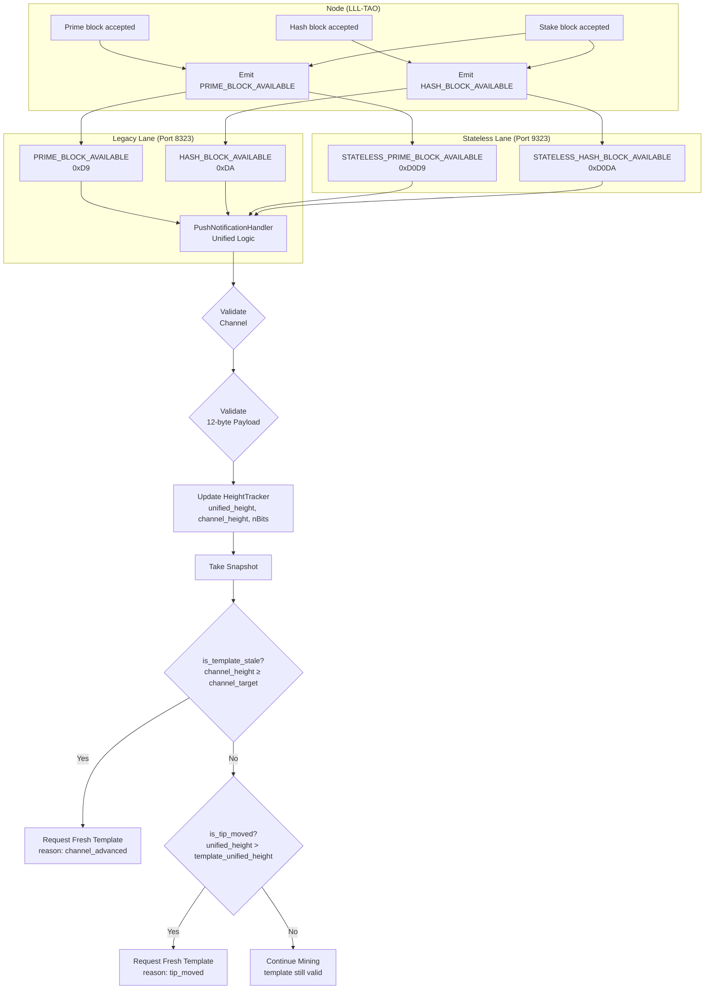

# NexusMiner Push Notification Architecture

## Universal Push Flow (PR #164+)

The node emits `PRIME_BLOCK_AVAILABLE` / `HASH_BLOCK_AVAILABLE` whenever **any**
channel advances the unified tip — not only when the miner's own channel mines.
This ensures miners always refresh their template's `hashPrevBlock` anchor.



## Payload Format (12 bytes BE)

```
[0–3]   unified_height  — best-tip height across ALL channels
[4–7]   channel_height  — miner's own channel height
[8–11]  nBits           — compact difficulty target
```

See [unified-tip-vs-channel-height.md](../current/mining/unified-tip-vs-channel-height.md)
for full definitions of `unified_height`, `channel_height`, `channel_target`, and
the two refresh reasons (`channel_advanced` vs `tip_moved`).
