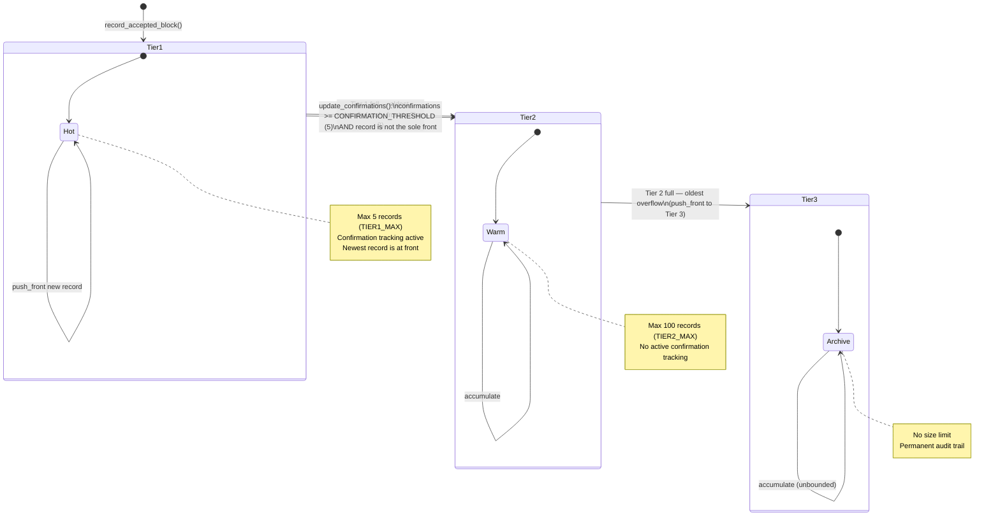
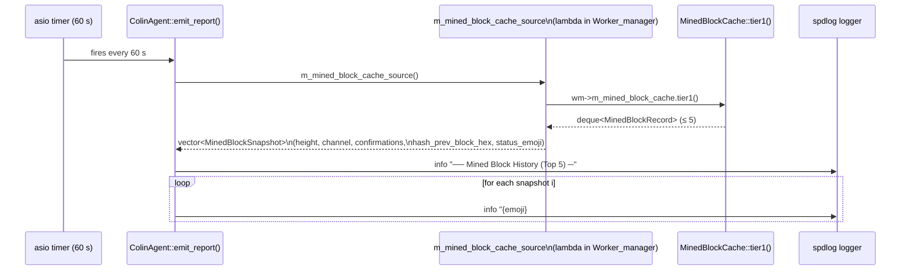
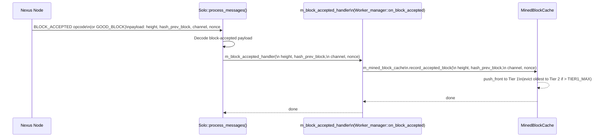

# Worker-Feed Dedup Guard + MinedBlockCache — Architecture Diagrams

This document contains five Mermaid diagrams describing the defense layers introduced by
PR #263 ("Add worker-feed dedup guard + mutex-based recovery gate as defense-in-depth").

---

## Diagram 1 — Worker-Feed Dedup Flowchart

Decision path from template notification arrival to worker restart.

```mermaid
flowchart TD
    A([SendChannelNotification / set_block_handler callback]) --> B[Extract block.nHeight\nand block.hashPrevBlock]
    B --> C[Build dedup key:\nheight == m_last_worker_feed_height\nAND hashPrevBlock == m_last_worker_feed_prev_hash]
    C --> D{same_template?}
    D -- No --> G[Update m_last_worker_feed_tp\nm_last_worker_feed_height\nm_last_worker_feed_prev_hash]
    D -- Yes --> E[Compute ms_since_last\n= now − m_last_worker_feed_tp]
    E --> F{ms_since_last\n< DEBOUNCE_MS\n(2 000 ms)?}
    F -- Yes --> H([⏱ Early-return — duplicate suppressed\nWorkers NOT restarted])
    F -- No --> G
    G --> I[update_confirmations on MinedBlockCache]
    I --> J[Distribute template to all workers]
    J --> K([Workers restart sieve / GPU loop])
```

---

## Diagram 2 — MinedBlockCache Three-Tier State Machine

State transitions for `record_accepted_block()` and `update_confirmations()`.



---

## Diagram 3 — Colin Diagnostic Report Pipeline

How the MinedBlockCache feeds the Colin 60-second diagnostic report.



---

## Diagram 4 — BLOCK_ACCEPTED / GOOD_BLOCK → Cache Record Flow

End-to-end path from node acknowledgement to MinedBlockCache.



---

## Diagram 5 — End-to-End Defense-in-Depth Stack

Layered architecture showing all four defense layers stacked vertically.

```mermaid
flowchart TB
    subgraph L4["Layer 4 — Node sends dual push (race source)"]
        N1[SendChannelNotification — primary lane]
        N2[GET_BLOCK response — secondary lane]
    end

    subgraph L3["Layer 3 — Worker-feed dedup guard (miner side)"]
        D[Dedup check: same height + hashPrevBlock\nwithin 2 000 ms debounce window]
        D -- duplicate --> DROP([⏱ Suppressed — workers NOT restarted])
        D -- unique / fork / expired --> PASS([✔ Passed through to workers])
    end

    subgraph L2["Layer 2 — Mutex-based recovery gate (m_recovery_mutex)"]
        M[std::mutex m_recovery_mutex\nSerialises create_workers + stop_all_workers]
        M -- blocked --> WAIT([⏳ Second thread waits])
        M -- acquired --> EXEC([✔ Single recovery executes])
    end

    subgraph L1["Layer 1 — MinedBlockCache (post-acceptance audit)"]
        C[record_accepted_block() → Tier 1 hot\nupdate_confirmations() on each template\nEviction: Tier 1 → Tier 2 → Tier 3]
    end

    subgraph L0["Layer 0 — Colin diagnostic report (operator visibility)"]
        R[emit_report() every 60 s\nLogs Mined Block History Top 5\nwith height, channel, confirmations, emoji]
    end

    N1 --> D
    N2 --> D
    PASS --> M
    EXEC --> C
    C --> R
```
