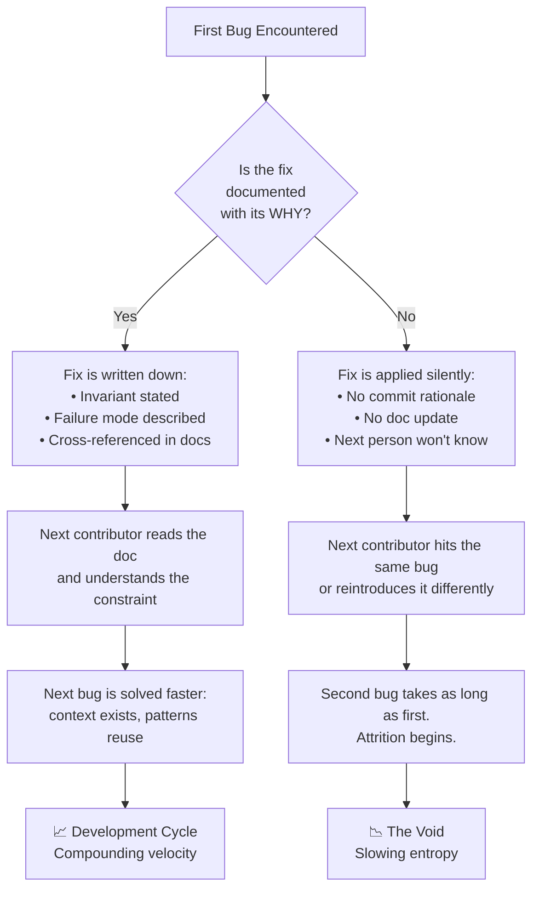
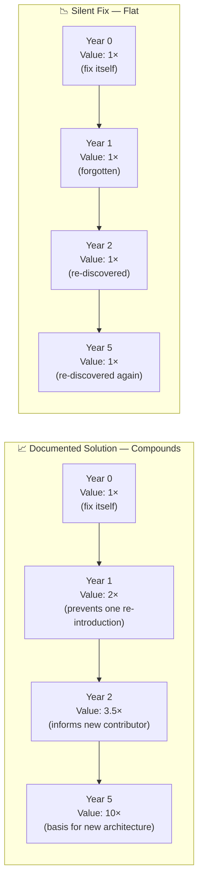
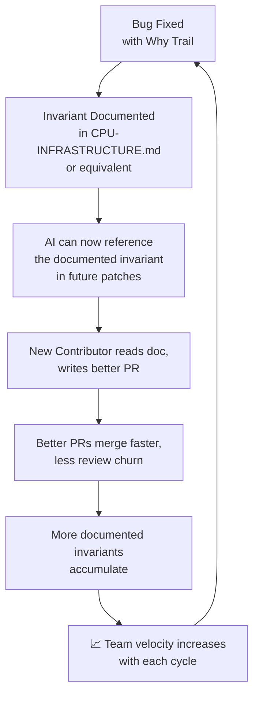

# Chapter II — Cycles of Development vs. the Void: The Dual-Use Principle and the Leadership that Prevented Emptiness

---

> *This is Chapter II of the NexusMiner engineering philosophy series. It assumes familiarity with [Chapter I](why-linux-nexus-vonbraun-succeed.md) — the Saturn V Standard, Torvalds' Why Trail, and the Autodidact Triangle — but is self-contained enough to stand alone.*

---

## The Two Outcomes: Cycles vs. the Void

Every engineering project faces a binary fate.

It either enters a self-reinforcing **development cycle** — where each solved problem creates tools, patterns, and knowledge that make the next problem easier — or it collapses into a **void** — where each unsolved problem creates paralysis, technical debt, and attrition until the team disintegrates and the codebase is abandoned.

This is not a dramatic distinction. It does not announce itself. The difference between the two paths is invisible at the moment of decision, which is exactly why most projects choose the wrong one without realising it.

The Void is quiet. It is:

- A bug that goes undocumented for six months.
- A PR merged without a rationale comment.
- A contributor who asks "why does this invariant exist?" and receives no answer.
- A co-ordination failure across 400,000 engineers with no common engineering notebook.
- A segfault blamed on hardware because no one wrote down what the race condition actually was.

The Development Cycle is equally quiet at its foundation. It is:

- A failure report written the same day the failure occurs.
- A commit message that says "this mutex protects X because Y could race with Z on template reset".
- A philosophy document written after a segfault is fixed — not before.
- A NASA memo explaining why a bolt specification was changed on the F-1 engine.

Neither path is loud. The bifurcation happens at the moment a bug is fixed — in the choice of whether to write down *why*.

### Diagram A — The Bifurcation: Development Cycle vs. the Void

The rest of this chapter is an argument that the NexusMiner project chose the left-hand path — and an explanation of why that choice compounds into something much larger than the original fix.

---

## NASA and the Dual-Use By-Product Machine

This is the heart of the chapter.

NASA's Apollo/Saturn program is remembered for putting twelve people on the Moon. It should also be remembered for the **extraordinary cascade of dual-use by-products** it generated — technologies developed for a single mission-critical purpose that turned out to be universally useful.

This was not accidental. It was a structural consequence of two things: the documentation culture that forced every solution to be written down in transferable form, and the requirement for **concurrent problem-solving** — many hard problems being worked in parallel by specialised teams who shared their findings openly across the programme.

When you solve a hard problem at the frontier and write down how you solved it, the solution escapes its original context. It becomes a tool that other people, working on other problems in other domains, can pick up and use. The by-product is a consequence of the *process*, not the *goal*.

| NASA Origin | Dual-Use By-Product | Crossover Domain |
|---|---|---|
| Space suit thermal regulation | Memory foam (temper foam) | Medical/consumer products |
| Satellite image enhancement algorithms | JPEG compression & digital image processing | Consumer photography, internet |
| Apollo Guidance Computer miniaturisation pressure | Modern integrated circuit manufacturing | Every chip made since 1971 |
| Space food safety (contamination prevention) | HACCP (Hazard Analysis Critical Control Point) | All food manufacturing globally |
| Fire-resistant materials for command module (Apollo 1 fire aftermath) | Fire-resistant fabrics in firefighting gear | Emergency services worldwide |
| Portable life support systems | Portable kidney dialysis machines | Healthcare |
| Structural analysis software (NASTRAN, 1969) | FEA (Finite Element Analysis) standard | Aerospace, automotive, civil engineering |
| Water purification for ISS | Household water filter technology | Developing world access to clean water |
| Scratch-resistant coating on helmet visors | Scratch-resistant eyeglass lenses | Every pair of glasses since ~1983 |
| Long-duration battery research | NiCd/NiMH battery improvements | Portable electronics |

None of these were goals. All of them were documented by-products of solving a different, harder problem with enough rigour that the solution generalised.

The Apollo Guidance Computer did not set out to create the semiconductor industry. It set out to navigate to the Moon with 1960s computing hardware, which required making chips small enough and reliable enough to fit in a spacecraft. The pressure to solve *that* problem drove the miniaturisation technology that made every chip manufactured since 1971 possible.

HACCP — the food safety system now required by law in food manufacturing facilities worldwide — was not developed by the food industry. It was developed by NASA and the Pillsbury Company to ensure that astronaut food could not cause illness in space, where there is no medical care available. The rigour required to solve the space problem generalised immediately to every food safety context.

The pattern is consistent: **NASA produced these by-products because they were solving hard problems at the frontier with a documentation culture that forced every solution into transferable form**. The by-product was the compound interest on the documentation.

---

## How Concurrent Problem-Solving Creates the Cycle

The mechanism is worth understanding precisely, because it is the same mechanism operating in the NexusMiner development campaign.

### The 400,000-person co-ordination problem

Von Braun's team solved the co-ordination problem with configuration management, failure review boards, and engineering change notices. Every change notice was a mini why trail: what changed, why it changed, what failure mode motivated the change, what the effect on adjacent subsystems would be.

This solved a problem that kills most large engineering efforts: the **zero-communication trap**. When teams work in isolation and don't document their decisions, the same problem gets solved eleven times independently, and the twelfth team — who didn't know eleven solutions existed — invents a worse one. The engineering change notice system meant that the solution invented by team 3 was available to teams 4 through 400,000 in a form they could actually use.

### The compound interest of documentation

A well-documented solution from year 1 is worth more in year 5 than the original solution was in year 1, because it prevents four years of rediscovery.

This sounds obvious. It is not widely practiced. Most codebases accumulate solutions that are documented in the heads of their original authors and nowhere else. When those authors leave — and they always leave — the solution is lost, and the next person who encounters the same problem solves it again from scratch, usually less elegantly, and usually without realising it had been solved before.

The Development Cycle is the alternative: each solution documented in transferable form, available to the next contributor, compounding.

### Diagram B — Compound Interest of Documentation

The documented solution compounds because it does work in its absence: it prevents the re-introduction of the bug, informs new contributors, and eventually becomes the foundation for architectural decisions that would be impossible to make correctly without it. The silent fix stays at 1× because it exists only in the current binary — it has no downstream effect on the people who come after.

---

## The Leadership Principle: Mutual Self-Discipline as Structural Foundation

Why does a small autodidact team succeed where large institutional teams fail?

The question is usually answered with reference to agility, passion, or talent. Those are real. But they are not the structural answer.

The structural answer is **mutual self-discipline** — not top-down authority, but a shared set of standards that every participant holds themselves and each other to. This is the leadership principle that made Von Braun's programme work at 400,000 people, that makes the Linux kernel work across tens of thousands of contributors, and that made the PR #335 → #348 campaign a documentation culture event rather than just a bug fix.

### Von Braun's failure review boards

No one was blamed for a failure. Everyone was required to explain it. The discipline was to the *process*, not to the individual.

This distinction is not semantics. Blame-focused failure review drives failures underground — people stop reporting problems they cannot explain, because explanation becomes exposure. Process-focused failure review drives failures into the open — the act of explanation is the required contribution, not the performance of competence.

Von Braun created an environment where the correct response to a test failure was a detailed written analysis, not an apology. The written analysis was the institutional contribution. The apology would have been worthless.

### Torvalds' LKML standards

Linus Torvalds is famously harsh in code review. The harshness is consistently applied to *reasoning quality*, not to the person.

A kernel contributor who writes "I changed this because the old code was ugly" will be rejected. A contributor who writes "I changed this because on SMP systems with PREEMPT_RT, the old lock ordering can deadlock when X and Y race on a context switch between the softirq handler and the process context" will be reviewed seriously — even if Torvalds thinks the patch is wrong, he will engage with the reasoning.

This is not capriciousness. It is a quality standard applied to the one thing that is actually hard to produce: a correct, complete explanation of why a change is necessary and why it is correct. The patch itself is easy to generate. The reasoning is the scarce contribution.

### NexusMiner's PR culture (PR #335 → #348)

Each PR in the race-condition campaign included the invariant being fixed, the failure mode it prevented, and a cross-reference to the documentation. That is mutual self-discipline: the contributor held themselves to the Saturn V standard without being asked, because they understood that a fix without a why trail is not a complete contribution.

**The Leadership Insight**: Effective leadership principles do not require a hierarchy. They require *agreement* on what constitutes a complete contribution. In NexusMiner that agreement is:

> A complete contribution is: the fix + the invariant it enforces + the documentation of why that invariant matters.

That standard is not enforced by anyone in particular. It is held by everyone who understands what the Development Cycle requires, and who has seen what happens when it is abandoned.

---

## The NexusMiner Dual-Use Cascade

The same pattern that generated NASA's by-products is already operating in NexusMiner. The documented solutions from the PR campaign are not just fixes — they are generalisable patterns, documented in transferable form, available to anyone working on a similar problem in any context.

| NexusMiner Origin | Dual-Use By-Product | Crossover |
|---|---|---|
| Sieve race-condition fix (PR #348) | `CPU-INFRASTRUCTURE.md` sieve ownership invariant spec | Any future multi-threaded sieve implementation on any architecture |
| GISPS division-by-zero fix (PR #341/344) | `reset_statistics()` pattern: always reset timers/counters on work unit boundaries | Any miner or benchmark tool that reports per-epoch rates |
| DualConnectionManager wiring (PR #342) | Lane-health bookkeeper pattern: lightweight value-member tracking dual-channel liveness with one-shot bypass | Any dual-transport protocol client (not just mining) |
| WorkPackage precomputed hash pattern | Shared immutable work unit with per-worker mutable state | Any parallel search workload (distributed Fermat test, distributed hash search) |
| `CPU-INFRASTRUCTURE-DIAGRAMS.md` (Diagrams 13–16) | Mermaid template for documenting thread-ownership invariants visually | Any concurrent C++ codebase documentation |
| This philosophy document series | A transferable framework for how autodidact AI-augmented teams should structure their development culture | Any open-source project founded by self-taught engineers |

The last row is the one worth pausing on. The philosophy document series — Chapter I, this chapter, the ones that will follow — is itself a dual-use by-product of the PR campaign. The campaign revealed the Development Cycle in action; the documentation of that revelation is a tool that any project can pick up and use.

That is how NASA produced scratch-resistant eyeglass lenses while trying to get to the Moon. You solve a hard problem with enough rigour and write it down carefully enough, and the solution generalises beyond anything you intended.

---

## The Void That Was Prevented

It is worth naming explicitly what would have happened without the documented-invariant culture, because the counterfactual is not obvious when the culture is working.

**Without PR #335 → #348's why trails:** the sieve race would have remained as an intermittent segfault, blamed on hardware, never fixed. Contributors who hit it would have filed issues, received no explanation, and moved on. The codebase would have accumulated a reputation for instability on RISC-V. The Void.

**Without `CPU-INFRASTRUCTURE.md`:** the next person to touch `Worker_prime` would not know the sieve ownership rule. They would see that `set_block()` doesn't call sieve initialisation methods and assume it was an omission. They would add the call — as the original code did — and reintroduce the crash, silently, in a PR that looked like a bug fix. The Void, delayed by months.

**Without the Autodidact Triangle** (the four-person synergy described in Chapter I): the classically-trained coders would have applied textbook mutex patterns — adding a lock to `set_block()` before calling sieve methods — rather than the correct architectural fix: moving all sieve initialisation to the worker thread and removing the calls from `set_block()` entirely. The textbook solution was tried (PR #338) and was insufficient. The architectural fix required the systems intuition of the autodidact core, which recognised that the invariant was not "protect the sieve with a lock" but "the sieve is exclusively owned by one thread and must never be touched by another."

That distinction — "protect with a lock" vs. "exclusive ownership" — is the difference between a fix that works under current conditions and a fix that enforces a correct invariant permanently. The documented invariant in `CPU-INFRASTRUCTURE.md` is the architectural fix. The lock would have been the textbook fix.

The Void was not a dramatic collapse. It was the quiet alternative: intermittent crashes, contributor attrition, architectural drift, and eventually an unmaintainable codebase. The Development Cycle was the equally quiet alternative: a written invariant, a referenced document, and a future contributor who reads the documentation and doesn't reintroduce the bug.

---

## Completing the Cycle — What Comes Next

The Development Cycle is not finished. It is, by definition, never finished — each iteration of the flywheel creates the conditions for the next. But we can describe its current state and its next iterations.

**RISC-V first-class**: The sieve ownership fix is especially important on RISC-V, where the RVWMO memory model is stricter than x86's Total Store Order and races manifest immediately rather than intermittently. RISC-V hardware is the test bed that keeps the invariant honest — a regression that might be invisible on x86 for months will surface on RISC-V within minutes. This is the property that made RISC-V act as a race detector in production during the original campaign, and it is the property that will continue to validate invariants as the codebase evolves.

**GPU prime worker parity**: The same sieve ownership pattern needs verification in `src/gpu/src/gpu/worker_prime.cpp`. The by-product of the CPU fix is a checklist for the GPU worker: does the GPU implementation respect the same thread-ownership invariant? Does it call sieve methods from the correct thread? The CPU documentation makes those questions answerable, because it defines what "correct" means.

**AI-human velocity**: As the codebase becomes more documented, AI can contribute higher-quality patches faster — because the context for each invariant is written down, not locked in the head of one developer. This is the compounding interest: each document written today makes the AI a better contributor tomorrow, because the AI can reference the documented invariant when generating a patch, rather than having to infer it from the code structure alone. The AI-augmented engineer who produced PR #348 was faster and more precise than an unaugmented engineer would have been. The AI-augmented engineer who produces the next patch will be faster still, because the documentation that PR #348 generated is now part of the context.

**Community gravity**: Projects with documented invariants attract contributors who read documentation. Those contributors write better PRs — because they understand the architecture before they change it. Better PRs attract more contributors, because they demonstrate that the project takes quality seriously and that the review process is predictable. The flywheel is self-reinforcing.

### Diagram C — The Development Cycle Flywheel

The flywheel is already turning. PR #348's documentation is already informing AI-generated patches. The philosophy document series is already articulating the framework for the next contributor who wants to understand why the culture is structured the way it is.

Each rotation of the flywheel makes the next one faster. That is the Development Cycle. That is what the void was not.

---

## See Also

- [why-linux-nexus-vonbraun-succeed.md](why-linux-nexus-vonbraun-succeed.md) — Chapter I: The Saturn V Standard, Torvalds' Why Trail, and the Autodidact Triangle
- [why-ai-human-wins.md](why-ai-human-wins.md) — AI-human collaboration model for NexusMiner development
- [../riscv/CPU-INFRASTRUCTURE.md](../riscv/CPU-INFRASTRUCTURE.md) — Sieve ownership invariant (the Saturn V notebook for PR #348)
- [../riscv/CPU-INFRASTRUCTURE-DIAGRAMS.md](../riscv/CPU-INFRASTRUCTURE-DIAGRAMS.md) — Diagrams 13–16: CPU worker lifecycle and sieve ownership model
- [../riscv/RISCV-OVERVIEW.md](../riscv/RISCV-OVERVIEW.md) — RISC-V ISA profiles, extensions, and performance context
