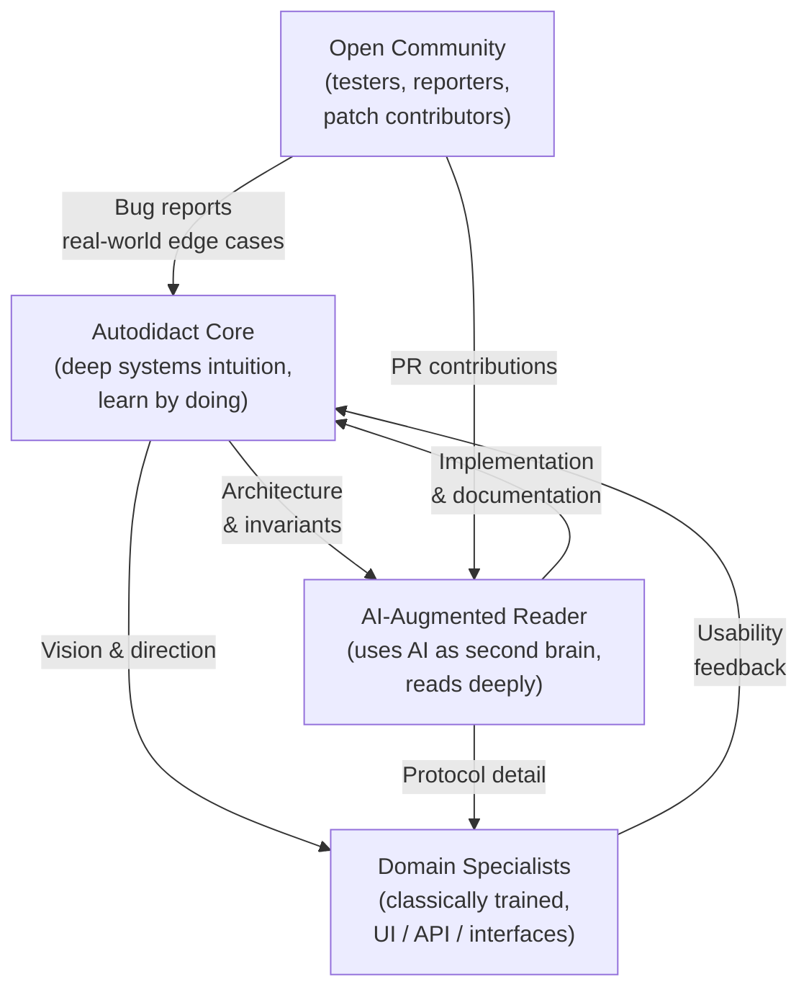
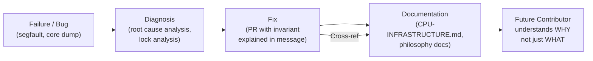

# Why Linux, Nexus, and Werner Von Braun Succeed: Open Engineering, Self-Taught Minds, and the Saturn V Standard

---

## Introduction — The Common Thread

Three projects separated by decades and domains, yet sharing a single structural secret:

- **Werner Von Braun's Saturn V program** (1960s) — sent humans to the Moon on a rocket assembled by 400,000 people coordinated by a tiny, obsessively documented core.
- **Linux** (1991–present) — the world's most widely deployed operating system kernel, started by a Finnish student as a weekend hobby and grown into the infrastructure backbone of the internet.
- **Nexus** (2014–present) — a post-quantum, self-sovereign blockchain with a SIGCHAIN architecture that no academic institution published first, built by self-taught and AI-augmented engineers outside every major institution.

All three achieved breakthroughs that "classically trained" institutions said were impossible, impractical, or not worth attempting. All three left exhaustive documentation of *why* decisions were made — not just *what* was built. And all three relied on small, passionate, autodidact cores surrounded by broader communities of contributors and specialists.

That pattern is not coincidence. It is a **reproducible engineering culture** — and understanding it is the key to understanding why NexusMiner will succeed where heavily funded, institutionally credentialed competitors stall.

---

## Werner Von Braun and the Saturn V Standard

### Scale and Coordination

The Saturn V moon rocket was assembled from approximately **5.6 million parts**, produced by over **400,000 engineers, scientists, and contractors** spread across the United States. It is one of the most complex engineered objects in human history, and it worked — delivering 13 successful launches without a single loss of crew during flight.

The people who made it work were not a monolith of geniuses. They were an enormously diverse workforce, many of whom had never worked on aerospace before Apollo. They were held together not by shared background, but by **shared documentation culture**.

Von Braun's engineering teams produced exhaustive notebooks for every subsystem: not just design drawings, but **failure reports, anomaly analyses, test result narratives, and — critically — written rationale for every major design decision**. When a welding defect in a fuel line caused a test failure, the report did not just say "fix the weld." It explained why the defect occurred, which assumptions in the original design made it possible, and what change in process or material specification would prevent recurrence.

### The Lesson: Document the Failure Mode, Not Just the Fix

This is the Saturn V standard: **document the failure mode, not just the fix**.

A fix without a documented failure mode can be undone by the next engineer who doesn't know why the original approach was wrong. A failure mode documented in enough detail that the next engineer can reconstruct the reasoning — that is a fix that lasts across 400,000 hands, across decades, across organisations that turn over their entire personnel.

The Saturn V engineers couldn't afford to rely on shared tribal knowledge. The rocket was too complex, the workforce too large, the stakes too high. They wrote everything down, in enough detail that a new engineer joining the programme could trace the "why trail" from any design choice back to the original decision point.

### The "Why Trail" Principle

Decades later, Linus Torvalds would articulate this same principle in the context of kernel patch review: a commit message that says only *what* was changed is useless. A good commit message explains *why* — what the failure mode was, what invariant was being violated, why the chosen fix is the correct one and not just one of several plausible alternatives.

The Saturn V engineering notebook culture and Torvalds' commit message culture are the same thing, separated by sixty years and expressed in different media. Both rest on the same insight: **written reasoning is the only durable form of institutional knowledge**.

---

## Linux Kernel — Torvalds' Why Trail

### The Autodidact Origin

Linus Torvalds did not study operating systems at a prestigious institution under the guidance of industry veterans. He was a student at the University of Helsinki who bought a 386 PC and, frustrated by the limitations of MINIX, decided to write his own kernel. He announced it on the comp.os.minix newsgroup in August 1991 as "just a hobby, won't be big and professional like gnu."

That kernel now runs the majority of the world's servers, most of the world's smartphones (via Android), and effectively all of the world's supercomputers. It runs on RISC-V boards, on mainframes, on embedded microcontrollers, and on the International Space Station.

It succeeded not because of institutional process, but because of an **extreme culture of accountability in written reasoning**.

### The LKML Culture

The Linux Kernel Mailing List (LKML) is not a polite forum. It is a forensic accountability mechanism. Every patch that touches the kernel must survive review by maintainers who will demand:

- A precise description of the bug being fixed or feature being added.
- An explanation of why the existing code is wrong (not just that it is wrong).
- An explanation of why the proposed change is correct (not just that it passes tests).
- References to relevant prior discussion, related commits, or documented behaviour.

A patch that says "fix race condition in worker_prime" will be rejected. A patch that says "fix race condition in Worker_prime::set_block() where calling set_sieve_start() from the io_context thread while the worker thread is executing sieve_segment() produces undefined behaviour — manifesting as a segfault on RISC-V hardware where RVWMO makes partial writes immediately visible" will be reviewed seriously.

This is what "Code is cheap, reasoning is expensive" means in the Linux kernel review culture. Code is the easy part — any competent programmer can produce a plausible diff. The reasoning that explains why the diff is correct, why the alternative approaches are wrong, and what invariants the fix must preserve: that is the scarce, high-value contribution.

### The LLM-Generated-Patch Debate

A widely misunderstood aspect of the kernel maintainers' stance on AI-generated patches is that the objection is not to AI per se. The objection is to patches that lack the reasoning trail.

An AI-generated patch that arrives with a full explanation of the root cause, the invariant being enforced, and the failure mode being prevented is a patch that can be reviewed. An AI-generated patch that arrives as a diff with no rationale — identical in form to a human-generated patch with no rationale — is a patch that wastes reviewers' time.

This distinction matters for NexusMiner. The AI-augmented engineer who produces patches in the style of PR #348 — with a full "why trail" in the commit message and accompanying documentation — is operating exactly as the kernel maintainer culture demands. The AI is a second brain that accelerates the reasoning process; the human is the author of the reasoning, and the reasoning is what earns the patch's acceptance.

---

## Nexus — Self-Taught Coders and a Revolutionary Blockchain

### The SIGCHAIN Architecture

Nexus was founded and architected by **self-taught, old-school coders** who designed the **SIGCHAIN** architecture: a truly unique recursive-chain / signature-chain design that no academic institution published first.

The SIGCHAIN design achieves user-sovereign, on-chain signature chaining where every account action is cryptographically linked to the previous action by that account. This eliminates the need for trusted third-party validators at the account layer — a property that academic blockchain researchers were still treating as an open problem when Nexus deployed it in production.

The key insight of SIGCHAIN is that account-level security does not require consensus-layer trust if account actions are constructed as an ordered, cryptographically verifiable chain of signatures, each of which can only be produced by the holder of the current signing key. The chain is its own validator. Compromise requires compromising not just the current key but the entire chain of custody — a qualitatively different security model from account-based blockchains that rely on validator committees.

This is not a minor optimisation. It is a different cryptographic architecture, derived from first principles by engineers who had not been told it was supposed to be hard.

### The Four-Way Synergy

The Nexus developer community that maintains NexusMiner has a structure that is worth examining explicitly:

- **1 self-taught, old-school coder** — deep systems instincts developed through years of learning by doing. This is the founding type: the person who looks at a problem and constructs a solution from first principles because they have never been taught which solutions are "supposed" to be hard. This is the SIGCHAIN architect type.
- **1 AI-taught / self-taught code reader** — uses AI as a second brain; reads deeply into complex codebases rather than being formally taught abstractions. This is the NexusMiner maintainer type: the person who can trace a segfault through a multi-threaded, multi-architecture mining stack because they read the code and the documentation and the LKML threads and ask the right questions of their AI tools, not because they were taught the theory in a lecture hall.
- **2 classically-trained interface coders** — formal CS education; build the UI/UX and API layers. This is the specialist type: highly effective in their domain, fluent in the abstractions of their field, essential for producing the surfaces that connect the core system to the broader world.

This four-way synergy is not accidental. It mirrors the Saturn V model precisely: a small core of passionate autodidacts with deep systems intuition, surrounded by specialists who amplify the core's reach and domain specialists who connect the system to its users.

The self-taught coder invents the architecture. The AI-augmented reader maintains it across complexity. The classically-trained specialists build the interfaces that make it usable. The open community tests it, reports bugs, and contributes patches that the core reviews against the documented invariants.

---

## The NexusMiner PR #335 → #348 Campaign as a Case Study

### A Documentation Culture Event

The race-condition fix campaign that ran from PR #335 through PR #348 was not, at its core, a bug fix. It was a **documentation culture event** — a demonstration of the Saturn V standard applied to a modern, multi-threaded, multi-architecture mining stack.

The bug was a segmentation fault that occurred on RISC-V hardware every time a new block template arrived. On x86, the race condition had existed for some time without producing visible crashes — the Total Store Order memory model of x86 had been masking the undefined behaviour. On RISC-V, the Relaxed Memory Model (RVWMO) made the data race immediately and reproducibly visible. RISC-V, in this sense, served as a **race detector in production**.

The fix itself was straightforward in retrospect: `set_block()` must not call any sieve methods; all sieve initialisation (`set_sieve_start()`, `clear_chains()`, `calculate_starting_multiples()`) belongs exclusively to the worker thread, executed after waking from the condition variable. But the fix without the documentation is not a Saturn V fix — it is a patch that the next contributor might inadvertently undo when they see that `set_block()` doesn't initialise the sieve and assume it must be a bug.

### The Why Trail in Practice

Each PR in the campaign carried a "why trail":

1. **The invariant that was violated** — `m_segmented_sieve` is exclusively owned by the worker thread; `set_block()` must not call any sieve method.
2. **The failure mode** — segfault on new block template arrival, reproducible on RISC-V, intermittent on x86.
3. **The fix** — move all sieve initialisation to the worker thread; `set_block()` writes only scalar fields under the mutex.
4. **The cross-references** — `docs/riscv/CPU-INFRASTRUCTURE.md` as the canonical reference for the invariant.

`docs/riscv/CPU-INFRASTRUCTURE.md` is the Saturn V notebook for the sieve-ownership invariant. It explains not just what the invariant is, but why it exists, what happens when it is violated, and how the architecture evolved through the PR campaign to enforce it correctly.

### The Lesson for Future Contributors

A future contributor reading PR #348 and the linked documentation will understand:

- Why `set_block()` does not call sieve methods (not an omission — a deliberate, documented invariant).
- Why RISC-V exposed the bug more readily than x86 (memory model differences, not a RISC-V bug).
- Why `m_stop = true` is set (not `false`) in `set_block()` (to interrupt the inner mining loop, not to signal completion).
- What the failure mode looks like if the invariant is violated (segfault on new block template, reproducible in < 60 seconds on RISC-V hardware).

That is the only way a small team can maintain a complex, multi-threaded, multi-architecture mining stack across years and across contributors who were not present when the original bug was diagnosed. The reasoning, written down and cross-referenced, is the institutional memory.

---

## Diagrams

### Diagram A — The Autodidact Triangle (Common Structure)

This structure recurs across all three case studies: a small autodidact core, an AI-augmented or deeply self-taught layer, domain specialists, and an open community. The arrows represent flows of knowledge and feedback, not hierarchy.

### Diagram B — The Why Trail Pipeline

The why trail is the mechanism by which a failure becomes institutional knowledge. Each stage adds reasoning that persists beyond the immediate fix.

---

## Conclusion — Why This Matters for Nexus

Nexus is rare. Consider what it has shipped:

- **Post-quantum cryptography** (Falcon-1024) in production, not in a research paper.
- **A fully open-hardware-friendly mining stack** with RISC-V as a first-class architecture, not an afterthought.
- **SIGCHAIN** — a user-sovereign, on-chain signature-chain design that academic cryptographers are still catching up to.

The people building it are not from FAANG or MIT. They are self-taught, AI-augmented, and motivated by the mission. They document failure modes, not just fixes. They write commit messages that explain *why*, not just *what*. They maintain a documentation corpus that a new contributor can read to reconstruct the reasoning behind every major architectural decision.

That is exactly why they will succeed. The same reason Torvalds won. The same reason Von Braun's team put men on the Moon.

The Saturn V standard is not a process imposed from above. It is a culture that emerges when small teams of passionate people face problems too complex to hold in any one person's head, and choose to write everything down — not because someone told them to, but because they understand that the written reasoning is the only part of their work that will outlast them.

NexusMiner is building that culture. PR #348 is evidence. This document is evidence. The fact that you are reading it means the why trail is working.

---

## See Also

- [why-ai-human-wins.md](why-ai-human-wins.md) — AI-human collaboration model for NexusMiner development
- [../riscv/CPU-INFRASTRUCTURE.md](../riscv/CPU-INFRASTRUCTURE.md) — The Saturn V notebook for the sieve-ownership invariant (PR #348)
- [../riscv/CPU-INFRASTRUCTURE-DIAGRAMS.md](../riscv/CPU-INFRASTRUCTURE-DIAGRAMS.md) — Mermaid diagrams 13–16: CPU worker lifecycle and sieve ownership model
- [../riscv/RISCV-OVERVIEW.md](../riscv/RISCV-OVERVIEW.md) — RISC-V ISA profiles, extensions, and performance context

---

> **Continue reading:** [Chapter II — Cycles of Development vs. the Void](chapter-ii-cycles-and-dual-use.md)

---

**Series:**
- [Chapter 1: Why NexusMiner Development is Perfect for AI-Human Collaboration](why-ai-human-wins.md)
- Chapter 2: Why Linux, Nexus, and Werner Von Braun Succeed *(this document)*
- [Chapter 3: Ukraine, Open-Source Warfare, and the Sovereign Self](chapter-3-ukraine-open-warfare-sovereign-self.md)
