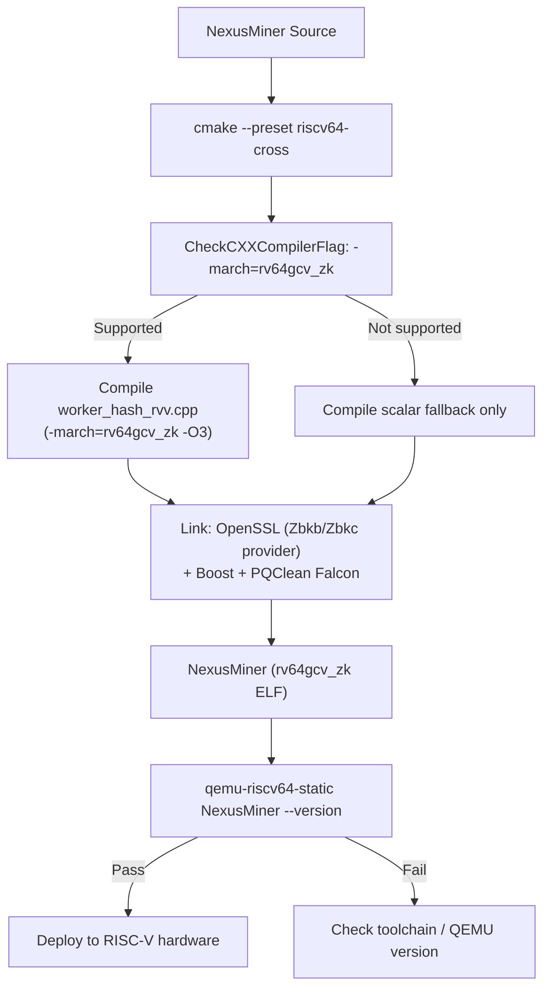
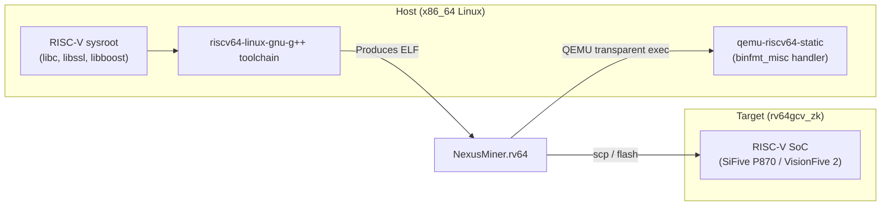

# Building NexusMiner for RISC-V

This guide covers cross-compiling NexusMiner for RISC-V targets and native
compilation on RISC-V hardware.

**See also:** [RISCV-OVERVIEW.md](RISCV-OVERVIEW.md) · [RISCV-DIAGRAMS.md](RISCV-DIAGRAMS.md) · [../../BUILD.md](../../BUILD.md)

---

## 1. Prerequisites

| Tool | Min version | Purpose |
|------|------------|---------|
| `riscv64-linux-gnu-gcc` / `g++` | 12 | C++17 cross-compiler |
| `cmake` | 3.25 | Build system (presets require 3.25+) |
| `qemu-riscv64-static` | 7.2 | Transparent cross-execution smoke-test |
| `binfmt_misc` kernel module | — | Enables transparent QEMU exec |
| OpenSSL (RISC-V sysroot) | 3.0+ | ChaCha20/Zbkb, TLS |
| Boost (RISC-V sysroot) | 1.71+ | Required for prime mining |

---

## 2. Toolchain Installation

### Ubuntu / Debian

```bash
sudo apt-get update
sudo apt-get install -y \
    gcc-12-riscv64-linux-gnu g++-12-riscv64-linux-gnu \
    cmake ninja-build \
    qemu-user-static binfmt-support \
    libssl-dev:riscv64 libboost-all-dev:riscv64
```

> **Tip:** On Ubuntu 22.04 you may need the `crossbuild-essential-riscv64` meta-package
> and the `ports.ubuntu.com` apt source for the `:riscv64` foreign-arch packages.

### Fedora / RHEL

```bash
sudo dnf install gcc-c++-riscv64-linux-gnu \
                 cmake ninja-build \
                 qemu-user-static
```

### From Source (GCC 13)

```bash
# Clone and build the RISC-V GNU toolchain
git clone https://github.com/riscv-collab/riscv-gnu-toolchain.git
cd riscv-gnu-toolchain
./configure --prefix=/opt/riscv --with-arch=rv64gcv_zk --with-abi=lp64d
make linux -j$(nproc)
export PATH="/opt/riscv/bin:$PATH"
```

---

## 3. Cross-Compilation

Use the `riscv64-cross` CMake preset (see [CMakePresets.json entry](#8-cmakepresetsj-son-entry)):

```bash
# Configure
cmake --preset riscv64-cross

# Build (all cores)
cmake --build build-riscv -j$(nproc)
```

The preset automatically sets:
- `CMAKE_TOOLCHAIN_FILE=cmake/riscv64-linux-gnu.cmake`
- `-march=rv64gcv_zk -mabi=lp64d -O3`
- `RISCV_ENABLED=ON`

---

## 4. Native Compilation on RISC-V Hardware

On a SiFive P870, StarFive VisionFive 2, or similar board running a Debian/Ubuntu
RISC-V port:

```bash
# Install build tools natively
sudo apt-get install -y build-essential cmake libssl-dev libboost-all-dev libgmp-dev

git clone https://github.com/NamecoinGithub/NexusMiner.git
cd NexusMiner
mkdir build-native && cd build-native

# Native build with full extension support
cmake -DCMAKE_BUILD_TYPE=Release \
      -DRISCV_ENABLED=ON \
      -DWITH_PRIME=ON \
      -DCMAKE_CXX_FLAGS="-march=rv64gcv_zk -mabi=lp64d" \
      ..
make -j$(nproc)
```

---

## 5. QEMU Smoke-Test

After cross-compiling, verify the binary runs correctly under QEMU:

```bash
# Ensure binfmt_misc is active
sudo update-binfmts --enable qemu-riscv64

# Run the binary transparently (QEMU intercepts rv64 ELF automatically)
./build-riscv/NexusMiner --version

# Or explicitly:
qemu-riscv64-static ./build-riscv/NexusMiner --version
```

Expected output:

```
NexusMiner v<version> (rv64gcv_zk, RVV enabled)
```

---

## 6. OpenSSL ChaCha20 Verification

To confirm OpenSSL is using hardware Zbkb/Zbkc acceleration on real RISC-V hardware:

```bash
openssl speed -evp chacha20-poly1305
```

Compare the throughput with and without the Zbkb/Zbkc provider. On SiFive P870
(VLEN=512) you should see ≥1.3× improvement over the scalar baseline.

---

## 7. Feature Detection at Runtime

At startup, `arch::detect()` (called once via `std::call_once`) queries the kernel
for hardware capability bits:

```cpp
// Simplified sketch — see src/Util/include/arch_detect.hpp
#ifdef __riscv
    unsigned long hwcap = getauxval(AT_HWCAP);
    has_rvv   = (hwcap & HWCAP_ISA_V) != 0;
    has_zksh  = (__riscv_zksh != 0);   // compile-time define set by -march
#endif
```

If `has_rvv` is false (e.g., on older U74 silicon), the worker factory selects the
portable scalar C++ backend automatically — no configuration required.

---

## 8. CMakePresets.json Entry

Add the following to the `configurePresets` array in `CMakePresets.json`:

```json
{
    "name": "riscv64-cross",
    "displayName": "RISC-V 64-bit cross-compile",
    "description": "Cross-compile for rv64gcv_zk (RVV 1.0 + full Zk crypto suite)",
    "binaryDir": "${sourceDir}/build-riscv",
    "toolchainFile": "${sourceDir}/cmake/riscv64-linux-gnu.cmake",
    "cacheVariables": {
        "CMAKE_BUILD_TYPE": "Release",
        "RISCV_ENABLED": "ON",
        "RISCV_RVV_ENABLED": "ON",
        "WITH_PRIME": "OFF",
        "CMAKE_CXX_FLAGS": "-march=rv64gcv_zk -mabi=lp64d -O3 -fstack-protector-strong"
    }
}
```

> **Note:** The existing `riscv` preset in `CMakePresets.json` targets native or
> QEMU builds with `-march=rv64gcv_zbkb_zbkc`. The new `riscv64-cross` preset is
> the recommended cross-compile path.

---

## 9. Compiler Flags Explained

| Flag | Meaning |
|------|---------|
| `-march=rv64gcv_zk` | rv64gc base + V (RVV 1.0) + full Zk scalar crypto suite |
| `-mabi=lp64d` | 64-bit LP64 ABI with hardware double-precision FPU |
| `-O3` | Full optimization — required for auto-vectorization |
| `-fstack-protector-strong` | Stack canaries (security hardening) |

The `_zk` extension group expands to `_zkn_zkr_zks_zkb_zkl` which includes
Zksh, Zknd, Zkne, Zbkb, Zbkc, and Zkr as individual sub-extensions.

---

## 10. Known Limitations

| Limitation | Detail |
|-----------|--------|
| **No RVV on older silicon** | U74 (VisionFive 2) and C906 do not implement RVV 1.0; scalar fallback is used automatically. |
| **RVV 0.7 (Milk-V Pioneer)** | C910 implements an earlier draft spec; NexusMiner will fall back to scalar on these boards. |
| **QEMU instruction coverage** | QEMU 7.2 covers RVV 1.0 and Zksh; Zknd/Zkne AES acceleration may not be modelled in older QEMU versions. |
| **GCC < 12** | Older cross-compilers do not support `-march=rv64gcv_zk`; use the scalar `riscv` preset instead. |
| **Prime mining** | `WITH_PRIME=ON` requires Boost and GMP built for the RISC-V sysroot; binary packages may not be available on all distros. |

---

## 11. CI YAML Snippet

Add to `.github/workflows/ci.yml` to enable cross-build verification:

```yaml
jobs:
  riscv-cross:
    name: RISC-V cross-compile
    runs-on: ubuntu-22.04
    steps:
      - uses: actions/checkout@v4

      - name: Install RISC-V toolchain
        run: |
          sudo apt-get update
          sudo apt-get install -y gcc-12-riscv64-linux-gnu g++-12-riscv64-linux-gnu \
              cmake ninja-build qemu-user-static binfmt-support

      - name: Configure
        run: cmake --preset riscv64-cross

      - name: Build
        run: cmake --build build-riscv -j$(nproc)

      - name: Smoke-test (QEMU)
        run: qemu-riscv64-static ./build-riscv/NexusMiner --version
```

---

## Diagram 5 — RISC-V Build Pipeline



---

## Diagram 6 — Cross-Compilation Host↔Target Flow


