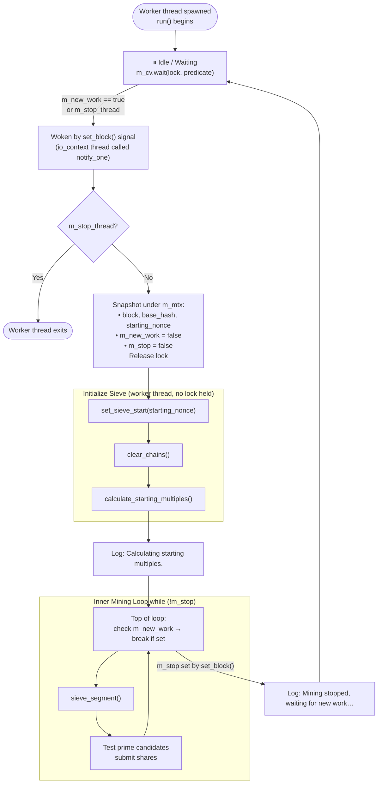
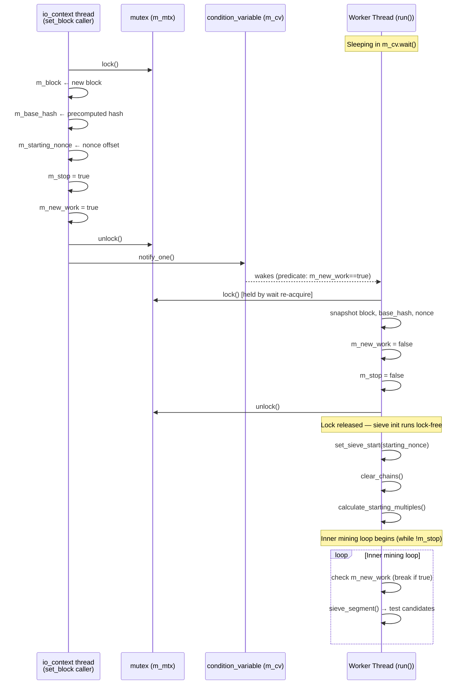
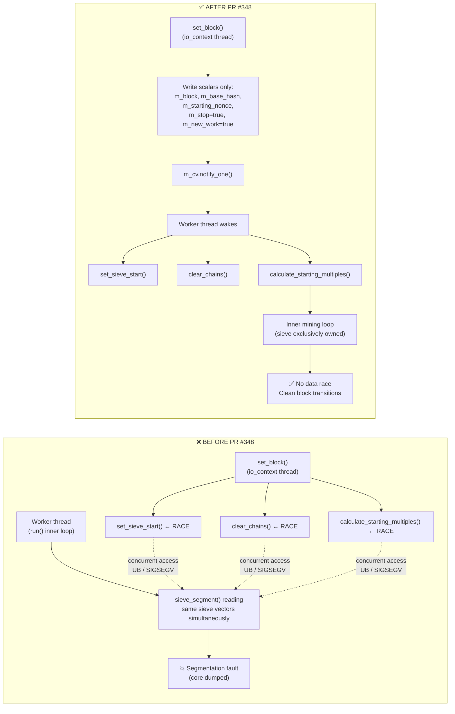
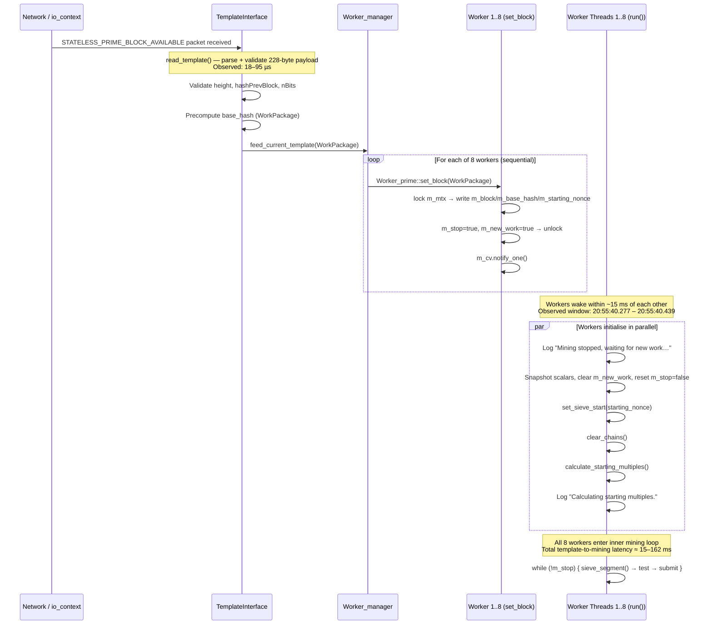
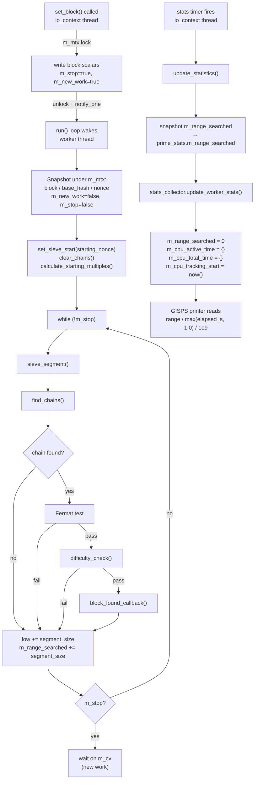

# CPU Infrastructure Diagrams

This document collects Mermaid diagrams 13–16 describing the CPU prime-worker
thread model, sieve ownership, and template-handoff protocol introduced (or
corrected) by the PR #335 → PR #348 race-condition fix campaign. See
[CPU-INFRASTRUCTURE.md](CPU-INFRASTRUCTURE.md) for the accompanying narrative
reference.

Diagrams 7–12 are in [RISCV-DIAGRAMS.md](RISCV-DIAGRAMS.md).

---

## Diagram 13 — CPU Worker Persistent Thread Lifecycle

This flowchart shows the complete lifetime of a single CPU prime worker thread.
The key insight is that all sieve initialisation (`set_sieve_start`,
`clear_chains`, `calculate_starting_multiples`) lives inside the **Initialize
Sieve** phase on the worker thread — never inside `set_block()`.

---

## Diagram 14 — set\_block() → Worker Thread Handoff Protocol

This sequence diagram shows the precise ordering of lock acquisitions, flag
writes, and condition-variable operations that transfer a new work unit from
the io\_context thread to the worker thread. Note that the sieve is never
touched while `m_mtx` is held by `set_block()`.

---

## Diagram 15 — Sieve Ownership Model (Before vs After PR #348)

This diagram compares the unsafe pre-PR #348 design with the corrected design.
The left path shows the data race that caused `Segmentation fault (core dumped)`
on every new block arrival; the right path shows the exclusive-ownership model
that eliminates the race.

---

## Diagram 16 — Template Arrival to Mining Start Timeline

This sequence diagram traces the full pipeline from the moment a new
`STATELESS_PRIME_BLOCK_AVAILABLE` packet arrives over the network to the moment
all 8 CPU workers are executing their inner mining loops. Timing numbers are
from observed production logs (timestamps 20:55:40.277 – 20:55:40.439).

---

## Diagram 17 — CPU Prime Worker — Sieve → Stats Pipeline

This diagram shows how the sieve inner loop accumulates `m_range_searched` and
how `update_statistics()` snapshots and resets it each stats interval to
produce accurate per-interval GISPS values.

The two paths (worker thread on the left, stats-timer thread on the right)
interact only at `m_range_searched`: the worker accumulates it; the stats
timer snapshots then resets it. The race can at most undercount one interval
by a few sieve-segment widths — a negligible blip, not a correctness issue.
