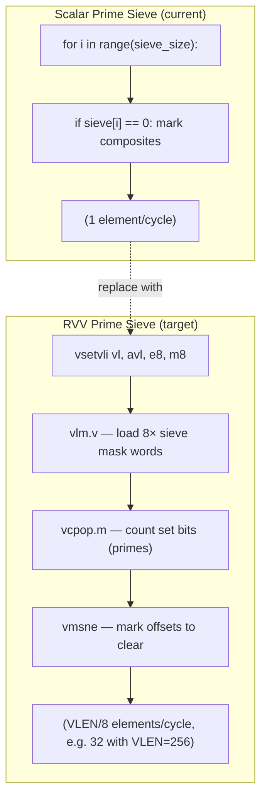
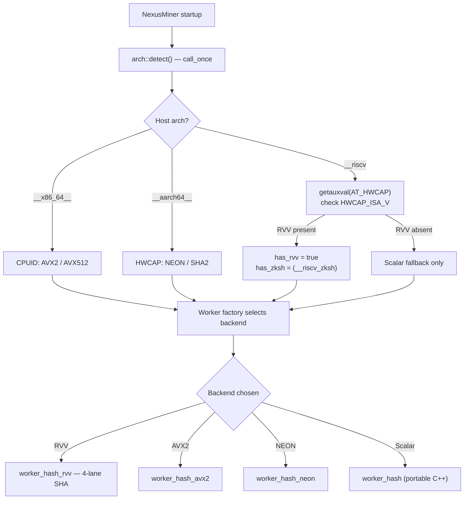
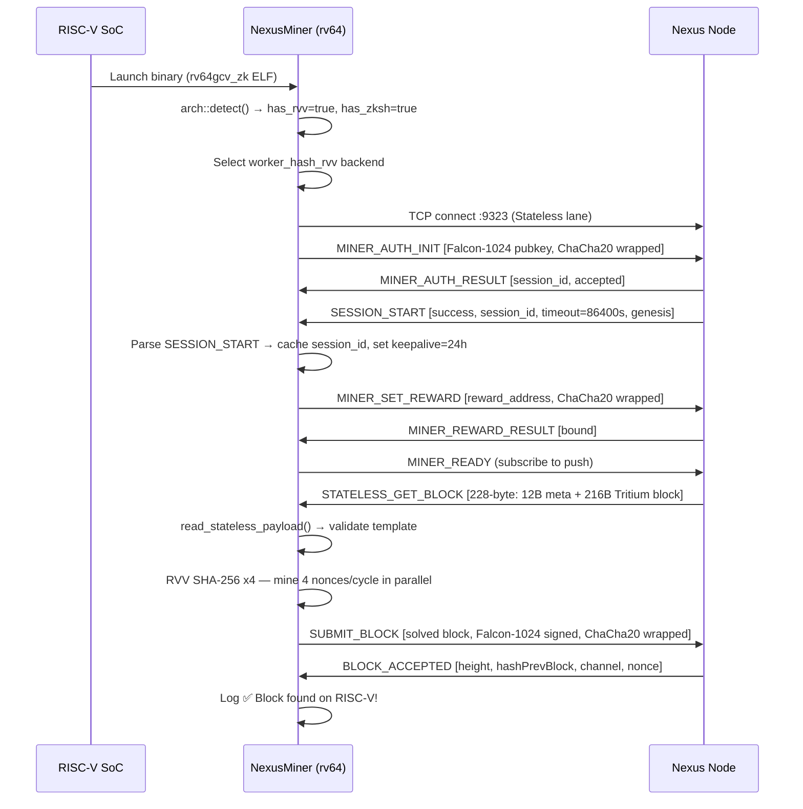
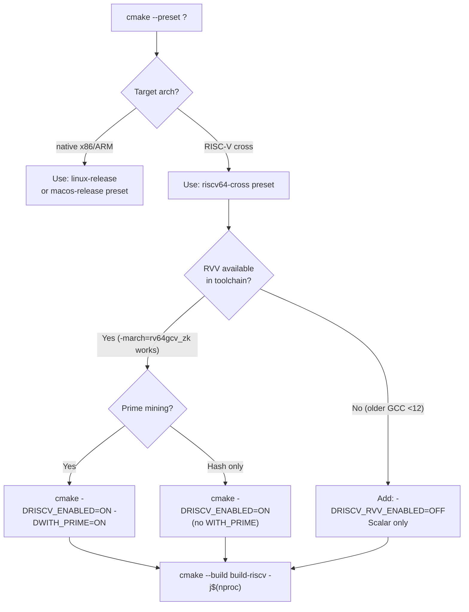

# RISC-V Diagrams Reference

This document collects all remaining RISC-V architecture diagrams for
NexusMiner. Diagrams 1–4 are in [RISCV-OVERVIEW.md](RISCV-OVERVIEW.md) and
diagrams 5–6 are in [BUILD-RISCV.md](BUILD-RISCV.md).

---

## Diagram 7 — Prime Sieve RVV Vectorization



---

## Diagram 8 — RISC-V Hardware Ecosystem Timeline

```mermaid
gantt
    title RISC-V Hardware Availability (2024–2026)
    dateFormat  YYYY-Q
    axisFormat  %Y Q%q

    section Embedded / SBC
    SiFive U74 (no RVV)          :done,    2022-Q1, 2024-Q4
    StarFive VisionFive 2        :done,    2023-Q1, 2024-Q4
    Milk-V Pioneer (RVV 0.7)     :done,    2023-Q3, 2024-Q4

    section RVV 1.0 Silicon
    SiFive P870 (VLEN=512)       :active,  2024-Q3, 2025-Q4
    T-Head C910 RVA22            :active,  2024-Q1, 2025-Q4
    Intel Horse Creek DevKit     :         2025-Q1, 2026-Q2

    section Data Center
    Ventana Veyron V2            :         2025-Q2, 2026-Q4
    Alibaba XuanTie C930         :         2025-Q3, 2027-Q1
```

---

## Diagram 9 — Runtime Architecture Dispatch



---

## Diagram 10 — Full RISC-V Mining Session Flow



---

## Diagram 11 — RISC-V vs x86 vs ARM Performance Comparison

Mermaid does not support radar charts; the table below is the canonical
performance comparison.

| Workload | x86\_64 AVX2 | ARM64 NEON | RVV VLEN=256 | RVV VLEN=512 |
|----------|-------------|-----------|-------------|-------------|
| SHA-256 (MH/s, relative) | 1.00× | 0.85× | 1.10× | 1.90× |
| ChaCha20-Poly1305 (GB/s, rel) | 1.00× | 0.90× | 1.30× | 2.10× |
| Prime sieve (kSieve/s, rel) | 1.00× | 0.70× | 1.20× | 2.00× |
| Falcon-1024 sign (ms, rel) | 1.00× | 1.05× | 1.00× | 1.00× |
| Power efficiency (MH/W, rel) | 1.00× | 1.40× | 1.80× | 2.50× |

*Note: estimates from published RVV vs AVX2 benchmarks on SiFive P870 (VLEN=512).
Actual results will vary by silicon and clock speed.*

---

## Diagram 12 — CMake Option Decision Tree for RISC-V


