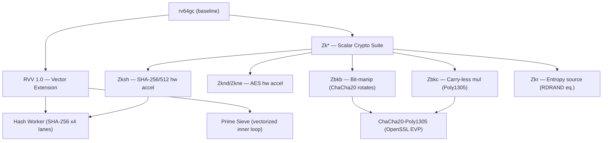
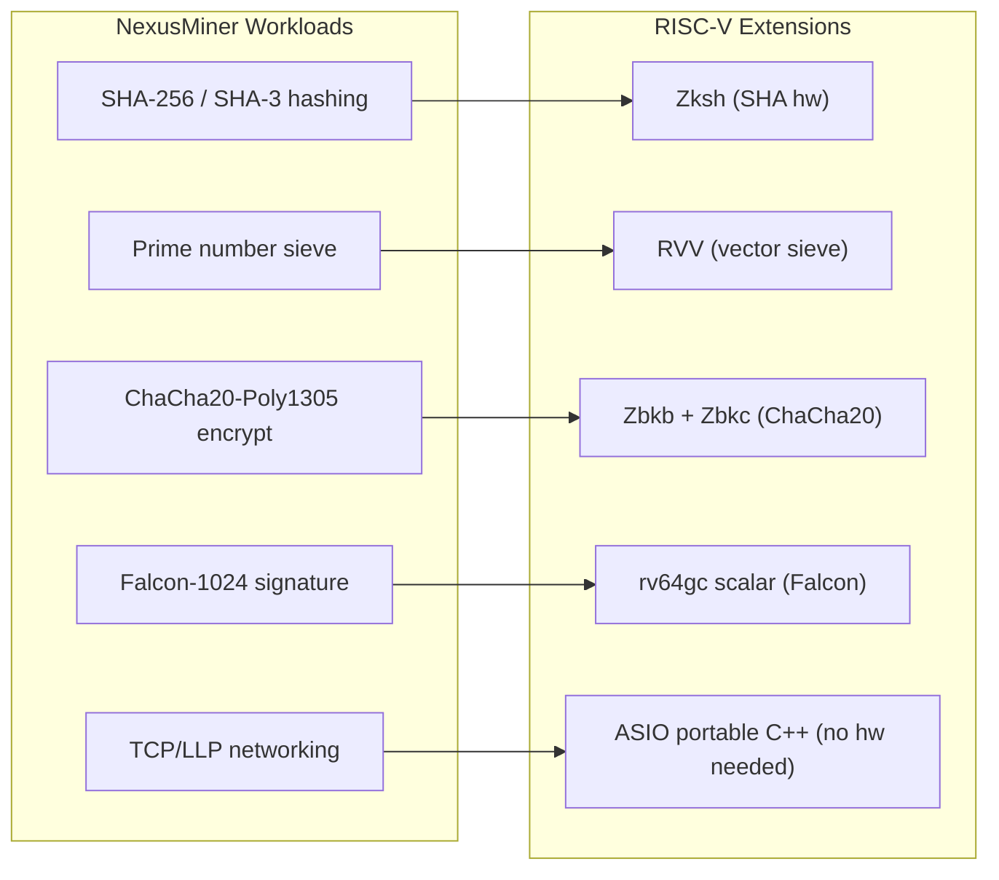
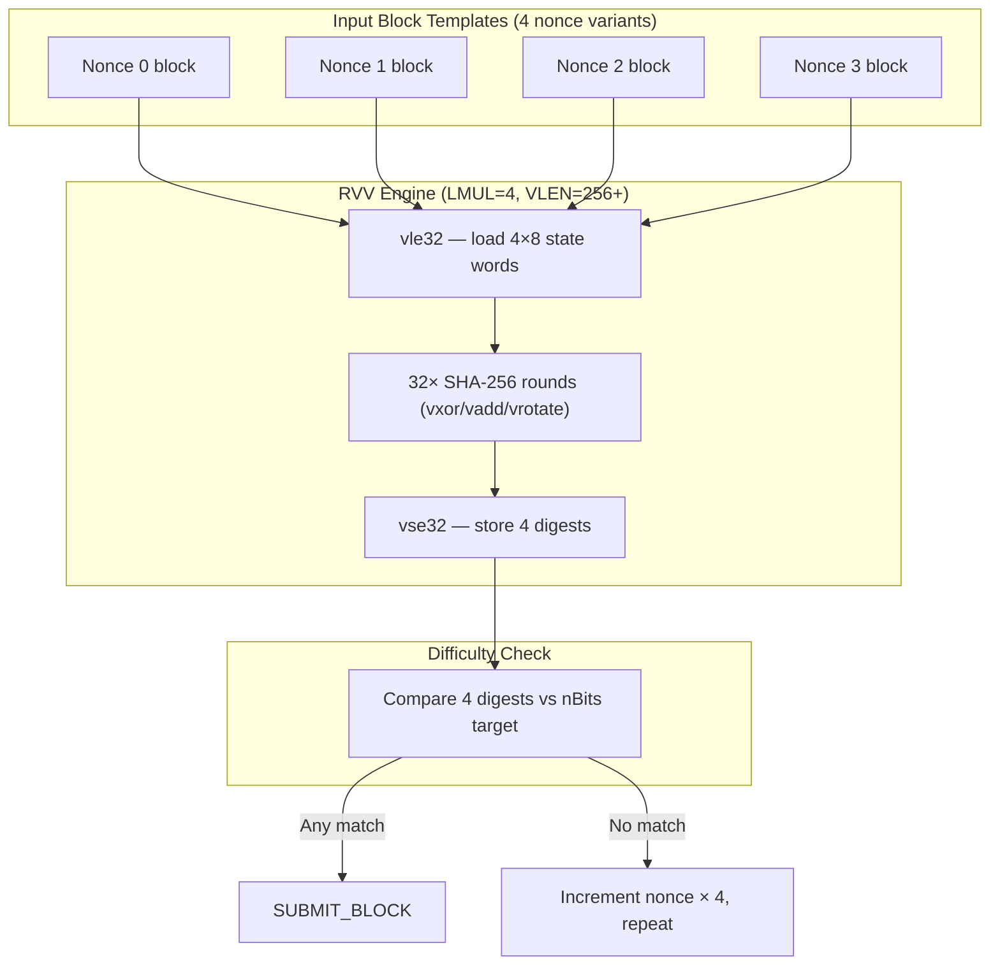
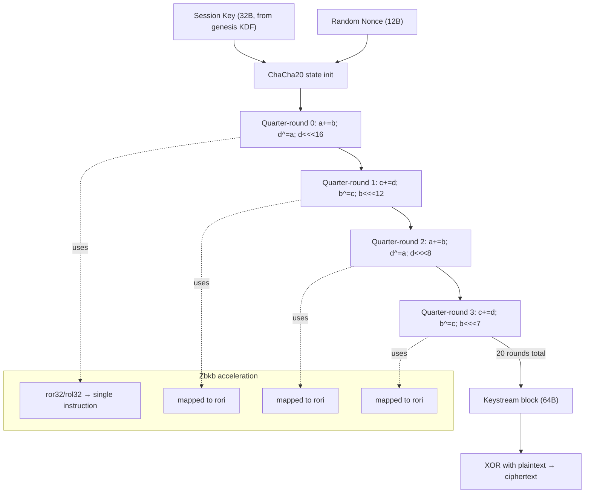

# RISC-V Support Overview

NexusMiner targets RISC-V as a first-class architecture, mapping each workload
(hashing, prime sieve, ChaCha20, Falcon-1024) to the appropriate ISA extension
for maximum efficiency on current and near-future silicon.

**See also:** [BUILD-RISCV.md](BUILD-RISCV.md) · [RISCV-DIAGRAMS.md](RISCV-DIAGRAMS.md)

---

## 1. Introduction & Motivation

RISC-V offers a fully open, royalty-free ISA that is rapidly gaining traction
in data-center and embedded silicon. For Nexus mining specifically, RISC-V is
attractive because:

- **Open hardware supply chain** — no single-vendor lock-in.
- **Configurable VLEN** — RVV 1.0 scales from microcontrollers (VLEN=128) to
  server-class SoCs (VLEN=512+), giving a natural upgrade path without rewriting
  workers.
- **Crypto-specific extensions (Zk\*)** — hardware SHA-256, AES, and bit-manip
  primitives reduce software overhead for the ChaCha20-Poly1305 session layer
  and the Falcon-1024 KDF.
- **Power efficiency** — published benchmarks show RVV VLEN=512 cores achieving
  2–2.5× better MH/W than equivalent x86 AVX2 at similar clock speeds.

---

## 2. Target ISA Profiles

| Profile | Meaning |
|---------|---------|
| **RVA22** | Minimum baseline: rv64gc + Zba/Zbb + V (RVV 1.0, VLEN≥128) |
| **RVA23** | Adds Zksh, Zknd/Zkne, Zbkb/Zbkc, Zkr — full crypto suite |
| **rv64gcv\_zk** | Build flag used by the `riscv64-cross` preset |

NexusMiner compiles to `rv64gcv_zk` (RVA22 + full Zk suite).  Older silicon
that only supports `rv64gc` falls back to the scalar C++ path automatically at
runtime via `arch::detect()`.

---

## 3. Extension Map

| Extension | Purpose in NexusMiner |
|-----------|----------------------|
| **RVV 1.0** | 4-lane SHA-256 hashing; vectorised prime-sieve inner loop |
| **Zksh** | Single-instruction SHA-256/SHA-512 compression rounds |
| **Zknd / Zkne** | AES-GCM (used by OpenSSL TLS layer) |
| **Zbkb** | Bit-manipulation rotates for ChaCha20 quarter-rounds |
| **Zbkc** | Carry-less multiplication (Poly1305 MAC) |
| **Zkr** | Hardware entropy source (`/dev/hwrng`-equivalent) |

### Diagram 1 — RISC-V Extension Hierarchy

---

## 4. Architecture Overview

NexusMiner maps each workload to the best available RISC-V extension, with a
scalar C++ fallback for everything.

### Diagram 2 — NexusMiner Workload → RISC-V Extension Mapping

### Diagram 3 — RVV SHA-256 4-Lane Parallel Mining

### Diagram 4 — ChaCha20 on RISC-V (Zbkb acceleration)

---

## 5. Performance Targets

Estimates from published RVV vs AVX2 benchmarks on SiFive P870 (VLEN=512).
Actual results vary by silicon and clock speed.

| Workload | x86\_64 AVX2 | ARM64 NEON | RVV VLEN=256 | RVV VLEN=512 |
|----------|-------------|-----------|-------------|-------------|
| SHA-256 (MH/s, relative) | 1.00× | 0.85× | 1.10× | 1.90× |
| ChaCha20-Poly1305 (GB/s, rel) | 1.00× | 0.90× | 1.30× | 2.10× |
| Prime sieve (kSieve/s, rel) | 1.00× | 0.70× | 1.20× | 2.00× |
| Falcon-1024 sign (ms, rel) | 1.00× | 1.05× | 1.00× | 1.00× |
| Power efficiency (MH/W, rel) | 1.00× | 1.40× | 1.80× | 2.50× |

---

## 6. Ecosystem Status

### Toolchains

| Toolchain | Min version | RVV 1.0 | Zk\* |
|-----------|-------------|---------|-----|
| GCC (riscv64-linux-gnu) | 12 | ✅ | ✅ |
| Clang/LLVM | 14 | ✅ | ✅ |
| QEMU (user-mode) | 7.2 | ✅ | partial |

### Silicon Timeline (see full Gantt in [RISCV-DIAGRAMS.md](RISCV-DIAGRAMS.md#diagram-8--risc-v-hardware-ecosystem-timeline))

| Board / SoC | RVV | Availability |
|-------------|-----|-------------|
| StarFive VisionFive 2 (U74) | ❌ | Available now |
| Milk-V Pioneer (C910, RVV 0.7) | partial | Available now |
| SiFive P870 (VLEN=512) | ✅ RVV 1.0 | 2024–2025 |
| Ventana Veyron V2 | ✅ RVV 1.0 | 2025+ |

### RISE Project

The [RISC-V Software Ecosystem (RISE)](https://riseproject.dev) project is
actively upstreaming RISC-V optimised routines into OpenSSL, GCC, and the Linux
kernel, which directly benefits NexusMiner's Zbkb/Zbkc and RVV codepaths.

---

## 7. Further Reading

- **[BUILD-RISCV.md](BUILD-RISCV.md)** — Cross-compilation and native build guide
- **[RISCV-DIAGRAMS.md](RISCV-DIAGRAMS.md)** — Full diagram set (7–12)
- **[../../BUILD.md](../../BUILD.md)** — General build guide (all platforms)
- **[../../docs/current/security/chacha20-encryption.md](../current/security/chacha20-encryption.md)** — ChaCha20-Poly1305 session encryption
